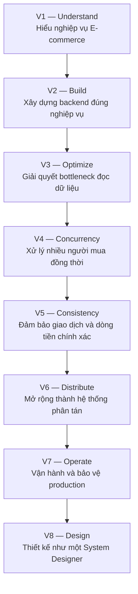

# INSIDE E-COMMERCE

## Complete Book Roadmap — 8 Volumes, 47 Chapters & Case Studies

> **Triết lý xuyên suốt:** Học cách một hệ thống E-commerce phát triển từ cửa hàng trực tuyến nhỏ thành nền tảng phân tán phục vụ lượng người dùng lớn. Mỗi chương bắt đầu từ một vấn đề thực tế, phân tích nguyên nhân, giải pháp, trade-off và bottleneck tiếp theo.

---

## Volume 01 — Understanding E-commerce

**Trạng thái:** Hoàn thành  
**Phạm vi:** Chapter 01–05

**Mục đích:** Hiểu nghiệp vụ E-commerce, các domain cốt lõi và cách chuyển yêu cầu kinh doanh thành mô hình backend trước khi lựa chọn công nghệ.

| Chapter | Topic |
|---|---|
| 01 | **E-commerce Ecosystem** — Toàn cảnh hệ thống thương mại điện tử |
| 02 | **E-commerce Business Models** — B2C, B2B, C2C, D2C và Marketplace |
| 03 | **Domain Modeling** — Entity, Value Object, Aggregate, Bounded Context |
| 04 | **Product & Pricing Engineering** — SKU, Price, Promotion, Voucher, Price Snapshot |
| 05 | **Order Lifecycle** — Vòng đời và trạng thái của đơn hàng |

**Kết quả:** Hiểu các đối tượng nghiệp vụ, trách nhiệm của từng domain, luồng hàng hóa, thông tin và dòng tiền; có thể phân tích yêu cầu trước khi thiết kế backend.

---

## Volume 02 — Building the E-commerce Core

**Trạng thái:** Tiếp theo  
**Phạm vi:** Chapter 06–10

**Mục đích:** Xây dựng một ứng dụng E-commerce hoàn chỉnh bằng Spring Boot, tổ chức code chuẩn, thiết kế database và đảm bảo tính đúng đắn của nghiệp vụ.

| Chapter | Topic |
|---|---|
| 06 | **Modular Monolith Architecture** — Tổ chức backend theo domain/module |
| 07 | **Database Design** — Thiết kế database E-commerce với PostgreSQL |
| 08 | **API Design** — REST API, validation, error handling, pagination |
| 09 | **Transaction Management** — ACID, Isolation Level, Rollback, Transaction Boundary |
| 10 | **Authentication & Authorization** — Customer, Seller, Admin, RBAC |

**Kết quả:** Thiết kế và xây dựng backend E-commerce hoạt động đúng nghiệp vụ, có thể bảo trì và phát triển tiếp.

---

## Volume 03 — Scaling Read Operations

**Phạm vi:** Chapter 11–17

**Mục đích:** Giải quyết bottleneck khi lượng truy cập sản phẩm và tìm kiếm tăng mạnh. Tối ưu khả năng xử lý **READ** của E-commerce.

| Chapter | Topic |
|---|---|
| 11 | **Database Query Optimization** — Phân tích và tối ưu slow queries |
| 12 | **Indexing & Pagination** — B-Tree, Composite Index, Offset vs Cursor Pagination |
| 13 | **Caching with Redis** — Cache Aside, TTL, Cache Hit/Miss |
| 14 | **Cache Consistency** — Cache Invalidation, Stampede, Penetration, Breakdown |
| 15 | **Read Replicas** — Primary–Replica, Replication Lag, Read Routing |
| 16 | **Search Architecture** — Full-text Search, Filtering, Elasticsearch/OpenSearch |
| 17 | **CDN & Object Storage** — Phục vụ hình ảnh và tài nguyên tĩnh ở quy mô lớn |

**Kết quả:** Hiểu cách cải thiện throughput và latency cho các chức năng có nhiều lượt đọc như xem sản phẩm, tìm kiếm và xem danh mục.

---

## Volume 04 — Concurrency & Inventory Engineering

**Phạm vi:** Chapter 18–23

**Mục đích:** Giải quyết vấn đề phát sinh khi nhiều người đồng thời mua hàng. Đảm bảo hệ thống không overselling và quản lý tồn kho chính xác.

| Chapter | Topic |
|---|---|
| 18 | **Race Conditions** — Đồng thời truy cập và thay đổi dữ liệu |
| 19 | **Database Locking** — Optimistic Lock, Pessimistic Lock, Row Lock |
| 20 | **Atomic Operations** — Atomic Update, Compare-and-Set, Conditional Update |
| 21 | **Flash Sale Architecture** — Xử lý lượng lớn người mua đồng thời |
| 22 | **Stock Reservation** — Giữ hàng, hết hạn giữ hàng, hoàn tồn |
| 23 | **Hotspot Management** — Hot Row, Lock Contention, Queue, Admission Control |

**Kết quả:** Có thể thiết kế hệ thống bán hàng concurrent mà không overselling, không tạo reservation trùng và kiểm soát được tranh chấp tài nguyên.

---

## Volume 05 — Order & Payment Engineering

**Phạm vi:** Chapter 24–30

**Mục đích:** Đảm bảo giao dịch mua hàng và thanh toán được xử lý chính xác, không tạo đơn trùng, không ghi nhận tiền sai và có khả năng phục hồi khi xảy ra lỗi.

| Chapter | Topic |
|---|---|
| 24 | **Checkout Architecture** — Xác thực giỏ hàng, giá, khuyến mãi và tồn kho |
| 25 | **Payment Integration** — Payment Gateway, Webhook, Payment State |
| 26 | **Idempotency** — Chống tạo đơn và thanh toán trùng |
| 27 | **Distributed Transactions** — Giao dịch trải qua nhiều service/database |
| 28 | **Saga & Compensation** — Điều phối giao dịch và thực hiện rollback nghiệp vụ |
| 29 | **Refund & Reconciliation** — Hoàn tiền, đối soát và xử lý chênh lệch |
| 30 | **Order Fulfillment** — Đóng gói, vận chuyển, giao hàng và hoàn trả |

**Kết quả:** Hiểu cách thiết kế luồng mua hàng có khả năng phục hồi khi thanh toán timeout, webhook đến trễ, đơn bị hủy hoặc hệ thống gián đoạn.

---

## Volume 06 — Distributed Systems & Data Scaling

**Phạm vi:** Chapter 31–36

**Mục đích:** Mở rộng hệ thống từ một ứng dụng backend thành nhiều thành phần phân tán, giải quyết giao tiếp giữa service, dữ liệu phân tán và khả năng chịu lỗi.

| Chapter | Topic |
|---|---|
| 31 | **Monolith to Microservices** — Khi nào cần và không cần tách service? |
| 32 | **Service Communication** — REST, gRPC, Synchronous vs Asynchronous |
| 33 | **Message Broker** — RabbitMQ, Kafka, Queue, Event-driven Architecture |
| 34 | **Data Consistency** — Strong Consistency, Eventual Consistency, Outbox |
| 35 | **Database Scaling** — Connection Pool, Partitioning, Replication, Sharding |
| 36 | **Fault Tolerance** — Timeout, Retry, Circuit Breaker, Bulkhead |

**Kết quả:** Biết khi nào cần phân tách service, xử lý giao tiếp và giải quyết các vấn đề phát sinh khi dữ liệu nằm ở nhiều hệ thống khác nhau.

---

## Volume 07 — Production & Reliability Engineering

**Phạm vi:** Chapter 37–42

**Mục đích:** Đưa E-commerce lên production, quản lý tải, theo dõi hệ thống, xử lý sự cố và duy trì khả năng hoạt động liên tục.

| Chapter | Topic |
|---|---|
| 37 | **Kubernetes & Autoscaling** — Deployment, Pod, Service, HPA |
| 38 | **Observability** — Metrics, Logs, Traces, Monitoring, Alerting |
| 39 | **Load & Stress Testing** — k6, JMeter, Throughput, Latency, Bottleneck |
| 40 | **Reliability & Recovery** — Failover, Disaster Recovery, Graceful Degradation |
| 41 | **Security Engineering** — API Security, Data Protection, Fraud Prevention |
| 42 | **Deployment & Migration** — CI/CD, Zero-downtime Deployment, Database Migration |

**Kết quả:** Đo lường, phát hiện, phân tích và xử lý bottleneck hoặc sự cố trong hệ thống đang vận hành thực tế.

---

## Volume 08 — Real-world System Design Case Studies

**Phạm vi:** 5 Case Studies

**Mục đích:** Vận dụng toàn bộ kiến thức từ Volume 1–7 để thiết kế các hệ thống E-commerce hoàn chỉnh. Mỗi case study yêu cầu phân tích nghiệp vụ, thiết kế kiến trúc, tìm bottleneck, đánh giá trade-off và xử lý các failure scenario.

| Case Study | Topic |
|---|---|
| 01 | **Design a Flash Sale System** — Bán 10.000 sản phẩm cho 1 triệu người mua đồng thời |
| 02 | **Design a Product Search System** — Tìm kiếm trên catalog 100 triệu sản phẩm |
| 03 | **Design a Shopping Cart System** — Quản lý giỏ hàng cho 10 triệu người dùng |
| 04 | **Design an Order & Payment System** — Xử lý hàng triệu giao dịch mỗi ngày |
| 05 | **Design a Multi-vendor Marketplace** — Thiết kế nền tảng thương mại điện tử nhiều người bán |

**Kết quả:** Có thể phân tích yêu cầu, xác định bottleneck, so sánh các phương án kiến trúc và giải thích trade-off như một System Designer.

---

## Toàn cảnh lộ trình học

**Tóm lại:**

- **Volume 1–2:** Hiểu và xây đúng.
- **Volume 3–5:** Giúp hệ thống chịu tải mà vẫn bảo vệ tính đúng đắn.
- **Volume 6–7:** Mở rộng và vận hành.
- **Volume 8:** Áp dụng tất cả vào các bài toán kiến trúc thực tế.

**Tiến độ tại thời điểm lập roadmap:** Hoàn thành Volume 1 (5/47); còn 42 chương/case study.
