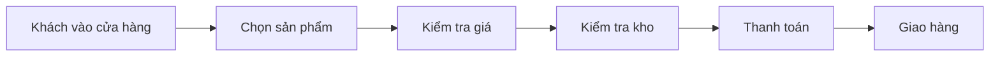
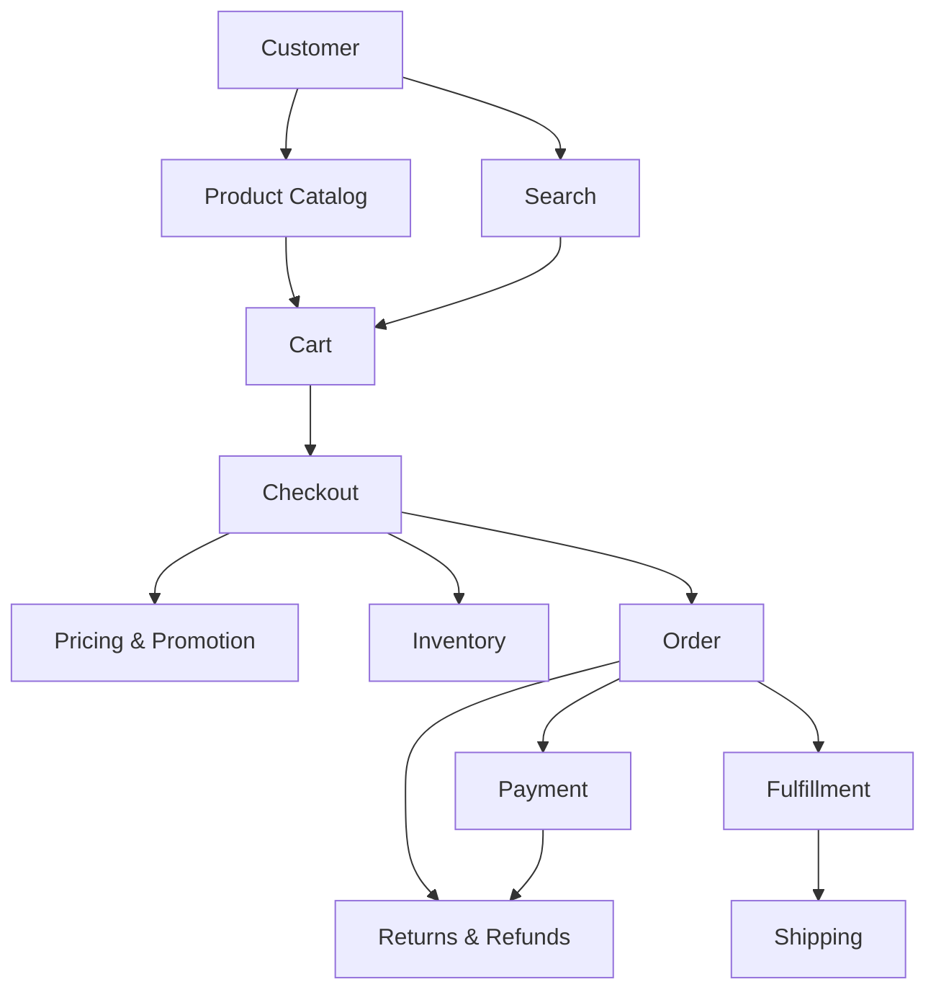
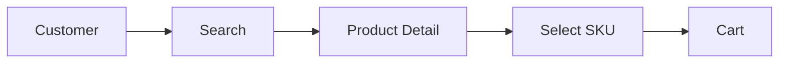
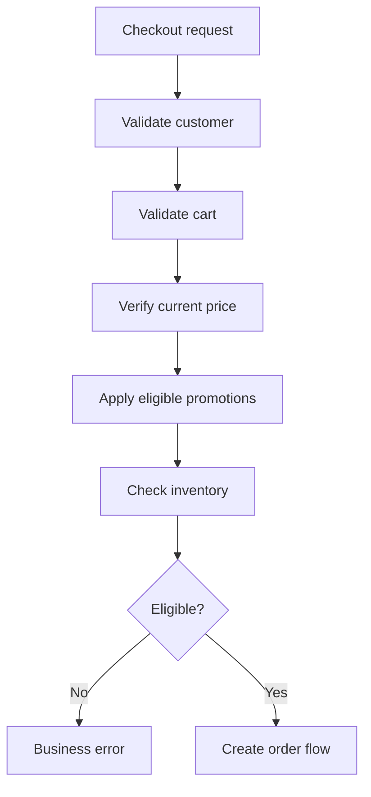
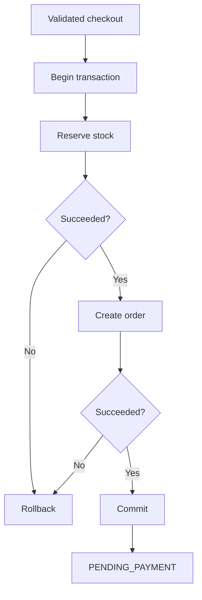
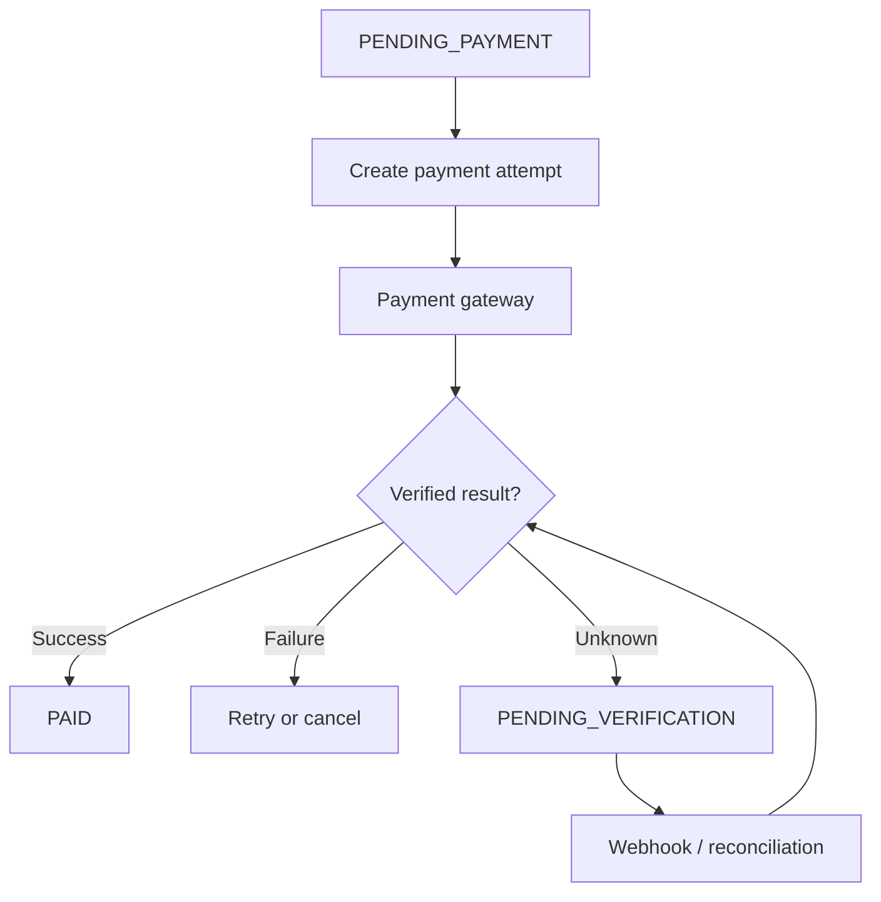
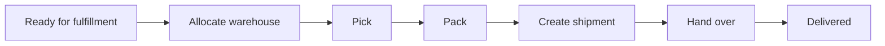
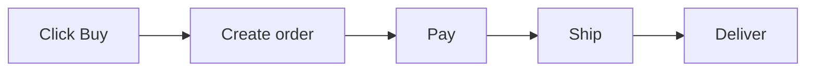
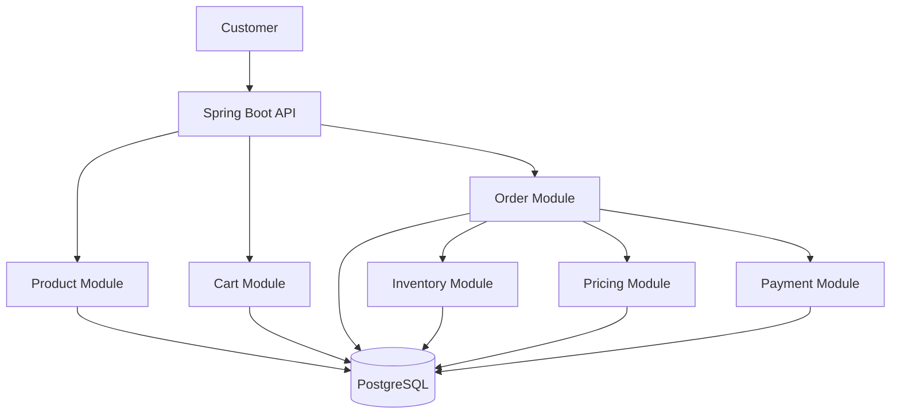
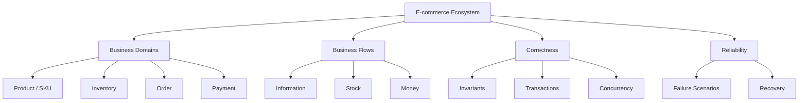

# INSIDE E-COMMERCE
## Volume 1 — Understanding E-commerce
### Chapter 01 — The E-commerce Ecosystem

> **Câu hỏi dẫn đường:** Điều gì thực sự diễn ra ở backend khi một khách hàng nhấn **Mua ngay**?

## Lời mở đầu

Người mua mở website, tìm một chiếc điện thoại, thêm vào giỏ và nhấn mua. Với họ, đó chỉ là vài thao tác. Nhưng hệ thống phải trả lời hàng loạt câu hỏi: sản phẩm có tồn tại, phiên bản đang chọn có còn hàng, giá và voucher còn hiệu lực, đơn được tạo thành công chưa, tiền đã được ghi nhận chưa, kho có thể giao hàng không? Nếu bất kỳ bước nào thất bại, hệ thống phải làm gì?

E-commerce không chỉ xử lý dữ liệu. Nó thực hiện những cam kết giữa người mua, người bán, đơn vị thanh toán và đơn vị vận chuyển. Cuốn sách bắt đầu từ **nghiệp vụ và tính đúng đắn**, rồi mới đi đến Redis, RabbitMQ, Kubernetes và hệ thống phân tán.

### Sau chương này, bạn có thể

- Kể lại vòng đời của một giao dịch mua hàng từ discovery đến fulfillment.
- Phân biệt Product, SKU, Inventory, Cart, Order, Payment và Shipment.
- Nhận diện **dòng thông tin, dòng hàng hóa, dòng tiền** và lý do chúng có thể lệch trạng thái.
- Viết các **business invariant** hệ thống không được vi phạm.
- Phát hiện những failure scenario ẩn phía sau một flow trông có vẻ đơn giản.

---

## 1.1. E-commerce dưới góc nhìn Backend Developer

Hãy hình dung một cửa hàng điện thoại truyền thống: khách xem hàng, nhân viên báo giá, kiểm tra kho, thu tiền, giao sản phẩm. Đưa cửa hàng lên Internet không làm các bước đó biến mất; nó biến chúng thành những hành vi phần mềm có thể diễn ra đồng thời ở quy mô lớn.



| Cửa hàng vật lý | E-commerce backend |
|---|---|
| Khách xem hàng | Product Catalog / Product Detail |
| Nhân viên tìm hàng | Search / Recommendation |
| Khách chọn nhiều món | Shopping Cart |
| Nhân viên báo giá | Pricing / Promotion |
| Nhân viên kiểm tra kho | Inventory |
| Khách xác nhận mua | Checkout / Order |
| Thu tiền | Payment |
| Giao sản phẩm | Fulfillment / Shipping |
| Trả hàng | Return / Refund |

Một nhân viên có thể nhận ra hai khách cùng muốn mua chiếc điện thoại cuối cùng. Một backend cần đảm bảo điều đó khi có hàng nghìn request đến gần như cùng lúc. Bởi vậy, **business logic + state + concurrency** là những mảnh ghép bắt buộc.

> **Định nghĩa:** E-commerce backend là hệ thống quản lý quy tắc kinh doanh, dữ liệu, giao dịch và trạng thái của quá trình mua bán trực tuyến.

## 1.2. Các domain cốt lõi

Sơ đồ sau mô tả **ranh giới trách nhiệm logic**, không bắt buộc mỗi ô là một microservice:



### A. Product Catalog — Chúng ta bán cái gì?

Product Catalog quản lý danh tính và nội dung sản phẩm: tên, mô tả, thương hiệu, danh mục, hình ảnh, trạng thái hiển thị. **Product tồn tại không đồng nghĩa có thể mua ngay.** Một điện thoại vẫn xuất hiện trên website khi hết hàng.

```json
{
  "productId": 1001,
  "name": "Smartphone X",
  "brand": "Example Brand",
  "category": "Smartphones",
  "status": "ACTIVE"
}
```

SKU (Stock Keeping Unit) đại diện cho một biến thể hàng hóa cần quản lý riêng. Ví dụ, điện thoại màu đen 256 GB và màu trắng 512 GB thường là hai SKU. Sự khác nhau này quyết định cách thiết kế giá, tồn kho và dòng đơn hàng.

### B. Inventory — Chúng ta có thể bán bao nhiêu?

Inventory theo dõi khả năng cung cấp theo SKU, đôi khi theo từng kho.

```json
{
  "skuId": "PHONE-X-BLACK-256",
  "warehouseId": "WH-HN-01",
  "physicalQuantity": 100,
  "reservedQuantity": 20,
  "availableQuantity": 80
}
```

Trong mô hình đơn giản: `available = physical - reserved`. Hệ thống thật có thể phải trừ hàng hỏng, hàng đang khóa, hàng chờ kiểm kê hoặc theo chính sách backorder.

### C. Shopping Cart — Khách muốn mua gì?

Giỏ hàng biểu thị ý định mua. Mặc định, **thêm vào giỏ không phải là giữ tồn kho**. Có thể 1.000 người cùng thêm một SKU vào giỏ trong khi kho chỉ có 100 chiếc. Thời điểm giữ hàng là quyết định nghiệp vụ, thường nằm gần checkout hoặc bước xác nhận đơn.

```json
{
  "userId": 101,
  "items": [{"skuId": "PHONE-X-BLACK-256", "quantity": 2}]
}
```

### D. Order — Giao dịch đã được xác nhận điều gì?

Order không chỉ là bản sao Cart. Nó cần lưu **snapshot giao dịch**: tên/phiên bản hàng cần thiết, đơn giá áp dụng, số lượng, giảm giá, địa chỉ giao, tổng tiền, loại tiền và trạng thái nghiệp vụ.

```json
{
  "orderId": "ORD-1001",
  "userId": 101,
  "status": "PENDING_PAYMENT",
  "totalAmount": 20000000,
  "currency": "VND"
}
```

Nếu ngày mai admin tăng giá catalog, đơn đã chốt không tự đổi theo. Chính sách chỉnh đơn/hủy đơn là một hành vi tường minh, không phải side effect từ việc sửa sản phẩm.

### E. Payment — Dòng tiền đang ở trạng thái nào?

Một Order có thể có **nhiều payment attempt**: thanh toán lần đầu timeout, lần hai dùng phương thức khác, hoặc có nhiều lần thử bị từ chối. Không nên gộp khái niệm Order, Payment Attempt và Payment Transaction thành một trạng thái duy nhất. Payment Gateway có thể xác nhận kết quả bất đồng bộ qua webhook.

### F. Fulfillment — Làm sao hàng đến tay người mua?

Fulfillment bao gồm phân bổ kho, lấy hàng, đóng gói, bàn giao vận chuyển, theo dõi giao và xử lý ngoại lệ. **Đã trả tiền ≠ đã giao hàng.** Đơn có thể được thanh toán thành công nhưng kho phát hiện hàng bị hỏng hoặc đơn vị vận chuyển không thể tiếp nhận.

## 1.3. End-to-end: Một giao dịch mua thực sự

Giả sử khách chọn một điện thoại giá 10 triệu đồng, thanh toán online và nhận hàng tại Hà Nội.

### Phase 1 — Discovery: chủ yếu là READ



Dữ liệu thường đọc gồm product, variant, image, category, price, inventory summary. Khi tải đọc tăng, cache, index, search engine và CDN có thể trở nên hữu ích — nhưng chưa cần áp dụng chỉ vì thấy công nghệ đó phổ biến.

### Phase 2 — Checkout: kiểm tra lại sự thật



Giỏ có thể được tạo lúc 10:00; khuyến mãi kết thúc 10:05; khách thanh toán 10:10. Backend phải chốt giá theo chính sách thực tế và thông báo nếu điều kiện thay đổi. Giá frontend gửi lên không phải nguồn sự thật.

### Phase 3 — Order creation và stock reservation



Sơ đồ giả định Order và Inventory nằm trong **cùng database transaction**. Nếu hai domain nằm ở hai service/database khác nhau, một transaction SQL thông thường không còn bao trùm được cả hai; các chương Distributed Systems sẽ giải quyết ranh giới đó.

### Phase 4 — Payment: timeout không có nghĩa thất bại



Nếu gọi Payment Gateway bị timeout, tiền **có thể đã bị trừ** trong khi backend chưa nhận phản hồi. Đừng đánh dấu `FAILED` chỉ dựa trên lỗi mạng. Tùy hợp đồng tích hợp, cần tra soát giao dịch, nhận webhook và bảo đảm idempotency.

### Phase 5 — Fulfillment



Kho thiếu hàng thực tế, đổi địa chỉ, người nhận từ chối hàng hoặc hãng vận chuyển thất bại đều là những nhánh cần thiết của nghiệp vụ. Một cột `SUCCESS/FAILED` duy nhất thường quá nghèo để mô tả toàn bộ vòng đời.

## 1.4. Ba dòng chảy khác nhau

| Dòng chảy | Hành trình mẫu | Câu hỏi chính |
|---|---|---|
| **Information flow** | Product → Cart → Order snapshot | Ta biết gì về giao dịch tại từng thời điểm? |
| **Inventory flow** | Warehouse → Reservation → Allocation → Shipment | Hàng đang ở đâu và có còn được bán không? |
| **Money flow** | Payment attempt → Confirmation → Settlement → Refund | Tiền đã được ghi nhận, đối soát và hoàn trả thế nào? |

Giả sử khách đặt và thanh toán thành công, nhưng kho phát hiện hàng bị hỏng:

- Information flow: Order đã tạo và có lịch sử rõ ràng.
- Inventory flow: Không thể thực hiện việc giao hàng như dự kiến.
- Money flow: Tiền đã được thanh toán; có thể cần hoàn tiền.

Đổi `order.status = FAILED` **không tự động** hoàn tiền hoặc sửa tồn kho. Chính chỗ lệch trạng thái này dẫn đến nhu cầu thiết kế Saga, Compensation và Reconciliation.

## 1.5. Business invariants: Điều hệ thống không được phép vi phạm

Invariant là điều kiện phải đúng tại ranh giới nghiệp vụ được xác định, ngay cả khi có concurrent requests hoặc một số thành phần bị lỗi.

| Invariant | Ý nghĩa |
|---|---|
| Inventory | Không xác nhận giữ thành công vượt khả năng phân bổ, trừ khi nghiệp vụ chủ động cho backorder. |
| Order snapshot | Giá trị đã chốt của đơn không tự biến đổi vì catalog đổi giá. |
| Payment | Nhận lại cùng một thông báo không tạo tác động tài chính/nghiệp vụ trùng. |
| Reservation | Một reservation chỉ được giải phóng/hoàn hàng một lần. |
| State transition | Không chuyển trạng thái bất hợp lệ, ví dụ giao hàng thành công trước khi có shipment hợp lệ. |

**Performance** trả lời *hệ thống nhanh đến đâu*. **Correctness** trả lời *hệ thống có đưa ra kết quả đúng không*. Một hệ thống cache cực nhanh nhưng oversell hay hoàn tiền trùng vẫn là một thiết kế chưa đạt yêu cầu.

## 1.6. Failure scenarios: Thiết kế ngoài happy path



Đó chỉ là happy path. Production còn những kịch bản sau:

| Tình huống | Rủi ro | Keyword để học tiếp |
|---|---|---|
| Hai khách mua sản phẩm cuối | Overselling | Concurrency, Atomic Update |
| Khách nhấn Mua hai lần | Duplicate order | Idempotency |
| DB commit nhưng mất HTTP response | Client tưởng chưa đặt hàng | Request identity, Retry |
| Payment Gateway timeout | Kết quả thanh toán chưa rõ | Reconciliation |
| Webhook đến trễ hoặc trùng | Order bị cập nhật sai | Idempotent handler |
| Worker chết sau khi giữ hàng | Reservation bị treo | Expiration, Recovery |
| Khách hủy khi kho đang đóng gói | Tranh chấp trạng thái | State machine |
| Giá đổi trong checkout | Price inconsistency | Pricing snapshot |

Nhiều lỗi không nằm ở cú pháp Java hay SQL; chúng phát sinh do **thời điểm, thứ tự thực hiện và trạng thái phân tán**.

## 1.7. Engineering Lab — Cửa hàng điện thoại đầu tiên

**Phạm vi giả định:** 1.000 người dùng; 100 product; một kho; Spring Boot + PostgreSQL; kiến trúc modular monolith. Đây là ràng buộc bài tập, **không phải** benchmark năng lực chịu tải.

### Lab A — Gán đúng domain

1. Khách hỏi điện thoại có những màu gì? → **Product Catalog**.
2. Khách hỏi kho còn mấy máy đen 256 GB? → **Inventory**.
3. Khách đã thanh toán nhưng chưa nhận hàng? → **Payment + Fulfillment**.
4. Admin đổi giá sau khi khách đặt? → **Giữ snapshot giao dịch của đơn đã chốt**.

### Lab B — Vẽ module boundary



Các module là các phần logic của một ứng dụng; không cần tách thành microservice ngay.

### Lab C — Tìm điểm yếu schema

Xem thiết kế cố ý quá đơn giản:

```sql
CREATE TABLE products (
  id BIGINT PRIMARY KEY,
  name TEXT NOT NULL,
  price NUMERIC(18,2) NOT NULL,
  stock INTEGER NOT NULL
);

CREATE TABLE orders (
  id BIGINT PRIMARY KEY,
  user_id BIGINT NOT NULL,
  product_id BIGINT NOT NULL,
  status TEXT NOT NULL
);
```

Hãy tự thiết kế lại để xử lý: nhiều item mỗi đơn; nhiều SKU mỗi product; snapshot đơn giá; nhiều kho; voucher; hoàn tiền/hoàn hàng một phần. Chúng ta sẽ giải bài toán này ở chương Domain Modeling và Database Design.

---

## Knowledge Map



## Key Takeaways

1. E-commerce không chỉ là CRUD sản phẩm và đơn hàng.
2. Product, SKU, Cart, Inventory, Order, Payment, Fulfillment có những trách nhiệm riêng.
3. Information, stock và money flow có thể ở trạng thái không đồng bộ.
4. Business invariants cho biết tính đúng đắn nào cần được bảo vệ.
5. Phải thiết kế cả happy path lẫn failure scenarios.
6. Hiểu domain trước khi chọn Redis, RabbitMQ, microservices hoặc Kubernetes.

**Chương tiếp theo:** Chapter 02 — E-commerce Business Models: B2C, B2B, C2C, D2C, Marketplace; seller ownership, commission, settlement, multi-seller orders và hệ quả đối với kiến trúc dữ liệu.
