# INSIDE E-COMMERCE
## Volume 1 — Understanding E-commerce
### Chapter 02 — E-commerce Business Models

> **Câu hỏi dẫn đường:** Tại sao một cửa hàng tự bán hàng và một marketplace có nhiều người bán đều có Product, Cart, Order, Payment nhưng cần **mô hình dữ liệu, phân quyền, checkout, tồn kho và dòng tiền** khác nhau?

> **Giới hạn chương:** Đây là tài liệu học kiến trúc phần mềm. Thuế, tư cách người bán chính thức, trách nhiệm hoàn tiền và quy trình chuyển tiền phụ thuộc hợp đồng, cổng thanh toán và từng thị trường; ví dụ trong sách là mô hình nghiệp vụ giả định, không thay cho tư vấn pháp lý/kế toán.

## Sau chương này, bạn có thể

- Phân biệt **B2C, B2B, C2C, D2C, 1P retail, 3P marketplace và hybrid** mà không nhầm các trục phân loại.
- Nêu ai là **seller of record**, ai sở hữu hàng, ai định giá, ai đóng gói, ai tiếp nhận tiền và ai giải quyết trả hàng cho từng mô hình.
- Giải thích vì sao một cart nhiều seller cần **order group + seller orders**, và có thể có nhiều shipment, refund, settlement.
- Phân biệt **catalog product, seller listing/offer, SKU, seller inventory, order item snapshot**.
- Phác thảo schema, API và authorization boundaries cho marketplace bằng Spring Boot/PostgreSQL.
- Tránh sai lầm đồng nhất `PAID`, `DELIVERED`, `SETTLED` hoặc coi Seller Balance là tiền chắc chắn đã chuyển tới ngân hàng.

---

## 2.1. Bắt đầu từ một cửa hàng điện thoại

Ở chương 01, bạn xây cửa hàng **Hoàng Phone**: cửa hàng nhập điện thoại từ nhà phân phối, đăng sản phẩm, lưu kho, bán hàng, nhận thanh toán và giao hàng. Toàn bộ nghiệp vụ khá dễ hình dung vì phần lớn trách nhiệm tập trung về một đơn vị bán hàng.

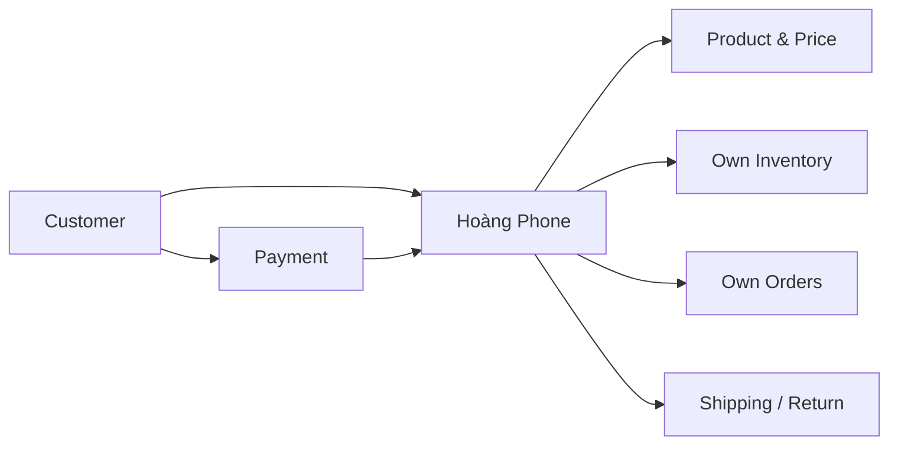

Một hôm, Hoàng Phone muốn bán thêm laptop, tai nghe, đồng hồ và phụ kiện mà không tự nhập tất cả vào kho. Cửa hàng mở cổng cho hai đối tác:

- **Seller A** bán điện thoại và tai nghe từ kho Hà Nội.
- **Seller B** bán đồng hồ và phụ kiện từ kho TP.HCM.

Khách hàng vẫn nhìn thấy **một website, một giỏ hàng, một nút checkout**. Nhưng đằng sau, hai seller có tồn kho, giá, trạng thái xác nhận đơn và vận chuyển riêng. Dòng tiền còn phải chia theo thỏa thuận giữa nền tảng và từng seller.

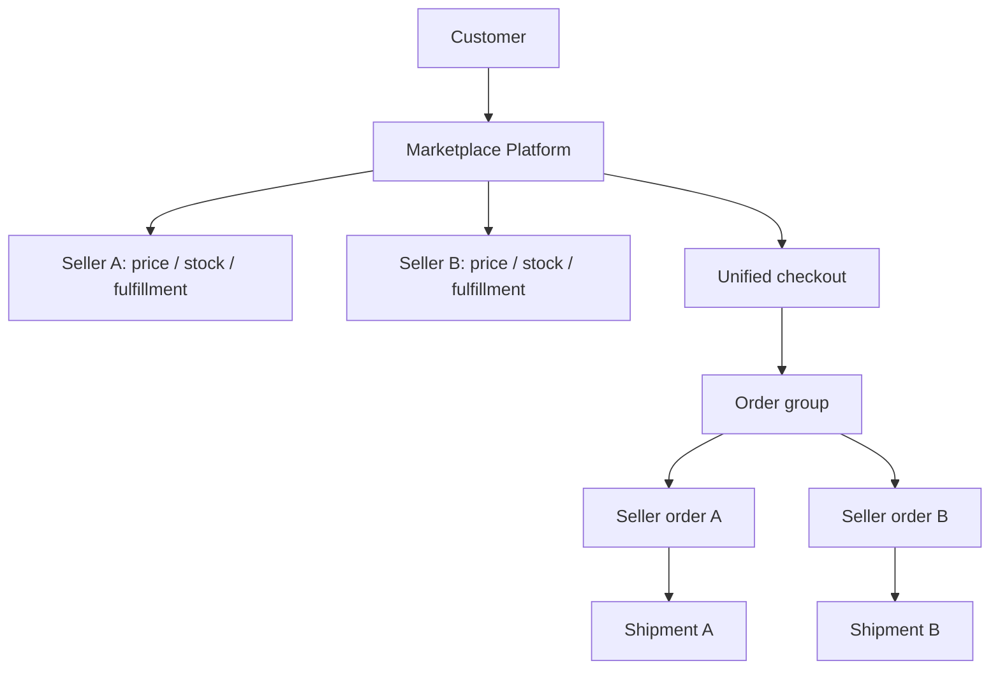

**Vấn đề hệ thống không còn là chỉ có bao nhiêu khách hàng.** Câu hỏi đầu tiên cần trả lời là: **trong một giao dịch, mỗi bên có quyền gì, phải làm gì và chịu trách nhiệm tới đâu?**

## 2.2. Các thuật ngữ không nằm trên cùng một trục

Đây là chỗ tài liệu tổng quan thường khiến người học nhầm lẫn. B2C/B2B/C2C mô tả **các bên giao dịch**; D2C mô tả **kênh đưa sản phẩm tới người mua**; 1P/3P mô tả **vai trò của nền tảng đối với người bán**. Chúng không phải sáu lựa chọn loại trừ lẫn nhau.

| Khái niệm | Câu hỏi nó trả lời | Ví dụ giả định | Hàm ý backend nổi bật |
|---|---|---|---|
| B2C (Business-to-Consumer) | Doanh nghiệp bán cho ai? | Hoàng Phone → khách cá nhân | Catalog, cart, consumer checkout, refund |
| B2B (Business-to-Business) | Doanh nghiệp bán cho ai? | Hoàng Phone → công ty mua 100 máy | Organization, approver, quote, price tier, credit terms |
| C2C (Consumer-to-Consumer) | Ai giao dịch với ai? | Cá nhân A bán máy cũ cho cá nhân B | Identity/trust, listing moderation, dispute, seller onboarding |
| D2C (Direct-to-Consumer) | Thương hiệu có bán trực tiếp tới khách không? | Hãng X bán máy trên site của chính hãng | Brand-owned pricing, CRM, fulfillment; có thể vẫn là B2C |
| 1P Retail (First Party) | Nền tảng có tự đứng vai trò người bán? | Nền tảng tự bán hàng do mình kinh doanh | Own stock, own order liability, centralized fulfillment |
| 3P Marketplace (Third Party) | Nền tảng có cho bên thứ ba bán? | Nhiều seller bán qua cùng một site | Seller tenancy, listing, split orders, fees, settlement |
| Hybrid 1P + 3P | Nền tảng có vừa tự bán vừa cho seller ngoài bán? | Cùng một catalog có hàng 1P và 3P | Nhận diện seller, offer selection, nhiều luồng trách nhiệm |

**Ví dụ về việc nhiều nhãn cùng đúng:** Một hãng bán laptop trực tiếp cho khách cá nhân qua website của hãng vừa là **B2C**, vừa là **D2C**, đồng thời có thể là **1P** đối với website đó. Một nền tảng B2B vẫn có thể vận hành marketplace nhiều nhà cung cấp.

### Dropshipping nằm ở đâu?

Dropshipping chủ yếu mô tả **cách thực hiện đơn hàng**: bên nhận đơn không nhất thiết nắm giữ hàng, supplier có thể giao trực tiếp. Nó không tự quyết định các vai trò B2C/marketplace hay ai là người bán chịu trách nhiệm với khách. Đừng nhìn thấy hàng xuất từ supplier rồi kết luận backend phải là marketplace.

### SaaS bán công cụ E-commerce có phải marketplace?

Một phần mềm cho nhiều merchant tạo website riêng là **commerce-enablement SaaS**. Merchant có thể tự sở hữu khách hàng, checkout và quan hệ thanh toán. Đó khác với một marketplace nơi nhiều seller cùng bán dưới một trải nghiệm mua hàng tổng hợp. Đôi khi một công ty cung cấp cả hai tính năng, nhưng hệ thống vẫn cần phân biệt domain.

## 2.3. Ma trận trách nhiệm — thiết kế trước khi viết entity

Trước khi lập bảng `sellers`, tôi muốn bạn điền một ma trận cho **một giao dịch cụ thể**.

| Quyết định | Single-vendor 1P (giả định) | Marketplace 3P (giả định) |
|---|---|---|
| Ai đăng sản phẩm? | Store admin | Seller, có thể chờ platform duyệt |
| Ai quyết định giá niêm yết? | Store | Seller hoặc quy tắc platform theo hợp đồng |
| Ai sở hữu tồn kho vật lý? | Store/đối tác kho của store | Từng seller hoặc mạng kho do platform vận hành |
| Ai nhận yêu cầu checkout? | Store | Platform |
| Ai giữ stock? | Inventory của store | Inventory theo seller + SKU + warehouse |
| Ai thực hiện giao hàng? | Store hoặc 3PL | Seller, platform fulfillment hoặc 3PL theo từng offer |
| Ai nhận tiền từ payment provider? | Theo tài khoản của store | Tùy payment flow: seller trực tiếp hoặc platform nhận rồi chuyển |
| Ai hưởng hoa hồng/fee? | Không bắt buộc có | Platform theo chính sách từng giao dịch |
| Ai xử lý hoàn tiền? | Store | Seller/platform/payment provider phối hợp theo thỏa thuận |

**Lưu ý:** “Ai sở hữu hàng”, “ai xuất hàng”, “ai là merchant of record”, “ai nhận tiền ban đầu” và “ai chịu phí chargeback” có thể là **những chủ thể khác nhau**. Không dùng một boolean `isMarketplace` để suy ra tất cả trách nhiệm.

> **Quy tắc thiết kế:** Business ownership → Domain boundaries → Data ownership → API permissions → Payment architecture. Làm ngược lại thường dẫn tới schema thiếu trường và flow xử lý khó sửa.

## 2.4. Chuyển từ một Product sang nhiều Offer

### 2.4.1. Sai lầm khi chỉ thêm `seller_id` vào `products`

Trong store 1P, một bảng `products(id, name, price, stock)` có thể dùng để minh họa. Sang marketplace, hãy giả sử hai seller cùng bán một mẫu điện thoại:

- Seller A: điện thoại màu đen 256 GB, giá 10.000.000đ, còn 8 chiếc, giao từ Hà Nội.
- Seller B: cùng biến thể, giá 9.800.000đ, còn 2 chiếc, giao từ TP.HCM.

Nếu `products.price = 10000000` và `products.stock = 10`, dữ liệu đó thuộc về ai? Cập nhật giá của Seller B có làm thay đổi giá Seller A không? Khách xem đánh giá chung của mẫu điện thoại hay đánh giá riêng chất lượng dịch vụ của Seller B?

Câu trả lời là bạn đang gộp nhiều khái niệm khác nhau.

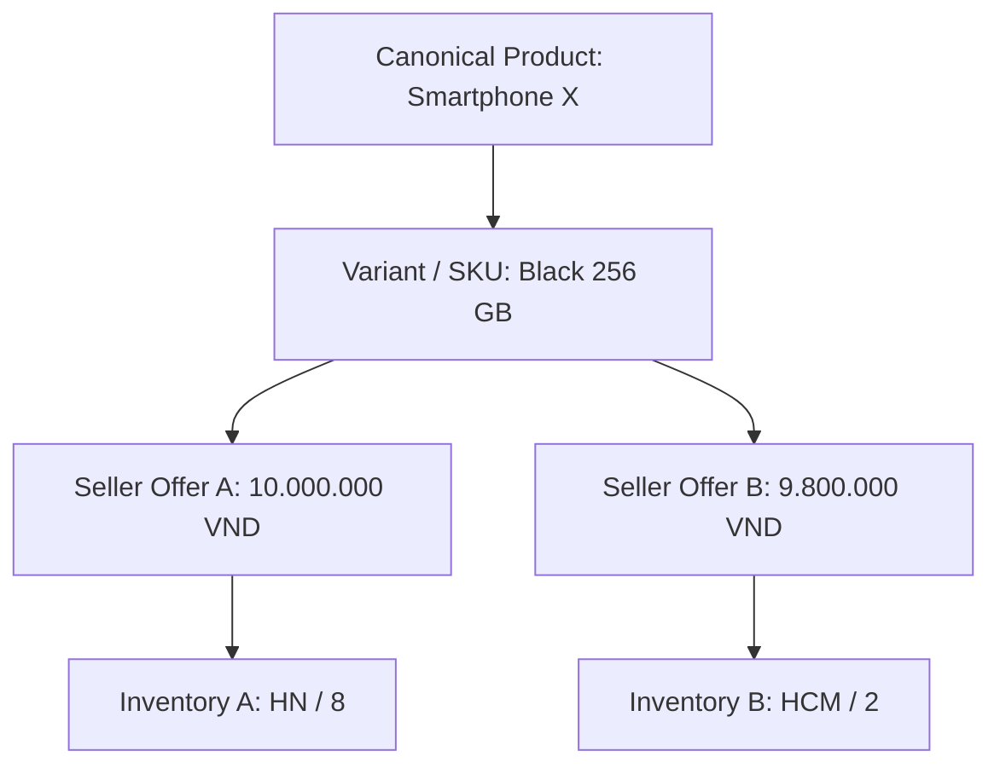

### 2.4.2. Phân biệt bốn đối tượng

| Đối tượng | Định nghĩa vận hành | Ví dụ |
|---|---|---|
| Canonical Product | Danh tính sản phẩm dùng chung trong catalog, nếu nền tảng có product matching | Smartphone X |
| Product Variant / SKU | Biến thể cần định danh | Black / 256 GB |
| Seller Listing / Offer | Lời chào bán cụ thể của seller với giá/chính sách/trạng thái | Seller A chào giá 10 triệu |
| Seller Inventory | Khả năng cung cấp của seller theo variant/kho | Seller A còn 8 tại HN |

Không phải mọi marketplace đều có canonical product; với hàng thủ công hoặc đồ cũ, **listing có thể chính là mặt hàng độc nhất**. Hãy thiết kế theo domain thực tế, không ép mọi loại hàng vào một catalog matching model.

### 2.4.3. Ai được sửa trường nào?

Seller A chỉ được sửa offer của mình. Platform có thể chuẩn hóa tên thương hiệu và danh mục. Nhân viên kho chỉ cập nhật inventory thuộc kho được giao. Customer chỉ được đọc những offer đang được phép hiển thị.

```text
PATCH /seller/offers/{offerId}
Authorization check:
  authenticatedSellerId == offer.sellerId
AND seller.status == APPROVED
AND offer editable in current state
```

**Không tin `sellerId` người dùng gửi trong JSON để xác định quyền.** Backend phải lấy actor từ danh tính đã xác thực và kiểm tra ownership trên bản ghi thực tế.

## 2.5. Single-seller checkout và multi-seller checkout khác nhau ở đâu?

Giỏ hàng sau có một khách nhưng hai seller:

```json
{
  "customerId": "U-101",
  "items": [
    {"offerId": "OFFER-A-01", "sellerId": "SELLER-A", "quantity": 1},
    {"offerId": "OFFER-B-09", "sellerId": "SELLER-B", "quantity": 2}
  ]
}
```

> `sellerId` trong payload trên chỉ để minh họa; backend phải tự resolve và xác minh seller sở hữu offer, không chấp nhận client tự quyết định.

Trong store 1P, bạn có thể hình dung một order, một tổng tiền, một shipment (dù thực tế store cũng có thể ship nhiều kiện). Với marketplace, **một lần checkout không đồng nghĩa một seller order hoặc một lần giao hàng**.

### 2.5.1. Thiết kế khái niệm order group và seller order

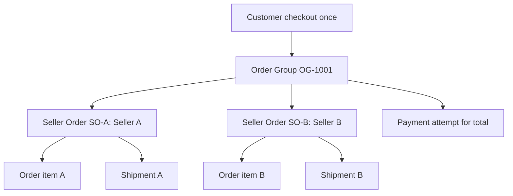

- **Order Group**: đơn tổng hợp mà khách nhìn thấy ở checkout.
- **Seller Order**: tập dòng hàng của một seller với lifecycle thực hiện tương đối độc lập.
- **Order Item**: snapshot mặt hàng, giá và số lượng tại thời điểm chốt.
- **Shipment**: một lần/kiện vận chuyển; một seller order có thể cần nhiều shipment.
- **Payment**: có thể gắn với order group hoặc từng seller order tùy mô hình thanh toán.

Tên thực tế có thể là `orders` + `sub_orders`, `purchase` + `fulfillment_order`, hoặc `order_groups` + `seller_orders`. **Tên không quan trọng bằng invariant và quan hệ.**

### 2.5.2. Vì sao không lưu `seller_id` trực tiếp trong bảng `orders`?

Vì một Order Group nhiều seller **không có đúng một seller_id**. Nếu ép lưu một seller, bạn sẽ mất thông tin hoặc buộc mỗi lần checkout thành nhiều giao dịch thanh toán riêng.

Một hệ thống vẫn có thể chỉ dùng một bảng `orders` với `parent_order_id`; điều đó khả thi, nhưng cần làm rõ row nào là group và row nào là seller order, unique constraints và state transition tương ứng. Với mục đích học, dùng hai bảng là cách thể hiện ranh giới rõ ràng hơn.

### 2.5.3. Partial failure là trạng thái bình thường

Nếu Seller A hết hàng nhưng Seller B còn hàng, hệ thống cần quy định: **rollback cả checkout** hay **cho phép chỉ mua các offer hợp lệ với sự đồng ý của khách**? Không có một đáp án bắt buộc cho mọi sản phẩm. Nhưng quyết định này cần đi trước việc viết transaction.

## 2.6. Dòng tiền marketplace — ba loại số tiền không được trộn

Có ba lớp khác nhau:

1. **Buyer payment:** khách phải trả bao nhiêu.
2. **Seller payable:** sau khi áp dụng quy tắc phí, hoàn tiền, hỗ trợ, người bán được nhận bao nhiêu.
3. **Platform revenue / costs:** nền tảng hưởng bao nhiêu và chịu phí nào.

### 2.6.1. Ví dụ tính tiền minh họa

Một order group gồm:

| Thành phần | Giá trị |
|---|---:|
| Hàng của Seller A | 2.000.000đ |
| Hàng của Seller B | 1.000.000đ |
| Gross merchandise subtotal | 3.000.000đ |
| Platform commission giả định | 10% mỗi seller |
| Seller A payable trước các điều chỉnh khác | 1.800.000đ |
| Seller B payable trước các điều chỉnh khác | 900.000đ |
| Platform commission trước các chi phí khác | 300.000đ |

Ở ví dụ **không tính phí giao hàng, voucher, thuế, payment fee hoặc hoàn tiền**. Đây là phép tính nghiệp vụ giả định, không phải công thức hạch toán chung cho mọi thị trường.

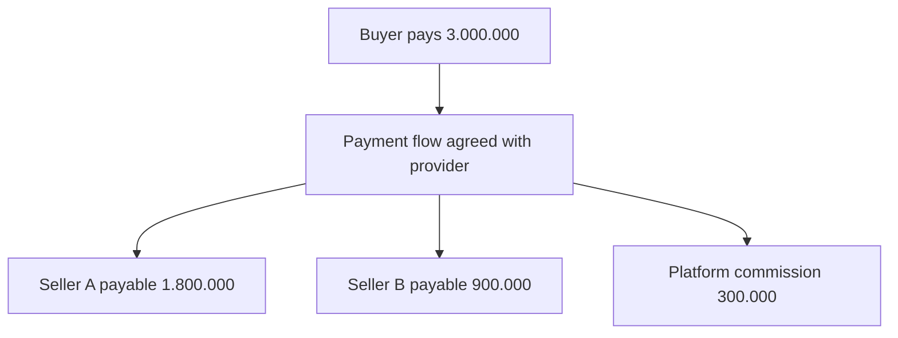

Nếu platform tự tài trợ voucher 100.000đ mà cam kết seller vẫn nhận nguyên số như trên, số khách trả còn 2.900.000đ và phần còn lại dành cho platform trước các chi phí khác còn 200.000đ. **Ai tài trợ voucher là dữ liệu nghiệp vụ bắt buộc**; cùng mức giảm giá hiển thị nhưng quyền lợi của seller có thể khác.

### 2.6.2. Charge khác transfer và payout

- **Charge/payment:** hành động thu tiền của khách theo provider.
- **Transfer:** luân chuyển quỹ giữa các tài khoản liên kết theo mô hình provider hỗ trợ.
- **Payout:** chuyển tiền từ số dư tại provider ra tài khoản ngân hàng/đích nhận của seller.
- **Settlement:** đối soát/ghi nhận số tiền phải thanh toán cho các bên theo một kỳ hoặc quy trình.

`payment.status = PAID` **không suy ra** `seller_payout.status = COMPLETED`.

Stripe Connect mô tả nhiều mô hình như **direct charges, destination charges, separate charges and transfers**. Mô hình chuyển tiền tới nhiều connected accounts là tình huống được Stripe tài liệu hóa; lựa chọn cụ thể phụ thuộc nơi hoạt động và quy tắc của provider. [S1][S2]

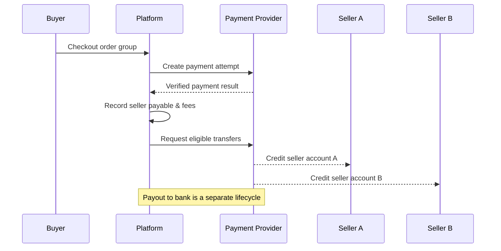

Sơ đồ là **mô hình chức năng giả định**, không phải hợp đồng API của một payment provider cụ thể.

### 2.6.3. Refund một phần làm thay đổi điều gì?

Khách chỉ trả lại hàng của Seller A. Hệ thống cần:

- Xác định item, số lượng và amount đủ điều kiện refund.
- Điều chỉnh seller payable hoặc thu hồi khoản đã chuyển theo cơ chế được phép.
- Xác định phí platform có hoàn lại hay không theo hợp đồng.
- Xử lý phí thanh toán, phí giao hàng, voucher theo quy tắc được phê duyệt.
- Lưu audit trail: **không sửa mất dấu khoản thu ban đầu**.

Cơ chế charge/dispute/refund phụ thuộc loại charge; tài liệu Stripe phân biệt trách nhiệm platform/seller theo payment architecture. [S3]

### 2.6.4. Marketplace khác ví điện tử

Một bảng `seller_balance` **không đồng nghĩa** bạn có thể tự ý giữ và di chuyển tiền thật như ngân hàng. Nó có thể chỉ là **sổ cái nội bộ ghi nhận nghĩa vụ phải trả**. Chức năng thu hộ, giữ tiền, chuyển tiền, KYC và payout phải phù hợp khả năng/tính hợp lệ của đối tác thanh toán và quy định áp dụng. Không tự triển khai “ví tiền” từ CRUD balance rồi coi là hoàn chỉnh.

## 2.7. Vì sao Marketplace cần seller onboarding và tenant isolation?

Store 1P chủ yếu quản lý customer, staff, admin. Marketplace thêm một actor quan trọng: **seller**. Seller có thể có nhiều nhân viên, nhiều kho, nhiều offer, nhiều payment/settlement record và nhiều order.

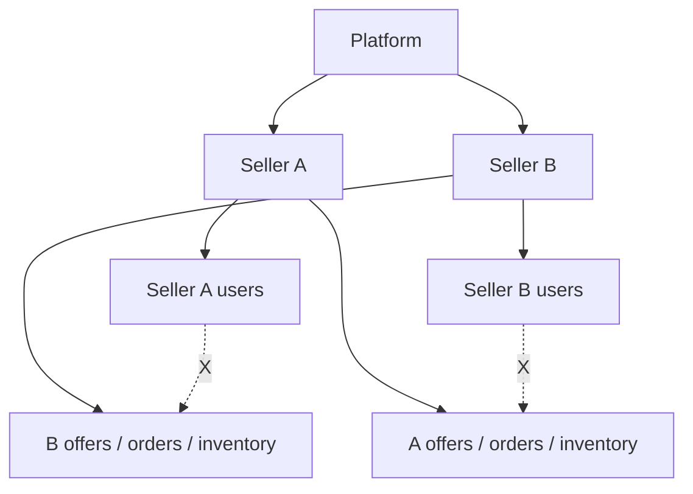

### 2.7.1. Onboarding state machine

```text
REGISTERED → UNDER_REVIEW → APPROVED → ACTIVE
                         ↘ REJECTED
ACTIVE → SUSPENDED → ACTIVE (if reapproved)
```

Seller đăng ký không tự động có quyền xuất bản offer hoặc nhận thanh toán. Thực tế còn cần xác minh thông tin theo provider và khu vực vận hành.

### 2.7.2. Data isolation là invariant, không phải một câu WHERE tùy hứng

```sql
SELECT *
FROM seller_orders
WHERE seller_id = :authenticated_seller_id
ORDER BY created_at DESC;
```

Dữ liệu của Seller B không được trả về cho Seller A dù A thay đổi URL từ `/seller/orders/1001` sang `/seller/orders/1002`.

Nên có các lớp bảo vệ:

- AuthN: người gọi là ai?
- AuthZ: actor có quyền đối với seller này không?
- Ownership check: bản ghi này có thuộc seller được phép không?
- Audit log: ai sửa giá, kho, trạng thái đơn, bank payout settings?
- Tests: truy cập chéo seller phải bị từ chối.

PostgreSQL Row-Level Security có thể là một lớp phòng vệ bổ sung tùy kiến trúc; không thay thế hoàn toàn authorization tại application.

## 2.8. Schema tham khảo cho Marketplace — không bắt đầu bằng microservices

Bạn vẫn có thể xây marketplace MVP bằng một Spring Boot modular monolith và PostgreSQL. Khác biệt đầu tiên cần xử lý là **mô hình nghiệp vụ**, không nhất thiết là số lượng service.

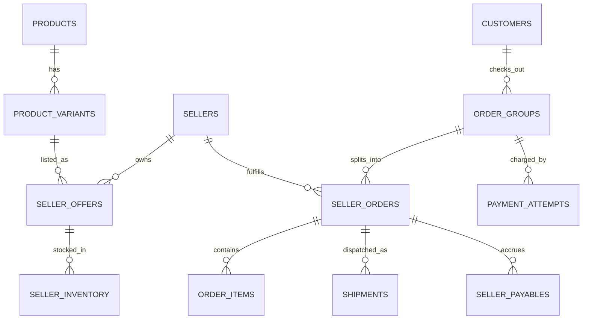

Schema SQL tối giản dưới đây chỉ minh họa **ownership và ranh giới order**, không phải migration production hoàn chỉnh:

```sql
CREATE TABLE sellers (
    id BIGINT PRIMARY KEY,
    name TEXT NOT NULL,
    status VARCHAR(32) NOT NULL
);

CREATE TABLE products (
    id BIGINT PRIMARY KEY,
    title TEXT NOT NULL
);

CREATE TABLE product_variants (
    id BIGINT PRIMARY KEY,
    product_id BIGINT NOT NULL REFERENCES products(id),
    variant_code TEXT NOT NULL UNIQUE
);

CREATE TABLE seller_offers (
    id BIGINT PRIMARY KEY,
    seller_id BIGINT NOT NULL REFERENCES sellers(id),
    variant_id BIGINT NOT NULL REFERENCES product_variants(id),
    price_vnd BIGINT NOT NULL CHECK (price_vnd >= 0),
    status VARCHAR(32) NOT NULL
);

CREATE TABLE order_groups (
    id BIGINT PRIMARY KEY,
    customer_id BIGINT NOT NULL,
    status VARCHAR(32) NOT NULL,
    total_vnd BIGINT NOT NULL CHECK (total_vnd >= 0)
);

CREATE TABLE seller_orders (
    id BIGINT PRIMARY KEY,
    order_group_id BIGINT NOT NULL REFERENCES order_groups(id),
    seller_id BIGINT NOT NULL REFERENCES sellers(id),
    status VARCHAR(32) NOT NULL,
    UNIQUE (id, seller_id)
);

CREATE TABLE order_items (
    id BIGINT PRIMARY KEY,
    seller_order_id BIGINT NOT NULL REFERENCES seller_orders(id),
    offer_id BIGINT NOT NULL REFERENCES seller_offers(id),
    product_title_snapshot TEXT NOT NULL,
    unit_price_vnd BIGINT NOT NULL CHECK (unit_price_vnd >= 0),
    quantity INT NOT NULL CHECK (quantity > 0)
);
```

**Điểm thiết kế cần chú ý:** `order_items.offer_id` giúp truy ngược offer gốc, nhưng `product_title_snapshot` và `unit_price_vnd` bảo vệ dữ liệu giao dịch khi seller đổi listing. Bảng inventory phải chứa seller/offer + warehouse + stock state nếu bạn cho phép nhiều kho. Với tiền, có thể dùng số nguyên đơn vị tiền nhỏ nhất được provider hỗ trợ hoặc `NUMERIC` theo currency; ví dụ dùng `BIGINT` VND để tránh float trong bài thực hành.

Để bảo đảm `order_items.offer_id` thực sự thuộc seller của `seller_order_id`, có thể xây composite foreign key/schema chặt hơn hoặc validate nhất quán bằng domain service và test. Schema minh họa chưa thực thi invariant này ở DB; **đừng xem nó như dữ liệu an toàn tuyệt đối**.

### API tối thiểu

```text
GET    /products/{productId}
GET    /products/{productId}/offers
POST   /checkout
GET    /orders/{orderGroupId}
GET    /seller/orders
PATCH  /seller/offers/{offerId}
POST   /seller/orders/{sellerOrderId}/confirm
POST   /seller/orders/{sellerOrderId}/shipments
```

**Phân quyền bằng actor + ownership**, không chỉ phân theo HTTP path hoặc role `SELLER` chung.

## 2.9. Sequence: một checkout, hai seller, hai lần giao hàng

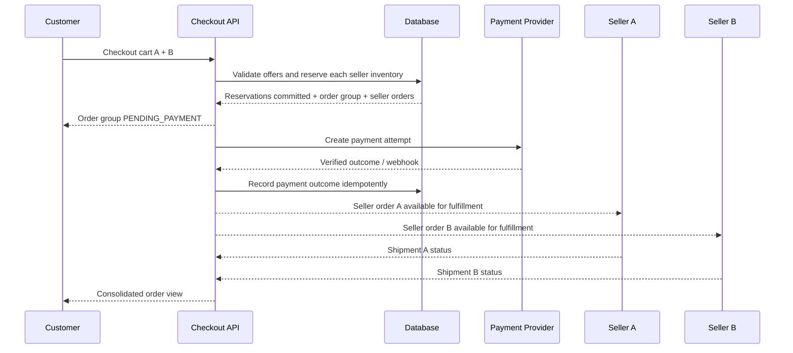

Sơ đồ cố tình không đặt lệnh gọi payment provider bên trong một DB transaction kéo dài. Khi provider timeout, checkout phải có trạng thái có thể khôi phục hoặc đối soát, không tự động coi tất cả là thất bại.

### Câu hỏi về trạng thái tổng hợp

- Seller A đã giao, Seller B đang chuẩn bị: order group là `PARTIALLY_FULFILLED` hay `IN_PROGRESS`?
- Seller A hủy vì hết hàng, Seller B đã giao: refund phần nào, phí ship tính lại không?
- Một seller order được chia thành hai shipment: seller order `SHIPPED` khi một kiện rời kho hay khi tất cả rời kho?

Không gộp bừa `order_group.status = min(child_status)` hoặc `max(child_status)`. Hãy định nghĩa **state aggregation policy** bằng business rule rõ ràng, có test cho các tổ hợp trạng thái.

## 2.10. Business-model decisions → System-design consequences

| Quyết định kinh doanh | Hệ quả domain/data | Hệ quả hệ thống |
|---|---|---|
| Mở third-party sellers | Sellers, offers, seller inventory | Seller onboarding, authZ theo seller |
| Cho nhiều seller cùng SKU | Canonical variant + nhiều offer | Offer selection, price competition, offer identity |
| Một checkout nhiều seller | Order group + seller orders | Partial cancellation/shipment/refund |
| Platform thu hoa hồng | Commission rules + payable ledger | Reconciliation, fee adjustment |
| Seller tự giao hàng | Shipment ownership / seller events | Webhook/integration, stale delivery status |
| Platform giữ stock hộ seller | Warehouse location + stock ownership | Allocation, transfers, physical vs book inventory |
| B2B bán theo hợp đồng | Organization, buyer roles, quotes | Approval workflow, payment terms, credit limits |
| Cho hàng đã qua sử dụng | Listing-specific condition and identity | Moderation, trust, dispute, no forced SKU matching |

Một anti-pattern thường gặp là quyết định công nghệ trước: “Dùng Kafka và 12 microservices cho giống sàn lớn.” Bạn có thể gặp 12 service nhưng **chưa phân biệt seller order với buyer order**. Đó không phải vấn đề scale; đó là domain sai.

## 2.11. B2B: khi người mua không còn là một cá nhân

B2C thường có customer đăng nhập và tự quyết định checkout. Trong B2B, công ty mua hàng có thể có người tạo yêu cầu, quản lý duyệt, nhân viên tài chính xác nhận hóa đơn và điều khoản thanh toán sau 30 ngày.

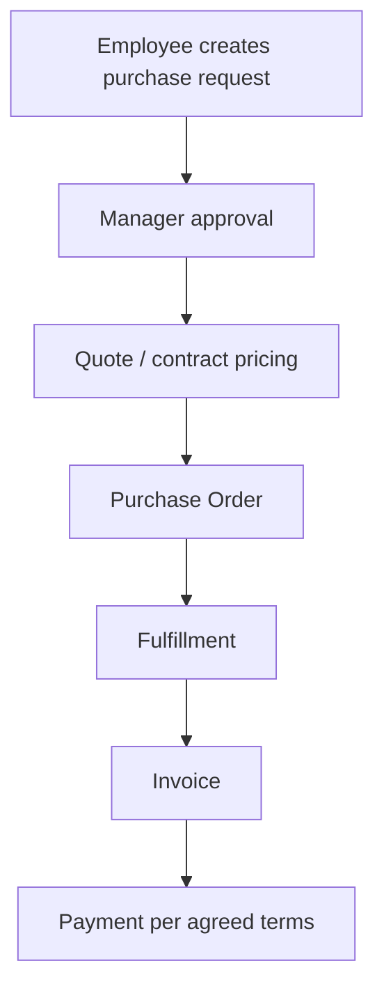

Những domain bổ sung có thể là:

- `organization`, `organization_members`, `buyer_roles`.
- `quotes`, `quote_lines`, `price_lists`, `volume_tiers`.
- `purchase_orders`, `approval_steps`, `credit_terms`.
- `invoices`, `receivables`, `payment_allocations`.

B2B không mặc định phải có tất cả; mô hình mỗi doanh nghiệp khác nhau. Điểm cốt lõi: **đơn vị mua là một tổ chức có quy trình phê duyệt, không đơn thuần là user với giỏ hàng lớn hơn**.

## 2.12. Failure scenarios: chuyển đổi business model thất bại như thế nào?

| Failure scenario | Root cause thường gặp | Điều cần bảo vệ |
|---|---|---|
| Seller A sửa offer của Seller B | API chỉ kiểm tra role SELLER | Ownership/tenant isolation |
| Một seller hủy làm cả đơn group thành CANCELLED | Gộp trạng thái cha-con sai | Aggregation policy |
| Seller đổi giá làm đơn cũ đổi theo | Order item chỉ join giá hiện tại | Price snapshot |
| Refund một item làm hoàn toàn bộ checkout | Refund chỉ gắn group | Refund granularity theo item/amount |
| Platform chuyển seller hai lần | Retry thiếu idempotency | Transfer dedup + reconciliation |
| Seller nhận tiền dù kiện chưa đủ điều kiện | Dùng PAID làm trigger payout duy nhất | Settlement eligibility |
| Một offer được bán vượt số lượng | Inventory gộp theo canonical product | Seller/offer/warehouse stock invariants |
| Seller bị khóa vẫn gọi API bán hàng | Chỉ kiểm tra token không kiểm tra status | Seller lifecycle authZ |
| Đồng bộ SKU trùng tên làm bán nhầm hàng | Matching bằng text hoặc slug | Stable product/variant identifiers |

## 2.13. Engineering Lab — Nâng cấp Hoàng Phone thành marketplace

### Bài toán

Bạn có một Spring Boot modular monolith từ chương 01. Nhiệm vụ: cho hai seller đăng bán cùng một điện thoại, khách checkout một lần, từng seller giao riêng và platform thu commission 10% (chỉ để thực hành, bỏ qua thuế/phí khác).

**Acceptance criteria**:

1. Seller A không đọc/sửa order hay offer của Seller B.
2. Hai offer cùng variant có hai mức giá và inventory riêng.
3. Checkout tạo đúng một order group và hai seller orders khi giỏ có hai seller.
4. Order item giữ giá snapshot dù offer sau đó đổi giá.
5. Seller A `SHIPPED`, Seller B `PENDING` không tự biến order group thành `DELIVERED`.
6. Payment được xử lý bằng idempotency key; không tạo tác động tài chính trùng khi nhận lại webhook.
7. Refund một seller order không hoàn nhầm seller order còn lại.
8. Seller phải đủ điều kiện hoạt động mới được công khai offer.

### Lab A — Ma trận trách nhiệm

Điền cho từng vai trò: customer, seller, platform operator, payment provider, carrier: ai **được ghi giá**, ai **giữ stock**, ai **xác nhận giao hàng**, ai **xử lý refund**. Viết rõ những phần tùy hợp đồng.

### Lab B — Thiết kế database

Từ các bảng `products`, `orders`, `order_items` của chương 01, thiết kế migration sang `seller_offers`, `seller_orders`, `seller_inventory`. Không làm mất order history hoặc thay giá đơn cũ.

### Lab C — Viết API authorization tests

```text
Given Seller A owns offer 101
When Seller B PATCH /seller/offers/101
Then 403 (or 404 masking existence, per API policy)
And original offer stays unchanged
```

### Lab D — Simulate partial cancellation

Seller A hủy do hết hàng sau khi Seller B đã đóng gói. Hãy mô tả state transition, inventory release, refund amount và những việc không được phép rollback ngược với Seller B.

### Lab E — Commission arithmetic

Cart A=2.000.000, B=1.000.000, platform fee=10%, voucher platform-funded=100.000. Tính buyer paid, seller payable, platform amount trước payment fee/tax/shipping. Sau đó đổi voucher thành seller-funded để quan sát trách nhiệm thay đổi.

**Đáp án tham khảo Lab E (platform-funded):** Buyer paid 2.900.000; seller payables 1.800.000 + 900.000 = 2.700.000; phần platform còn 200.000 trước các chi phí khác. Với seller-funded voucher, kết quả phụ thuộc **quy tắc phân bổ voucher theo item/seller và thứ tự tính commission**; phải xác định policy trước khi tính.

## Knowledge Map

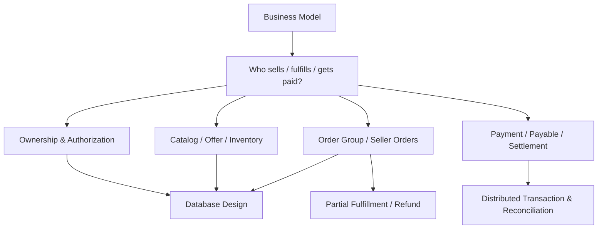

## Key Takeaways

1. **B2B/B2C/C2C, D2C và 1P/3P là các trục phân loại khác nhau.** Đừng chọn schema dựa trên một nhãn marketing.
2. Marketplace là bài toán **đa chủ thể và ownership**, không chỉ “website có nhiều sản phẩm”.
3. Product, variant, offer và inventory cần được phân biệt; cùng SKU có thể có nhiều seller offer và tồn kho khác nhau.
4. Một checkout có thể tạo một order group và nhiều seller order; giao hàng, refund, payout có thể diễn ra không đồng thời.
5. `PAID` không có nghĩa `DELIVERED`; `DELIVERED` không có nghĩa tiền đã `PAYOUT_COMPLETED`.
6. Seller authorization và dữ liệu chéo tenant là **business invariant**, không phải chi tiết UI.
7. Hãy làm đúng domain trong modular monolith trước; microservices, message broker và distributed transactions chỉ xuất hiện khi bài toán cần.

---

## Tài liệu tham khảo và giới hạn áp dụng

- **[S1] Stripe Connect — nền tảng/marketplace, các payment flows và payouts:** https://stripe.com/connect
- **[S2] Stripe Docs — Separate charges and transfers:** https://docs.stripe.com/connect/separate-charges-and-transfers
- **[S3] Stripe — Marketplace payment processing guide (updated 2026-05-05):** https://stripe.com/resources/more/marketplace-payment-processing-apis
- **[S4] AWS — Guidance for Third-Party Marketplace on AWS:** https://docs.aws.amazon.com/solutions/third-party-marketplace-on-aws/

Tài liệu bên trên được dùng để kiểm chứng **khái niệm marketplace, seller fulfillment, luồng tiền nhiều bên**. Ví dụ schema, amount, state machine và quyết định domain trong chương là mô phỏng để học thiết kế, không phải cam kết rằng một provider hay một quốc gia hỗ trợ tất cả các luồng trong ví dụ.

**Chương tiếp theo:** Chapter 03 — Domain Modeling: Product, SKU, Offer, Inventory, Cart, Order, Payment và ranh giới trách nhiệm giữa chúng.
