# INSIDE E-COMMERCE
## Volume 1 — Understanding E-commerce
### Chapter 03 — Domain Modeling: Từ nghiệp vụ đến mô hình dữ liệu và backend

> **Câu hỏi dẫn đường:** Tại sao một bảng `products(id, name, price, stock)` và `orders(id, user_id, product_id, status)` có thể chạy trong demo nhưng trở nên khó sửa khi thêm màu sắc, nhiều seller, nhiều kho, voucher, thanh toán lại và hoàn hàng một phần?

> **Phạm vi:** Chúng ta tiếp tục dự án giả định **Hoàng Phone → Hoàng Marketplace** của chương 01–02. Ví dụ dùng PostgreSQL và Java/Spring Boot, không tuyên bố đây là schema duy nhất. Quy tắc thuế, hoàn tiền và thanh toán thực tế phụ thuộc mô hình vận hành. Những đoạn code được ghi “minh họa” không phải repository production hoàn chỉnh.

## Sau chương này, bạn có thể

- Chuyển phát biểu kinh doanh thành **ubiquitous language, use cases, rules và invariants** trước khi vẽ bảng.
- Phân biệt **Product, Product Variant/SKU, Seller Offer, Stock, Reservation, Cart, Order Group, Seller Order, Order Item, Payment Attempt**.
- Nhận ra **Entity, Value Object, Aggregate, Aggregate Root, Bounded Context và Domain Event**; biết khi nào không cần áp dụng DDD đầy đủ.
- Xác định ranh giới transaction: dữ liệu nào cần nhất quán tức thì; dữ liệu nào có thể đồng bộ qua sự kiện.
- Viết schema PostgreSQL mẫu có PK/FK/UNIQUE/CHECK, snapshot giá, bảng reservation và chống trùng request.
- Tổ chức một Spring Boot **modular monolith** không biến mọi bảng thành REST CRUD public.
- Nhận biết lỗ hổng trong mô hình qua test scenario và câu hỏi của một system designer.

---

## 3.1. Bad case: bắt đầu bằng bảng, không bắt đầu bằng nghiệp vụ

Một developer nhận yêu cầu “xây website bán điện thoại”, rồi viết ngay:

```sql
CREATE TABLE products (
  id BIGINT PRIMARY KEY,
  name TEXT NOT NULL,
  price NUMERIC(18, 2) NOT NULL,
  stock INTEGER NOT NULL
);

CREATE TABLE orders (
  id BIGINT PRIMARY KEY,
  user_id BIGINT NOT NULL,
  product_id BIGINT NOT NULL,
  status TEXT NOT NULL
);
```

Với demo “mỗi đơn mua một sản phẩm, một người bán, một kho, không khuyến mãi”, nó có thể đủ để bắt đầu. Nhưng **database đang ngầm chứa một tập giả định nghiệp vụ**:

1. `products.price`: chỉ có một mức giá cho mọi seller và mọi kênh bán.
2. `products.stock`: chỉ có một con số tồn kho, không phân biệt kho hay hàng đã giữ.
3. `orders.product_id`: mỗi đơn chỉ có đúng một mặt hàng.
4. `orders.status`: một trạng thái đủ mô tả thanh toán, đóng gói, vận chuyển và hoàn hàng.
5. Không có dữ liệu thời điểm mua; giá đổi sẽ khiến ta khó giải thích tổng tiền của đơn cũ.

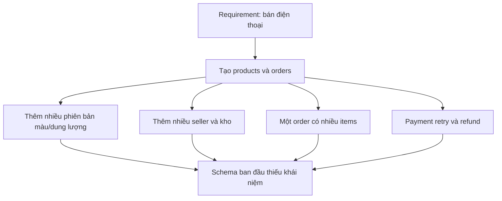

**Nỗi đau không phải SQL viết sai. Nỗi đau là ta đã thiết kế dữ liệu khi chưa biết nó phải đại diện cho hiện thực nào.**

### Một thực hành tốt hơn

Trước mỗi entity, hỏi: “Ai ra quyết định? Quy tắc nào không được phá vỡ? Đối tượng này sống bao lâu? Có thay đổi độc lập với đối tượng khác không?”

| Phát biểu từ business | Khái niệm cần xác định | Câu hỏi thiết kế |
|---|---|---|
| “Cùng điện thoại, mỗi màu có số lượng khác nhau” | Variant / SKU | Cái gì định danh từng phiên bản bán được? |
| “Seller A và B bán cùng một máy, giá khác nhau” | Offer | Giá thuộc catalog chung hay lời chào bán của seller? |
| “Hàng đã giữ 15 phút” | Reservation | Giữ bao nhiêu, đến lúc nào, ai sở hữu việc giải phóng? |
| “Giỏ có hàng của hai seller” | Order Group / Seller Order | Ai thực hiện từng phần đơn hàng? |
| “Khách đã trả tiền nhưng chưa giao hàng” | Payment / Fulfillment | Vì sao không thể dùng một status duy nhất? |

## 3.2. Ubiquitous Language — thống nhất từ vựng trước khi code

Trong Domain-Driven Design, **ubiquitous language** là ngôn ngữ chung được dùng nhất quán giữa business và engineering trong một phạm vi nghiệp vụ. Nó không đồng nghĩa “dịch mọi tên sang tiếng Anh”, mà là làm rõ nghĩa của từ.

Ví dụ business nói: “Còn 10 máy”. Engineer phải hỏi: 10 máy **thực tế trong kho**, 10 máy **được phép bán**, hay 10 máy **đã trừ lượng giữ hàng**?

| Từ trong dự án | Định nghĩa vận hành trong ví dụ |
|---|---|
| Product | Thông tin chung về một dòng hàng được nhận diện trong catalog |
| Variant / SKU | Biến thể định danh đơn vị hàng có thể bán: màu + dung lượng |
| Seller Offer | Lời chào bán của một seller cho một variant: giá và điều kiện bán |
| On-hand Stock | Số lượng vật lý ghi nhận trong kho theo định nghĩa kế toán kho của hệ thống |
| Reserved Stock | Số lượng đang được giữ cho yêu cầu mua hợp lệ |
| Available Stock | Khả năng tiếp tục bán được suy ra từ các số liệu tồn kho |
| Cart Item | Ý định mua; thường chưa giữ tồn kho |
| Order Item | Dòng hàng trong giao dịch đã được chốt, có dữ liệu snapshot |
| Payment Attempt | Một lần thử thực hiện thanh toán cho đơn/nhóm đơn |

**Lưu ý thực tế:** Nhiều doanh nghiệp dùng “SKU” để chỉ mã hàng do seller tự đặt, trong khi một marketplace có thể dùng mã variant chung riêng với seller SKU. Ta phải ghi rõ hai namespace, không tranh luận rằng chỉ có một định nghĩa SKU duy nhất.

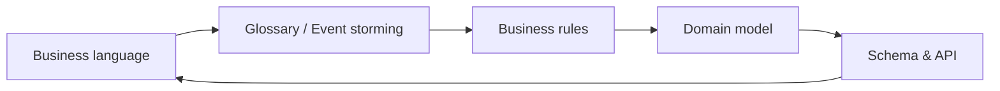

### Kỹ thuật hỏi để khám phá domain

Với mọi khái niệm, hỏi năm câu: **nó là gì; ai sở hữu; khi nào sinh ra; khi nào thay đổi; khi nào chấm dứt**. Ví dụ `Reservation` sinh ra lúc checkout được chấp nhận, tồn tại trong trạng thái `ACTIVE`, sau đó chuyển `CONFIRMED`, `RELEASED` hoặc `EXPIRED` theo quy tắc. Có một `reservation_id` riêng sẽ giúp trace và chống hoàn hàng hai lần.

## 3.3. Entity khác Value Object ra sao?

### Entity: thứ cần theo dõi danh tính

Hai đơn hàng có cùng customer, số tiền và sản phẩm vẫn là **hai đơn khác nhau** vì có `order_id` khác nhau. Danh tính và vòng đời là trọng tâm. Tương tự, hai Payment Attempt cùng số tiền vẫn khác nhau.

### Value Object: thứ được định nghĩa bằng giá trị

`Money(10000000, "VND")` và `Money(10000000, "VND")` có thể được coi là cùng một giá trị. `ShippingAddressSnapshot` thường được lưu như giá trị trong order vì sau khi khách thay đổi sổ địa chỉ, địa chỉ giao hàng của order đã chốt không được tự thay đổi.

| Khái niệm | Thường mô hình hóa | Lý do |
|---|---|---|
| Order | Entity | Có identity, trạng thái, lịch sử |
| Order Item | Entity con của Order Aggregate trong ví dụ | Cần định danh dòng hàng để hủy/hoàn một phần |
| Payment Attempt | Entity | Có vòng đời và mã giao dịch riêng |
| Money | Value Object | Giá trị + đơn vị tiền; arithmetic phải đúng currency |
| Address trong Order | Value Object snapshot | Không tự thay đổi khi profile đổi |
| Address Book Entry của khách | Có thể là Entity | Nếu sửa/xóa/quản lý theo ID qua thời gian |

**Không đánh đồng “Entity trong DDD” với `@Entity` JPA.** `@Entity` là mapping cho persistence; một domain Value Object có thể được lưu nhiều cột, và một domain Entity có thể cần nhiều bảng để biểu diễn. Tài liệu Microsoft nhấn mạnh identity của Entity và đặc tính không có danh tính độc lập của Value Object [R1, R2].

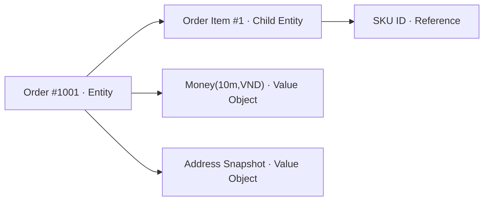

### Money: tránh `double`

Số tiền phải được tính bằng kiểu có độ chính xác phù hợp (`BigDecimal` trong Java và `NUMERIC` trong PostgreSQL) hoặc đơn vị tiền nguyên nhỏ nhất theo chính sách. `double` là floating point nhị phân, không phù hợp để lưu kết quả thanh toán chính xác [R4]. `Money` phải mang theo currency; không được cộng VND với USD mà bỏ qua quy đổi và tỷ giá.

Ví dụ Value Object tối giản:

```java
public record Money(BigDecimal amount, String currency) {
    public Money {
        Objects.requireNonNull(amount);
        Objects.requireNonNull(currency);
        if (currency.isBlank()) throw new IllegalArgumentException("currency");
    }

    public Money add(Money other) {
        if (!currency.equals(other.currency())) {
            throw new IllegalArgumentException("Currency mismatch");
        }
        return new Money(amount.add(other.amount()), currency);
    }
}
```

Code là minh họa ý tưởng; production còn phải chuẩn hóa currency, scale, rounding và giới hạn số tiền.

## 3.4. Tách Product / Variant / Offer / Inventory / Order Snapshot

Đây là bản nâng cấp mô hình từ chương 02. Hãy tưởng tượng mẫu Smartphone X được bán bởi hai seller:

| Thành phần | Giá trị ví dụ |
|---|---|
| Product | Smartphone X |
| Variant | Black / 256GB |
| Offer A | Seller A, 10.000.000 VND |
| Offer B | Seller B, 9.800.000 VND |
| Inventory A | Seller A ở kho HN: 8 còn bán được |
| Inventory B | Seller B ở kho HCM: 2 còn bán được |

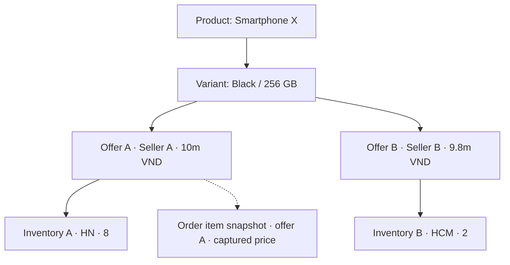

**Vì sao `price` không nhất thiết đặt trong `products`?** Cùng một định danh catalog có thể xuất hiện trong nhiều lời chào bán khác nhau. Giá có thể phụ thuộc seller, thời điểm, đối tượng mua, số lượng hay chương trình giảm giá. Mô hình chi tiết của Pricing Engine sẽ được khai thác sâu hơn ở chương 04.

**Vì sao inventory không đơn giản là `products.stock`?** Một offer có thể cung cấp từ nhiều kho. Một kho có thể có số hàng on-hand nhưng một phần đã reserved. Tồn kho thuộc **đơn vị có thể bán và nguồn cung** chứ không thuộc mô tả sản phẩm chung.

**Vì sao Order Item lưu snapshot?** `offer_id` chỉ là tham chiếu về đối tượng gốc. Order Item phải ghi `sku_code_snapshot`, `title_snapshot`, `unit_price`, `currency`, discount/tax basis phù hợp và số lượng để tái dựng giao dịch lịch sử. Không lấy trực tiếp `offers.price` hiện tại để tính lại đơn cũ.

> Với sản phẩm đồ cũ độc nhất, có thể không cần canonical product matching. `Listing` có thể đại diện trực tiếp cho hàng bán; mô hình phải phục vụ business, không bắt business chạy theo sơ đồ mẫu.

## 3.5. Quan hệ giữa các domain: không phải mọi mũi tên là foreign key

Có ít nhất bốn loại quan hệ cần phân biệt:

1. **Composition trong aggregate:** `Order` quản lý `OrderItem`.
2. **Identity reference giữa aggregates:** `OrderItem` lưu `offerId` để biết mua lời chào bán nào, nhưng dữ liệu hợp đồng đã chốt nằm trong snapshot.
3. **Database foreign key:** đảm bảo ID liên quan tồn tại nếu cùng DB và phù hợp lifecycle; không thay được mọi business rule.
4. **Integration relationship:** Order thông báo Payment/Fulfillment qua event/API; không nhất thiết dùng FK hoặc chung database.

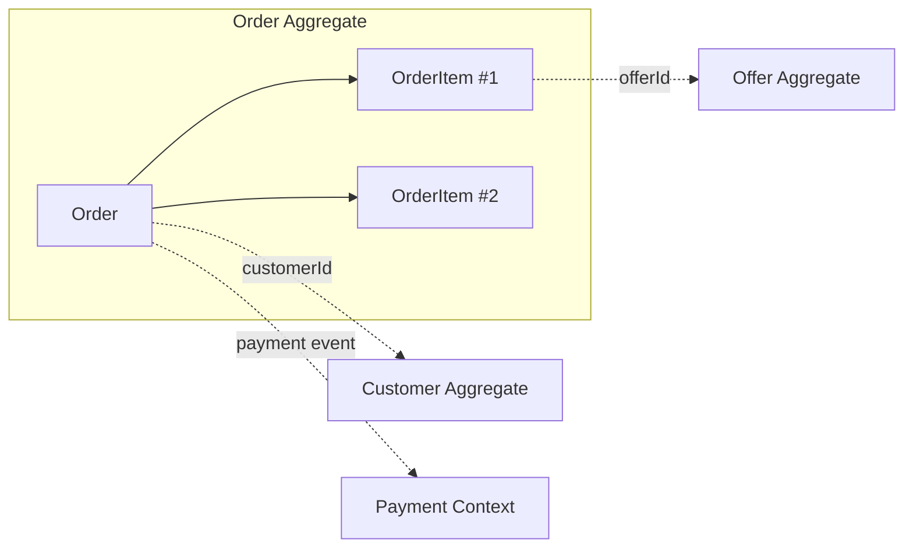

### Bad case: JPA graph xuyên toàn bộ hệ thống

Nếu `Order` có `@ManyToOne Customer`, mỗi item `@ManyToOne Offer`, Offer `@ManyToOne Product`, Product `@OneToMany Reviews` và API serialize nguyên entity, bạn có thể gặp query N+1, vòng lặp JSON, lazy loading ngoài transaction và coupling giữa module.

Thay vào đó, request/response API nên dùng DTO rõ mục đích; aggregate liên hệ qua ID khi thích hợp; truy vấn đọc có thể join/projection riêng, không bị buộc phải đi qua domain entity graph.

## 3.6. Bounded Context: cùng một từ có thể mang nhiều ý nghĩa

Trong một E-commerce, từ `Product` xuất hiện ở nhiều nơi nhưng không phải chỗ nào cũng cần cùng một model:

| Context | Cần biết gì về sản phẩm? |
|---|---|
| Catalog | Tên, mô tả, ảnh, thuộc tính, category |
| Pricing | Đối tượng định giá, currency, chính sách và phiên bản giá |
| Inventory | Mã hàng/offer và nguồn cung theo kho |
| Ordering | Snapshot mặt hàng mà khách đã mua |
| Search | Document được tối ưu tìm kiếm, có thể chậm hơn Catalog |

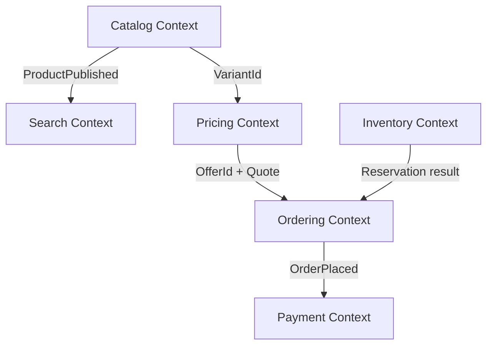

**Bounded Context không đồng nghĩa microservice.** Trong dự án đầu tiên, năm context vẫn có thể nằm trong một Spring Boot và một database; boundaries thể hiện ở package/module, API nội bộ, quyền ghi và quy tắc phụ thuộc. Tài liệu Microsoft nêu việc tách model theo context, và xem microservice là một lựa chọn triển khai boundary chứ không phải định nghĩa của domain [R1, R2].

### Context ownership matrix

| Dữ liệu / quyết định | Owner trong thiết kế ví dụ |
|---|---|
| Product description | Catalog |
| Seller offer price | Pricing / Offer management theo quyết định team |
| On-hand và reserved quantity | Inventory |
| Confirmed order total | Ordering |
| Provider transaction status | Payments |
| Parcel / shipping label | Fulfillment |

**Quy tắc:** cùng một dữ liệu có thể được sao chép phục vụ READ nhưng không nên có nhiều nơi tùy ý chỉnh cùng một sự thật nghiệp vụ.

## 3.7. Aggregate và Aggregate Root: từ “cụm bảng” sang “ranh giới tính đúng đắn”

Một Aggregate là nhóm đối tượng nghiệp vụ phải giữ **một tập invariant nhất quán** khi được thay đổi. Aggregate Root là cửa vào cho các thao tác cập nhật nhóm đó. Nó có thể chỉ có **một entity**, không bắt buộc là 10 bảng. Đây là cách tài liệu tactical DDD mô tả transactional consistency boundaries [R1, R2].

Ví dụ với `Order`:

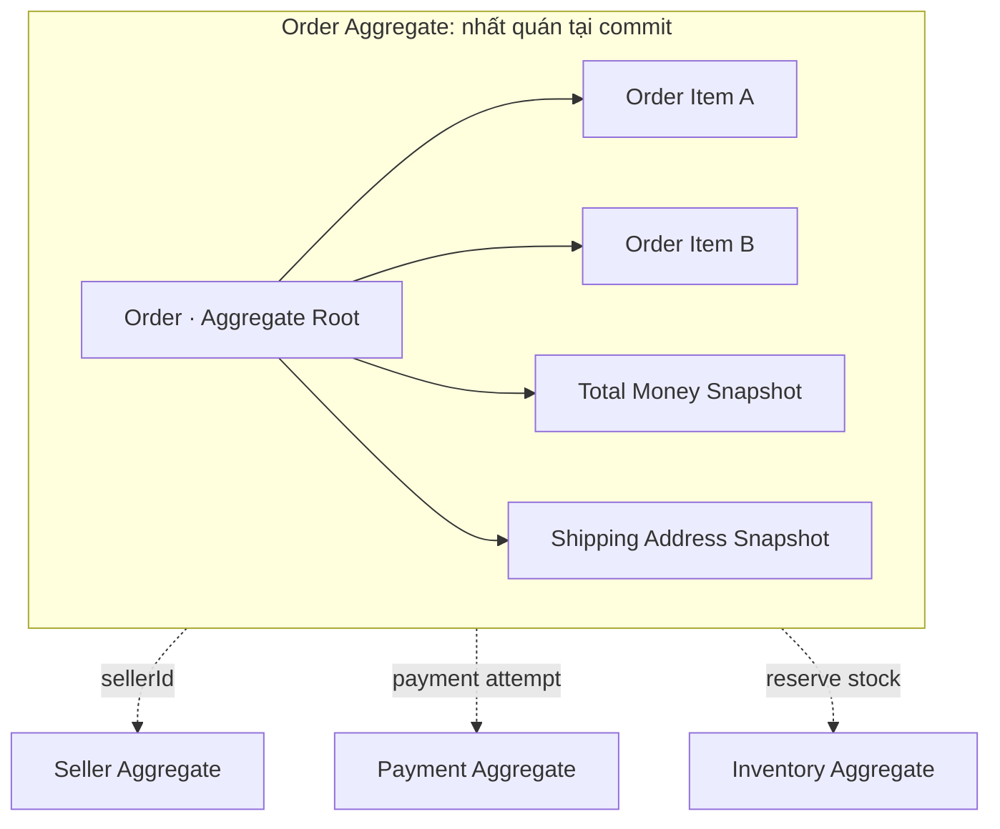

**Các invariant ví dụ trong Order:**

- Không tạo order không có item nếu business không cho phép.
- `quantity > 0` cho mỗi dòng hàng.
- Các item và tổng tiền là dữ liệu snapshot nhất quán theo chính sách tính tiền.
- Không chuyển `CANCELLED → PAID` chỉ bằng một lệnh tùy ý; mọi state transition phải được định nghĩa.

**Inventory aggregate** bảo vệ bất biến riêng: `reserved_quantity <= on_hand_quantity` và không được trừ/giải phóng vượt số lượng. Lưu ý, CHECK trên stock row không tự bảo đảm tổng `quantity` ở bảng reservations luôn bằng `reserved_quantity`; các bước tạo, xác nhận và giải phóng reservation phải cập nhật đồng bộ theo transaction. **Payment aggregate** bảo vệ chống xử lý trùng provider transaction và tính hợp lệ của payment state.

### Có phải một `@Transactional` = một Aggregate?

**Không.** Aggregate là ranh giới mô hình nghiệp vụ. Database transaction là công cụ persistence để giữ tính nhất quán. Một use case có thể cần cập nhật nhiều aggregates trong cùng một database transaction, chẳng hạn tạo Order và đặt Reservation, nếu phù hợp độ phức tạp và lock behavior. Điều đó không bắt hai aggregates phải gộp thành một object graph. Khi đã tách database/service, ta không còn mặc định một local ACID transaction bao phủ được mọi nơi.

## 3.8. Business Invariants: chuyển từ câu nói thành luật có thể kiểm thử

Nhiều developer viết `validate()` rải rác trong controller, rồi tưởng rằng đã bảo vệ dữ liệu. Câu hỏi đúng là: **điều kiện nào phải đúng kể cả khi 20 Pod và 100 Worker gọi đồng thời?**

| Invariant | Cách bảo vệ khả thi | Ranh giới |
|---|---|---|
| Offer price không âm | Domain validation + DB CHECK | Offer |
| Stock reserved không vượt on-hand | Atomic DB update + CHECK | Inventory row |
| Order item quantity dương | Domain validation + DB CHECK | Order |
| Client retry không tạo đơn lần hai | Idempotency key + UNIQUE + transaction | Ordering |
| Order total không dùng giá hiện hành để tính lại | Price snapshot + server-side calculation | Ordering |
| Một reservation không được release hai lần | Conditional state transition + transaction | Inventory |
| Seller không sửa offer seller khác | Authenticated actor + ownership check | Offer management |

### Check constraint đủ để ngăn overselling?

Với hai cột trên **cùng một dòng stock**, CHECK là lớp chặn cuối cùng hữu ích:

```sql
CHECK (on_hand_quantity >= 0),
CHECK (reserved_quantity >= 0),
CHECK (reserved_quantity <= on_hand_quantity)
```

Nhưng nếu dữ liệu tổng nằm rải ở nhiều dòng hay nhiều bảng, PostgreSQL `CHECK` không được dùng như cơ chế đảm bảo điều kiện xuyên bảng. Khi cần, dùng transaction, FK/UNIQUE, atomic update, trigger đã kiểm chứng hoặc thiết kế lại trạng thái trung tâm [R3].

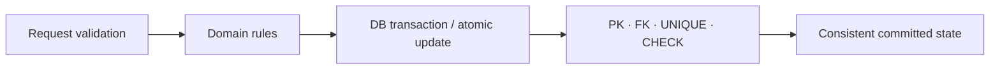

## 3.9. State Machine: `status` là hợp đồng nghiệp vụ, không phải chuỗi tùy ý

Nếu mọi module cùng gọi `order.setStatus("SUCCESS")`, mỗi team sẽ hiểu khác nhau: đã tạo đơn, đã trả tiền hay đã giao xong? Hãy dùng từ có nghĩa và mô hình trạng thái rõ.

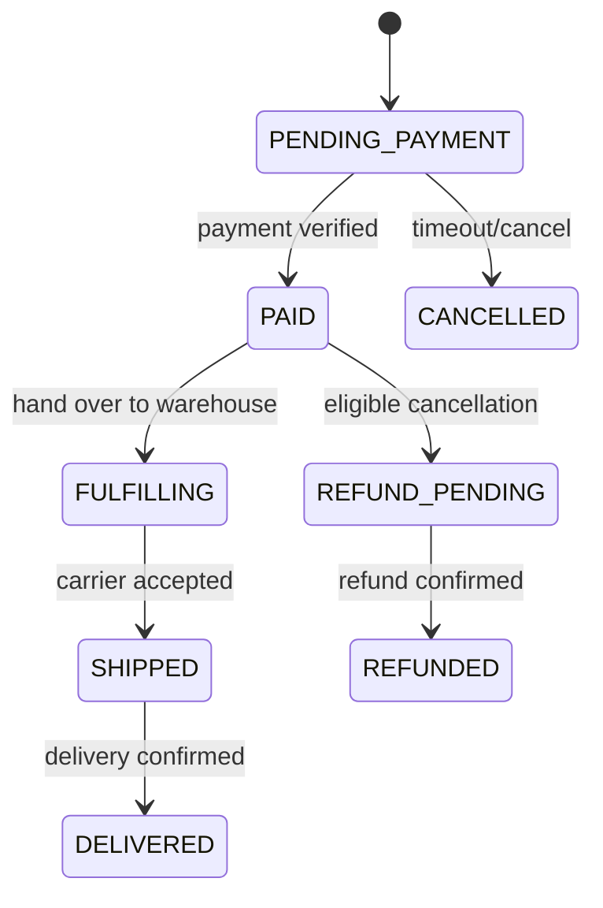

Sơ đồ trên **chỉ minh họa** một order flow; không đại diện mọi chính sách hủy, hoàn một phần, COD hoặc shipment nhiều kiện. Với marketplace, nên tách `order_group`, `seller_order`, `payment_attempt`, `shipment`, `refund` thành state machine có trách nhiệm riêng.

### Bad case: kết hợp trạng thái không hợp lệ

Ví dụ `order.payment_status = PAID`, `order.fulfillment_status = NOT_STARTED` là trạng thái **có thể hoàn toàn hợp lệ**. Nếu dùng một cột `status`, bạn dễ đánh mất thông tin quan trọng.

## 3.10. Thiết kế Database Schema tham khảo cho Hoàng Marketplace

Chúng ta chọn mô hình học tập: **một order group có tối đa một seller order cho mỗi seller; mỗi order item có tối đa một reservation trong một kho; tất cả trong một PostgreSQL**. Đây là giới hạn có chủ đích để schema hiểu được. Khi một item chia nhiều kho hoặc nhiều shipment, cần mở rộng reservation/allocation tương ứng.

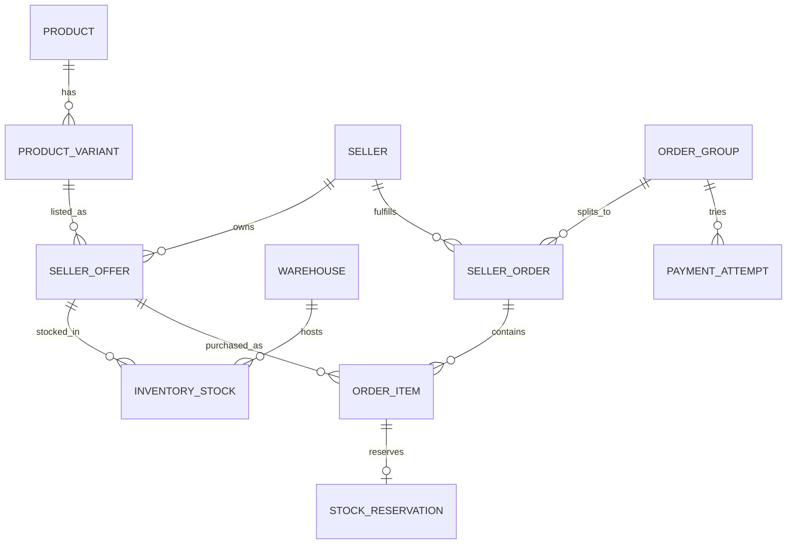

### 3.10.1. Bộ bảng tối thiểu và quyền sở hữu

| Bảng | ID quan trọng | Điểm thiết kế |
|---|---|---|
| `products` | product_id | Canonical catalog identity |
| `product_variants` | variant_id, sku_code | Một biến thể thuộc một product |
| `sellers` | seller_id | Chủ sở hữu offer/order phần seller |
| `seller_offers` | offer_id, seller_id, variant_id | Giá của lời chào bán |
| `warehouses` | warehouse_id, seller_id | Kho thuộc seller trong ví dụ |
| `inventory_stock` | offer_id + warehouse_id | Một stock row cho nguồn cung |
| `order_groups` | order_group_id, customer_id | Một checkout của khách |
| `seller_orders` | seller_order_id, group_id, seller_id | Một seller chịu trách nhiệm phần đơn |
| `order_items` | order_item_id, seller_order_id, offer_id | Snapshot dòng hàng |
| `stock_reservations` | reservation_id, order_item_id | Giữ hàng có lifecycle |
| `payment_attempts` | payment_attempt_id, group_id | Mỗi lần thử thanh toán |

### 3.10.2. SQL có thể kiểm tra trong PostgreSQL

File SQL đầy đủ đi kèm trong `labs/chapter-03/schema.sql`. Trích đoạn quan trọng:

```sql
CREATE TABLE seller_offers (
  offer_id BIGINT GENERATED ALWAYS AS IDENTITY PRIMARY KEY,
  seller_id BIGINT NOT NULL REFERENCES sellers(seller_id),
  variant_id BIGINT NOT NULL REFERENCES product_variants(variant_id),
  unit_price NUMERIC(18, 2) NOT NULL CHECK (unit_price >= 0),
  currency CHAR(3) NOT NULL,
  status TEXT NOT NULL CHECK (status IN ('DRAFT','ACTIVE','PAUSED')),
  UNIQUE (offer_id, seller_id)
);

CREATE TABLE inventory_stock (
  offer_id BIGINT NOT NULL,
  seller_id BIGINT NOT NULL,
  warehouse_id BIGINT NOT NULL,
  on_hand_quantity INTEGER NOT NULL CHECK (on_hand_quantity >= 0),
  reserved_quantity INTEGER NOT NULL DEFAULT 0 CHECK (reserved_quantity >= 0),
  PRIMARY KEY (offer_id, warehouse_id),
  FOREIGN KEY (offer_id, seller_id)
    REFERENCES seller_offers(offer_id, seller_id),
  FOREIGN KEY (warehouse_id, seller_id)
    REFERENCES warehouses(warehouse_id, seller_id),
  CHECK (reserved_quantity <= on_hand_quantity)
);
```

Composite FK bảo vệ để tồn kho của Seller A không bị đặt vào kho Seller B trong mô hình giả định. Việc seller được phép dùng fulfillment warehouse chung sẽ yêu cầu sửa quy tắc sở hữu này; không nên giữ cứng khi business thay đổi.

### 3.10.3. Giá chốt trong Order Item

```sql
CREATE TABLE order_items (
  order_item_id BIGINT GENERATED ALWAYS AS IDENTITY PRIMARY KEY,
  seller_order_id BIGINT NOT NULL REFERENCES seller_orders(seller_order_id),
  offer_id BIGINT NOT NULL REFERENCES seller_offers(offer_id),
  sku_code_snapshot TEXT NOT NULL,
  title_snapshot TEXT NOT NULL,
  quantity INTEGER NOT NULL CHECK (quantity > 0),
  unit_price_snapshot NUMERIC(18,2) NOT NULL
    CHECK (unit_price_snapshot >= 0),
  currency CHAR(3) NOT NULL
);
```

**Lưu ý consistency:** chỉ có FK `offer_id` vẫn chưa đảm bảo offer và seller order thuộc cùng seller. Ở schema đầy đủ, `seller_id` trên `order_items` được xác minh qua composite FK đến cả offer và seller order. Đừng coi việc join đúng ở một API là bảo vệ toàn hệ thống.

## 3.11. Transaction Boundary trong use case `PlaceOrder`

### Ranh giới nguyên tử nếu Order và Inventory cùng DB

Từ request, server resolve Offer và current quote; xác thực seller/availability; tạo Order; giữ stock; commit. Các thay đổi liên quan cần được quản lý bằng một local transaction phù hợp. **Không gọi HTTP Payment Gateway khi đang giữ row lock trong transaction**.

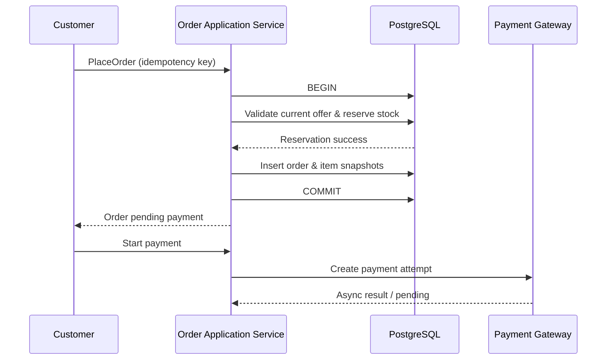

Một cách trừ **available** để tăng **reserved** an toàn tại PostgreSQL:

```sql
UPDATE inventory_stock
SET reserved_quantity = reserved_quantity + :quantity
WHERE offer_id = :offer_id
  AND warehouse_id = :warehouse_id
  AND on_hand_quantity - reserved_quantity >= :quantity
RETURNING offer_id, on_hand_quantity, reserved_quantity;
```

Nếu không có dòng trả về, không được coi là đã giữ thành công. PostgreSQL xử lý UPDATE đồng thời với row locking và kiểm tra điều kiện thích hợp khi tiếp tục, nhưng toàn bộ use case vẫn phải thiết kế retry/timeout và constraint đúng [R5]. Khi reservation thực sự được tiêu thụ để xuất hàng theo chính sách ví dụ, `on_hand_quantity` và `reserved_quantity` phải cùng giảm đúng `quantity` trong một transaction kèm chuyển trạng thái reservation. Nếu đơn bị hủy trước khi xuất hàng, chỉ `reserved_quantity` giảm khi giải phóng thành công; `on_hand_quantity` không đổi.

### Khi nào không nên gộp vào một Aggregate?

Order và Stock có lifecycle khác nhau. Một Order cần giữ stock cho từng line, nhưng stock có thể bị điều chỉnh bởi nhập kho, hỏng hàng, xuất kho và đơn khác. Gộp tất cả thành một `Order` object cực lớn không làm transaction “an toàn hơn”; nó tạo coupling và có thể tăng contention.

## 3.12. Modular Monolith trong Spring Boot

Chọn phân chia package theo **business capability**, không chia toàn dự án thành các package toàn cục `controller`, `service`, `repository`, `entity` khiến code của mỗi use case rải khắp nơi.

```text
com.hoang.marketplace/
├── catalog/
│   ├── api/
│   ├── application/
│   ├── domain/
│   └── infrastructure/
├── offers/
├── inventory/
├── ordering/
│   ├── api/PlaceOrderController.java
│   ├── application/PlaceOrderService.java
│   ├── domain/Order.java
│   ├── domain/OrderItem.java
│   ├── domain/Money.java
│   └── infrastructure/OrderJpaRepository.java
├── payments/
└── fulfillment/
```

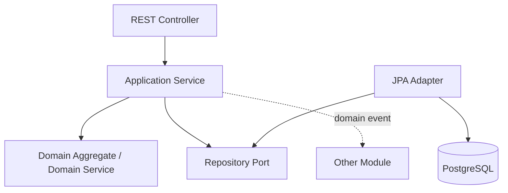

| Layer | Nên làm | Không nên làm |
|---|---|---|
| API / Controller | Parse request, auth boundary, map DTO/status | Tự trừ stock và sửa state machine |
| Application Service | Điều phối use case, transaction, idempotency | Nhồi toàn bộ invariant vào `if` rải rác |
| Domain | Business rule, state transitions, Value Object | Phụ thuộc HTTP, controller, Spring MVC |
| Infrastructure | SQL, JPA, broker, external provider | Quyết định ai được phép mua dựa trên input chưa xác thực |

DDD **không ép tất cả module phải có rich domain model**. Catalog CRUD thuần túy có thể đơn giản hơn; Inventory và Ordering thường chứa nhiều invariant và hành vi cần mô hình hóa rõ. Tài liệu Microsoft cũng lưu ý DDD pattern đặc biệt hữu ích với domain phức tạp, còn CRUD đơn giản không cần bị over-engineer [R1].

### Java Domain ví dụ: không cho ai tùy ý đổi trạng thái

```java
public final class Order {
    private final long id;
    private OrderStatus status;

    public void markPaid() {
        if (status != OrderStatus.PENDING_PAYMENT) {
            throw new IllegalStateException("Invalid transition");
        }
        status = OrderStatus.PAID;
    }

    public void cancelBeforePayment() {
        if (status != OrderStatus.PENDING_PAYMENT) {
            throw new IllegalStateException("Cannot cancel here");
        }
        status = OrderStatus.CANCELLED;
    }
}
```

Ví dụ này chỉ mô tả invariant trạng thái. Hệ thống thực tế cần map trạng thái Payment verified, xử lý đồng thời, nhiều trạng thái hủy/hoàn tiền, lưu vết và persistence.

## 3.13. Domain Events: thứ gì đã xảy ra, không phải một lệnh SQL

`OrderPlaced`, `StockReserved`, `PaymentVerified`, `ReservationExpired` là các sự kiện có nghĩa nghiệp vụ. `row_inserted`, `table_updated` chỉ nói về persistence.

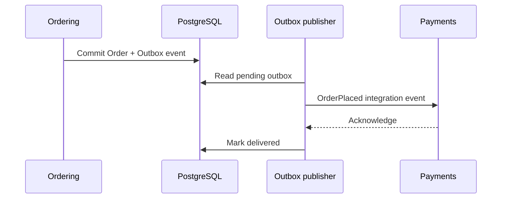

Với các module cùng process và database, bạn có thể xử lý một số domain event nội bộ trong use case. Nếu dùng broker hoặc service bên ngoài, phải nghĩ đến **DB committed nhưng event không gửi được**. Transactional Outbox là một hướng giải quyết: ghi sự kiện trong cùng DB transaction, rồi xuất bản bất đồng bộ. Consumer vẫn cần idempotent vì event có thể được gửi lại.

Đừng làm toàn bộ event-driven ngay chương này; chúng ta dùng Domain Event để diễn tả một sự thật nghiệp vụ, còn reliability kỹ thuật sẽ học sâu ở Volume 5–6.

## 3.14. Failure scenarios: domain model tốt giúp phát hiện lỗi trước khi scale

| Failure scenario | Thiếu trong mô hình | Cách phát hiện / phòng vệ |
|---|---|---|
| Khách đổi địa chỉ profile sau khi đặt | Address snapshot | Test order address không đổi |
| Seller B sửa offer của Seller A | Owner boundary | AuthZ test khác seller → 403 |
| Order cũ đổi tổng tiền khi offer đổi giá | Order item price snapshot | Test update offer không đổi order |
| Hai checkout giữ cùng stock cuối | Atomic reservation | Concurrency integration test |
| Client retry sau timeout tạo order thứ hai | Idempotency | UNIQUE(customer_id, key) + replay result |
| Worker giải phóng một reservation hai lần | Reservation lifecycle | Conditional `ACTIVE → RELEASED` và update stock cùng transaction |
| Offer thuộc seller A nhưng order item gán seller B | Cross-table ownership constraint | Composite FK hoặc domain verification + integration test |
| Một seller order hủy nhưng group báo hoàn tất | Group state derived incorrectly | Test partial-failure aggregation |

### Quiz phân biệt lỗi về model và lỗi về infrastructure

1. Một cột `stock` không phân biệt kho: lỗi mô hình.
2. PostgreSQL hết connection: vấn đề vận hành/capacity, có thể bị khuếch đại bởi schema/query tệ.
3. Payment callback gửi hai lần tạo hai lần hoàn tiền: model/idempotency + xử lý concurrency.
4. Search index cập nhật chậm vài giây nhưng order check lại current price: có thể là eventual consistency được phép theo business.

## 3.15. Engineering Lab — từ schema ngây thơ đến domain có thể kiểm chứng

### Điều kiện đầu vào

- Hoàng Marketplace: hai seller bán cùng một variant; mỗi seller có một kho.
- Giỏ có thể chứa hàng của hai seller.
- Checkout tạo order group + seller order + order items.
- Giá đã chốt phải không đổi khi offer thay đổi.
- Một reservation ở một kho có thể được release tối đa một lần.

### Lab A — Vẽ context map

Tạo sơ đồ Catalog, Offers, Inventory, Ordering, Payments, Fulfillment. Với mỗi mũi tên, ghi rõ đây là API query, command, event hay identity reference. Không vẽ tất cả thành quan hệ FK.

### Lab B — Chạy SQL mẫu

File `labs/chapter-03/schema.sql` chứa schema và các constraint; file `queries.sql` có câu UPDATE đặt giữ hàng, release và truy vấn snapshot. Chạy thử một lỗi `reserved_quantity > on_hand_quantity` và xác nhận CHECK từ chối.

### Lab C — Concurrency test

Seed stock: on_hand = 1, reserved = 0. Cho hai transaction đồng thời chạy UPDATE giữ 1. Kỳ vọng: chỉ một request nhận một dòng `RETURNING`, request còn lại nhận zero rows, sau commit stock không âm và không overselling.

### Lab D — State transition test

Viết test cho `PENDING_PAYMENT → PAID` hợp lệ; `CANCELLED → PAID` bị từ chối nếu chưa có quy trình phục hồi đặc biệt. Đừng chỉ test HTTP response; test invariant trong domain.

### Lab E — Architecture review

Trả lời bằng lời, không cần code: Tại sao Order lưu `offer_id` và cả `unit_price_snapshot`? Vì sao Payment Attempt tách khỏi Order? Khi nào một `Address` là Value Object, khi nào trở thành Entity? Nếu sau này seller dùng kho fulfillment chung, constraint nào trong schema hiện tại phải thay đổi?

### Checklist hoàn thành chương

- [ ] Tôi phân biệt Product, Variant, Offer, Inventory và Order snapshot.
- [ ] Tôi biết Entity không phải lúc nào cũng bằng bảng hoặc `@Entity`.
- [ ] Tôi xác định được ít nhất bốn business invariants có thể viết test.
- [ ] Tôi biết Aggregate là consistency boundary, không phải tên khác của microservice.
- [ ] Tôi biết khi nào dùng ID reference, FK và event.
- [ ] Tôi hiểu local DB transaction không bao phủ tự động payment provider.
- [ ] Tôi có thể giải thích vì sao dữ liệu seller cần owner boundary.

---

## Knowledge Map

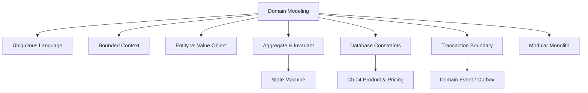

## Key Takeaways

1. **Business rules → domain model → persistence/API**, không đảo ngược và để bảng quyết định nghiệp vụ.
2. Product, Variant, Offer, Inventory, Order Item Snapshot là những khái niệm khác nhau; trộn chúng khiến giá, kho, lịch sử đơn hàng sai.
3. Entity cần identity; Value Object được nhận diện bằng giá trị. `@Entity` JPA chỉ là cơ chế persistence.
4. Bounded Context là ranh giới về ngôn ngữ và quyền quyết định, không bắt buộc tách deployment.
5. Aggregate bảo vệ invariant; không mặc định một Aggregate = một bảng hoặc một `@Transactional`.
6. Dùng DB constraints cùng domain logic/transaction để bảo vệ tính đúng đắn dưới concurrency.
7. Giao dịch tài chính, tồn kho và trạng thái đơn có lifecycle riêng; không nhồi vào một `status` đa nghĩa.
8. Schema tốt phải có cả tính đúng đắn **và** kế hoạch phát triển khi business thay đổi.

## Tài liệu tham khảo và giới hạn áp dụng

- **[R1]** Microsoft Learn, *Designing a microservice domain model*: https://learn.microsoft.com/en-us/dotnet/architecture/microservices/microservice-ddd-cqrs-patterns/microservice-domain-model
- **[R2]** Microsoft Learn, *Use tactical DDD to design microservices*: https://learn.microsoft.com/en-au/azure/architecture/microservices/model/tactical-ddd
- **[R3]** PostgreSQL Documentation, *Constraints*: https://www.postgresql.org/docs/current/ddl-constraints.html
- **[R4]** PostgreSQL Documentation, *Numeric Types*: https://www.postgresql.org/docs/current/datatype-numeric.html
- **[R5]** PostgreSQL Documentation, *Transaction Isolation*: https://www.postgresql.org/docs/current/transaction-iso.html
- **[R6]** Spring Data JPA, *Reference Documentation*: https://docs.spring.io/spring-data/jpa/reference/

> Các sơ đồ và số liệu Hoàng Marketplace trong chương là mô hình học tập giả định. Cần thống nhất đúng nghiệp vụ trước khi áp dụng vào một dự án thật; schema và code phải được kiểm thử với phiên bản PostgreSQL/Spring đang triển khai.

**Tiếp theo — Chapter 04: Product & Pricing.** Chúng ta sẽ khai thác product lifecycle, variant modeling, giá của Offer, lịch sử giá, voucher, quote, giá được chốt và các trade-off khi cache giá sản phẩm.
