# INSIDE E-COMMERCE
## Volume 1 — Understanding E-commerce
### Chapter 04 — Product & Pricing Engineering: Vì sao giá không chỉ là một cột `price`?

> **Câu hỏi dẫn đường:** Khách thấy điện thoại giá 20 triệu, admin giảm còn 19 triệu, voucher giảm thêm 500 nghìn, phí giao hàng thay đổi, rồi khách nhấn thanh toán đúng lúc chương trình hết hạn. Hệ thống phải hiển thị, tính và ghi nhận giá nào?

> **Phạm vi:** Tiếp tục ví dụ giả định **Hoàng Phone → Hoàng Marketplace** ở chương 01–03. Các khoản tiền, thuế và ưu đãi trong chương là ví dụ thiết kế, không phải tư vấn pháp lý hoặc công thức áp dụng cho mọi quốc gia. Các chiến lược như “giữ giá X phút”, “áp voucher trước phí ship” là **quy tắc business phải khai báo**, không phải quy luật chung của mọi E-commerce.

## Sau chương này, bạn có thể

- Phân biệt **Product, Variant/SKU, Seller Offer, List Price, Selling Price, Compare-at Price, Cost, Price Quote và Order Price Snapshot**.
- Thiết kế pricing pipeline kiểm tra điều kiện khuyến mãi, voucher, phí vận chuyển và thuế có **thứ tự, phiên bản, cách làm tròn xác định**.
- Giải thích vì sao cart total chỉ là **ước tính** và vì sao checkout phải tính lại bằng dữ liệu có thẩm quyền.
- Xử lý cuộc đua giữa cập nhật giá, cache cũ, voucher giới hạn lượt, Flash Sale và request checkout bị gửi lại.
- Thiết kế dữ liệu PostgreSQL và Java `BigDecimal` cho tiền tệ không sử dụng sai `double`.
- Tạo **Price Quote** có thời hạn hoặc chính sách revalidation; ghi **Order Snapshot** giải thích được giao dịch cũ.
- Quan sát bottleneck pricing, test invariants và nêu trade-off khi tách Pricing Service.

---

## 4.1. Bad case: lưu mọi thứ trong `products.price`

Phiên bản demo của Hoàng Phone chỉ có một giá và một seller:

```sql
CREATE TABLE products (
  id BIGINT PRIMARY KEY,
  name TEXT NOT NULL,
  price NUMERIC(18, 2) NOT NULL
);
```

Frontend nhận `product.price`, nhân số lượng, trừ voucher từ request rồi gửi `totalAmount` về backend. Backend tạo đơn theo số tiền đó.

**Vấn đề không phải cột `price` luôn sai. Vấn đề là ta đã ép quá nhiều khái niệm khác nhau vào một con số và để client quyết định tiền phải thu.**

Nếu thêm Marketplace, cùng một SKU có thể được Seller A chào bán 20 triệu và Seller B chào bán 19,7 triệu. Nếu thêm Flash Sale, giá còn phụ thuộc thời điểm và điều kiện. Nếu thêm voucher, giá cuối cùng còn phụ thuộc khách hàng, số lượng, giỏ hàng, địa chỉ nhận, cách giao hàng và quy tắc kết hợp ưu đãi.

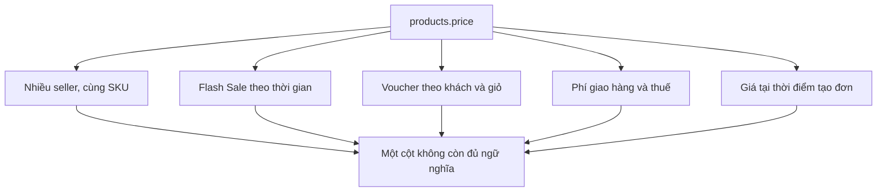

### Nỗi đau được bộc lộ qua bốn câu hỏi

1. Cùng một mã hàng, hai seller khác nhau có được đặt hai giá khác nhau không?
2. Khách đã đặt đơn với giá 20 triệu, admin sửa catalog còn 18 triệu: đơn cũ phải hiện 20 hay 18?
3. Khách sửa `totalAmount=1000` trong HTTP request: backend có tin không?
4. Giá Flash Sale hết hạn giữa lúc khách đang điền địa chỉ: hệ thống áp giá nào và thông báo ra sao?

Ta cần định nghĩa lại **giá thuộc ngữ cảnh nào và có hiệu lực vào thời điểm nào**.

## 4.2. Product, SKU và Seller Offer: ai thực sự sở hữu giá?

Trong ví dụ Marketplace, ba khái niệm dễ nhầm là:

| Khái niệm | Trách nhiệm | Ví dụ |
|---|---|---|
| Product | Thông tin mặt hàng chung | Điện thoại X |
| Variant / SKU | Cấu hình hàng có thể bán | X đen, 256 GB |
| Seller Offer | Lời chào bán của seller cho SKU theo điều kiện | Seller A bán X đen 256 GB giá 20 triệu |

Cùng một variant có thể có nhiều Offer. Nếu hệ thống bán trực tiếp, giá có thể gắn vào SKU/price list của cửa hàng; nếu Marketplace, Seller Offer thường là vị trí tự nhiên để biểu đạt seller, kênh bán, điều kiện và mức giá.

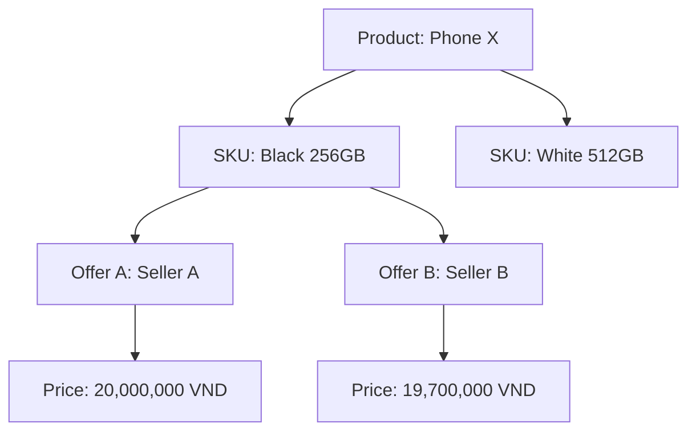

**Khái niệm ‘giá thuộc SKU hay Offer’ là quyết định domain**, không phải yêu cầu công nghệ. Cần dựa vào cách vận hành: ai được sửa giá, ai chịu doanh thu, mức giá có thay đổi theo kênh/bên bán hay không.

### Những mức giá phải tách tên

| Thuật ngữ | Ý nghĩa | Có nhất thiết là giá thanh toán? |
|---|---|---|
| List / Regular Price | Giá bán thông thường theo chính sách | Không |
| Selling Price | Giá bán đang có hiệu lực trước các ưu đãi bổ sung | Chưa chắc |
| Compare-at Price | Giá đối chiếu phục vụ hiển thị khi phù hợp quy định | Không |
| Cost / COGS | Chi phí vốn phục vụ nội bộ | Không |
| Unit Price in Quote | Đơn giá hệ thống xác nhận cho một yêu cầu cụ thể | Tham gia tính tổng |
| Line Total | Tổng dòng hàng sau phân bổ giảm giá tương ứng | Một phần tổng đơn |
| Order Snapshot | Giá đã chốt và phép tính tại thời điểm đặt đơn | Căn cứ giải thích giao dịch |

**Compare-at Price không mặc nhiên chứng minh khách đã từng mua ở giá đó.** Cách thể hiện ‘giảm bao nhiêu %’ còn phải tuân thủ chính sách kinh doanh và quy định quảng cáo/giá tại thị trường triển khai. Các nền tảng commerce thực tế cũng tách `price` và `compare-at price` theo variant; tham khảo Shopify Help Center trong mục Tài liệu tham khảo cuối chương.

## 4.3. Pricing Context — vì sao cùng SKU có nhiều giá hợp lệ?

Đừng viết hàm `getPrice(productId)` rồi cố truyền thêm tham số mỗi khi business đổi yêu cầu. Hãy hình dung toàn bộ ngữ cảnh cần thiết để **định giá một lời đề nghị mua hàng**:

```json
{
  "buyerId": 101,
  "sellerOfferId": 701,
  "skuId": "PHONE-X-BLACK-256",
  "quantity": 2,
  "channel": "WEB",
  "currency": "VND",
  "deliveryZone": "HANOI",
  "promotionCodes": ["WELCOME500"],
  "quotedAt": "2026-09-23T13:45:00+07:00"
}
```

`buyerId` có thể chỉ dùng để tra cứu phân khúc/điều kiện ưu đãi, không cần lộ dữ liệu nhạy cảm trong cache key. `quotedAt` cần được lấy từ thời gian tin cậy phía server; **không tin thời gian do client tự gửi**. Địa chỉ chính xác được cung cấp ở checkout, còn khu vực giao hàng có thể dùng cho báo giá sơ bộ.

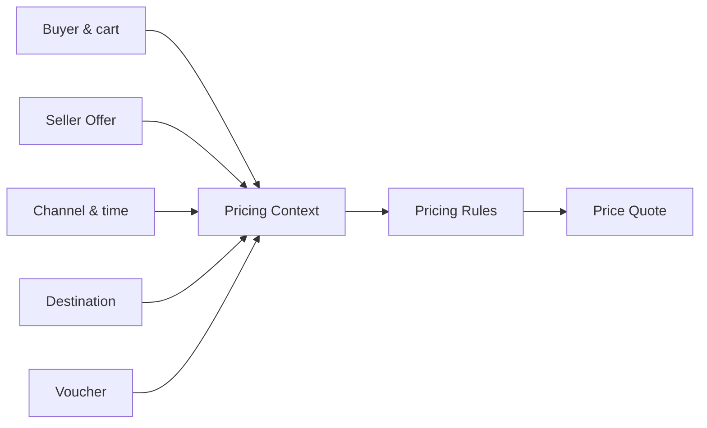

### Phân biệt Quote và Order

- **Product display price:** mức giá đủ hữu ích để duyệt catalog; có thể cache theo ngữ cảnh đã xác định.
- **Cart estimate:** giá tạm tính; phải chấp nhận thay đổi về phí ship/ưu đãi khi checkout.
- **Checkout quote:** kết quả tính chính thức hơn, có thời hạn và điều kiện sử dụng rõ ràng.
- **Order snapshot:** các giá trị giao dịch được chốt sau khi tạo đơn thành công; không tham chiếu sống sang catalog để tái tính đơn cũ.

Một Quote **không tự động giữ tồn kho hay voucher**. Muốn đảm bảo mức giá/ưu đãi đến thời điểm chốt đơn, bạn cần triển khai thêm cơ chế commit/reservation cho các tài nguyên tương ứng, và quy tắc hết hạn rõ ràng.

## 4.4. Pricing Pipeline: từ giá chào bán đến số tiền cần thanh toán

Một mô hình minh họa cho Hoàng Phone:

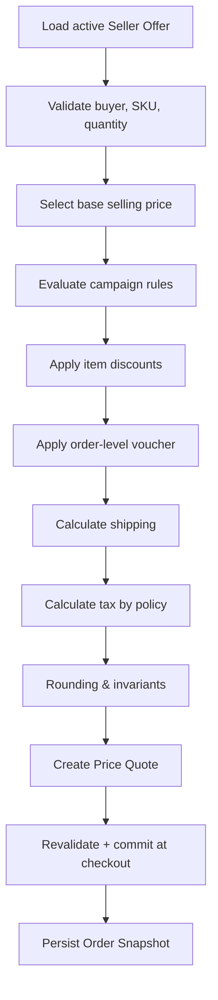

**Không có một thứ tự cộng/trừ duy nhất đúng với tất cả thị trường hoặc chiến dịch.** Đặc biệt thuế có thể là giá bao gồm thuế, giá chưa thuế, thuế tính trên giá sau giảm, các voucher có thể được phân bổ về từng dòng hàng. Từng chiến dịch phải mô tả rõ cơ sở tính, đối tượng giảm, thứ tự, khả năng kết hợp và làm tròn.

### Một phép tính trọn vẹn (giả định chính sách cụ thể)

Đơn mua 2 chiếc tai nghe, mỗi chiếc 500.000 VND:

| Bước | Phép tính | Kết quả |
|---|---:|---:|
| Gross item subtotal | 2 × 500.000 | 1.000.000 |
| Item campaign discount | −10% của item subtotal | −100.000 |
| Subtotal after item discount | 1.000.000 − 100.000 | 900.000 |
| Order voucher | −50.000 | −50.000 |
| Merchandise total | 900.000 − 50.000 | 850.000 |
| Shipping fee | +30.000 | 880.000 |
| Tax (ví dụ này giả định đã nằm trong giá) | +0 | **880.000 VND** |

Lưu ý: đây là ví dụ **giá đã bao gồm mọi thuế áp dụng** nên không cộng thuế ở cuối. Không suy diễn công thức này thành cách tính thuế mặc định cho mọi hàng hóa.

### Không cho tổng âm

Nếu voucher 1 triệu áp lên giỏ đủ điều kiện trị giá 850.000 mà chính sách không cho phát sinh credit, discount được **cap** tại 850.000, hoặc voucher bị từ chối nếu quy tắc quy định mức mua tối thiểu. Việc chọn cách xử lý thuộc rule engine, không phải `Math.max(0,total)` vá ở bước cuối.

## 4.5. Promotion và Voucher: hai khái niệm không nên nhập làm một

Một campaign tự động có thể áp dụng khi điều kiện thỏa mãn; voucher thường yêu cầu code hoặc được phát cho một khách nhất định. Nhưng business hoàn toàn có thể gọi “voucher tự động”, vì vậy hãy ghi rõ định nghĩa trong glossary của dự án.

**Promotion Rule** nên trả lời được:

- `eligible`: ai, seller nào, SKU nào, kênh nào, vùng giao nào được áp dụng?
- `validity`: `starts_at <= server_now < ends_at` hay lịch theo timezone nào?
- `benefit`: giảm % hay tiền cố định, có mức tối đa không, có miễn phí ship không?
- `stackability`: có kết hợp voucher, campaign khác, Flash Sale hay giá dành cho thành viên không?
- `budget`: tổng ngân sách, số lượt sử dụng, giới hạn mỗi user và giới hạn toàn campaign là bao nhiêu?
- `allocation`: discount cấp đơn phân về từng item/seller như thế nào khi hoàn một phần?

### Bad case: logic ưu đãi rải rác trong controller

```java
if (voucher.equals("WELCOME500")) total -= 500_000;
if (isFlashSale) total = total * 0.8;
if (isVip) total -= 100_000;
```

Ba dòng code này không nói rõ thứ tự, giá trị tối thiểu, giới hạn giảm, số tiền còn lại, điều kiện seller, cách làm tròn, quyền sửa mã từ request, và liệu khách VIP có được dùng đồng thời với Flash Sale không.

Thay vì “if chain” không có metadata, tách việc kiểm tra điều kiện và việc áp dụng:

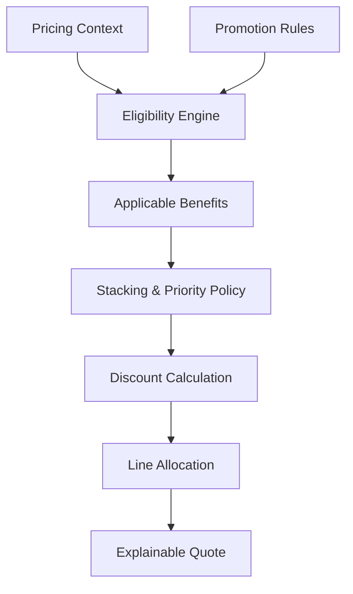

### Stacking policy ví dụ

| Campaign | Voucher | Chính sách giả định | Kết quả |
|---|---|---|---|
| Flash Sale 20% | WELCOME50K | Không stack | Chọn một theo điều kiện business |
| Category 10% | Free Shipping | Stack được | Giảm hàng + giảm ship |
| Seller A 5% | Seller B 5% | Áp theo seller | Mỗi benefit chỉ trên item tương ứng |

Từ “chọn một” không nhất thiết nghĩa là chọn giảm giá lớn nhất: có nơi ưu tiên campaign cao hơn, nơi khác chọn lợi ích cao hơn, nơi khác buộc người dùng lựa chọn. Đây là phần cần thống nhất với business và đưa vào test.

## 4.6. Money: đừng dùng `double` để biểu diễn tiền

`double` lưu số thực nhị phân gần đúng; không thể biểu diễn chính xác nhiều số thập phân như 0.1. Những phép cộng/trừ nhỏ khi tích lũy qua hàng nghìn dòng có thể gây sai lệch khi đối soát. Với Java, dùng `BigDecimal` có scale/rounding rõ ràng, hoặc dùng số nguyên đơn vị tiền nhỏ nhất nếu hệ thống thống nhất quy ước từ đầu.

```java
import java.math.BigDecimal;
import java.math.RoundingMode;

BigDecimal price = new BigDecimal("500000");
BigDecimal quantity = BigDecimal.valueOf(2);
BigDecimal gross = price.multiply(quantity);
BigDecimal tenPercent = gross
    .multiply(new BigDecimal("0.10"))
    .setScale(0, RoundingMode.HALF_UP);
BigDecimal net = gross.subtract(tenPercent);

// Tránh new BigDecimal(0.1): constructor nhận double đã gần đúng.
```

### Value Object nên biết currency

```java
public record Money(BigDecimal amount, String currency) {
    public Money {
        if (amount == null || currency == null || currency.isBlank()) {
            throw new IllegalArgumentException("Money must have amount and currency");
        }
    }

    public Money add(Money other) {
        if (!currency.equals(other.currency())) {
            throw new IllegalArgumentException("Currency mismatch");
        }
        return new Money(amount.add(other.amount()), currency);
    }
}
```

Đây là **mẫu minh họa**; production còn phải quy định scale được chấp nhận của từng currency, cách chuẩn hóa mã tiền, rounding, serialisation, overflow/range và conversion rate nếu bán xuyên biên giới.

### PostgreSQL: `NUMERIC` thay vì floating point

```sql
selling_amount NUMERIC(18, 2) NOT NULL
  CHECK (selling_amount >= 0),
currency_code CHAR(3) NOT NULL
```

PostgreSQL khuyến nghị kiểu `numeric` cho các giá trị cần chính xác như tiền. `NUMERIC(18,2)` không tự động là lựa chọn tốt nhất cho tất cả currency: VND thường có thể chọn `NUMERIC(18,0)` theo chính sách không dùng phần thập phân, trong khi một số currency cần số chữ số lẻ khác. Nếu dữ liệu đa tiền tệ, nên quyết định một quy tắc chuẩn hóa hợp lệ và nhất quán cho từng đồng tiền, hoặc lưu đơn vị nhỏ nhất khi phù hợp.

### Vấn đề làm tròn: giảm 10.000 VND cho ba dòng hàng

Tính số tiền giảm theo tỷ trọng với line gross lần lượt 100.000, 100.000, 100.000:

- Tỷ lệ mỗi dòng: 10.000 ÷ 3 = 3.333,333... VND.
- Nếu làm tròn từng dòng: 3.333 × 3 = 9.999 → thiếu 1 VND.
- Cách phân bổ deterministic minh họa: **3.334 + 3.333 + 3.333 = 10.000**.

Quy tắc phân bổ phải bảo đảm:

```text
sum(allocated_discounts) == order_discount
sum(line_payables) + shipping + tax_adjustment == payable_total
```

Với marketplace, lưu allocation theo seller/line để refund một phần và settlement không phải đoán lại từ tỷ lệ hiện tại. Các khoản tax/shipping nếu được hoàn hay không phải được xử lý theo quy tắc riêng.

## 4.7. Giá tại ba thời điểm: display → quote → snapshot

Giả sử Hoàng Phone đang bán một điện thoại:

| Thời điểm | Sự kiện | Giá |
|---|---|---:|
| 10:00 | Khách mở trang sản phẩm | 20.000.000 |
| 10:02 | Admin giảm giá | 19.000.000 |
| 10:03 | Khách nhấn checkout | Cần xử lý theo chính sách |
| 10:04 | Đơn được xác nhận | Giá trong snapshot được chốt |

Có ít nhất hai mô hình hợp lệ:

**Model A — Reprice at checkout:** giá hiển thị mang tính tham khảo; checkout trả quote mới 19 triệu; khách cần xác nhận thay đổi. Dễ triển khai hơn, nhưng UX phải minh bạch.

**Model B — Time-bounded price guarantee:** hệ thống phát quote 20 triệu hợp lệ tới thời điểm nhất định. Cần lưu và xác minh quote, đồng thời xử lý trường hợp chiến dịch/ngân sách/voucher/tồn kho hết. Quote đã hết hạn phải được tính lại; quote chưa hết hạn không mặc nhiên bảo đảm tồn kho.

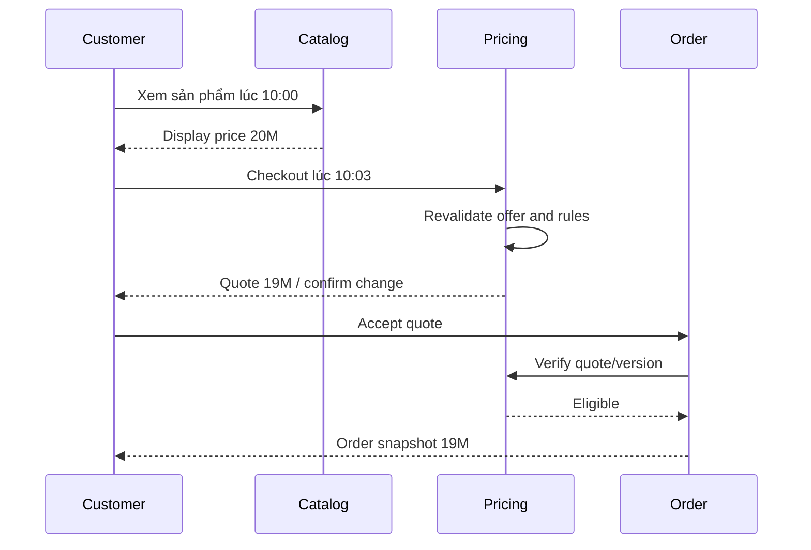

Một **Price Quote** có thể gồm:

```json
{
  "quoteId": "QT-20260923-001",
  "buyerId": 101,
  "currency": "VND",
  "sellerOfferId": 701,
  "priceVersion": 42,
  "promotionVersion": 8,
  "lineSubtotal": "20000000",
  "discountTotal": "1000000",
  "shippingFee": "30000",
  "taxIncluded": true,
  "payableTotal": "19030000",
  "expiresAt": "2026-09-23T14:00:00+07:00"
}
```

`priceVersion` và `promotionVersion` giúp truy vết **rule nào đã tạo ra quote**, không đồng nghĩa với tự động thực thi ràng buộc hết hạn. `quoteId` phải liên kết với dữ liệu lưu phía server hoặc có chữ ký chống sửa đổi, ràng buộc buyer và cart fingerprint khi sử dụng. Nếu cần giữ quyền dùng voucher, có thể thêm **promotion reservation** được commit cùng order theo cơ chế nhất quán đã chọn.

## 4.8. Checkout Revalidation — tuyệt đối không tin tổng tiền từ frontend

### Bad case

```http
POST /orders
Content-Type: application/json

{"skuId":"PHONE-X","quantity":1,"totalAmount":1000}
```

Nếu backend lấy `totalAmount` trực tiếp để tạo order và charge payment, chỉ cần sửa request là giá đã sai.

### Thiết kế tốt hơn

```text
Client gửi: offerId, quantity, address/method, voucher, quoteId, idempotencyKey
Server lấy: giá và rules có thẩm quyền, tình trạng voucher, quota, shipping, tax
Server tự tính: line totals, discounts, payable, snapshot
```

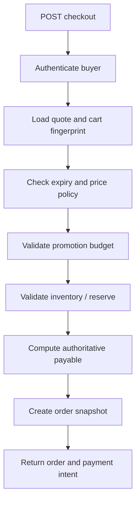

Nếu giá thay đổi ngoài policy cho phép, trả lỗi nghiệp vụ có cấu trúc như `PRICE_CHANGED` và quote mới để client quyết định, **không tự âm thầm charge giá khác đã được khách đồng ý**.

### Cửa sổ TOCTOU: kiểm tra đúng nhưng ghi sai

TOCTOU = *Time Of Check To Time Of Use*.

```text
A: Check voucher remaining = 1
B: Check voucher remaining = 1
A: Create order and use voucher
B: Create order and use voucher
```

Dù cả hai lần kiểm tra đều chính xác ở thời điểm đọc, tổng cộng đã dùng voucher hai lần. Đây không phải bug của Redis hay Kubernetes; đây là lỗi **kiểm tra và tiêu thụ quyền lợi không được thực hiện nguyên tử**.

Một cách bảo vệ quota PostgreSQL:

```sql
UPDATE promotion_budget
SET reserved_uses = reserved_uses + 1
WHERE promotion_id = :promotion_id
  AND reserved_uses + consumed_uses < usage_limit;
```

Chỉ tiếp tục khi `affected_rows = 1`. Để chống lặp theo mỗi user cần thêm khóa duy nhất/idempotency trên `promotion_redemption`, không chỉ global counter. `reserved_uses` phải được giải phóng chính xác một lần khi reservation hết hạn/hủy; `consumed_uses` phản ánh rule “dùng thành công” đã được business định nghĩa.

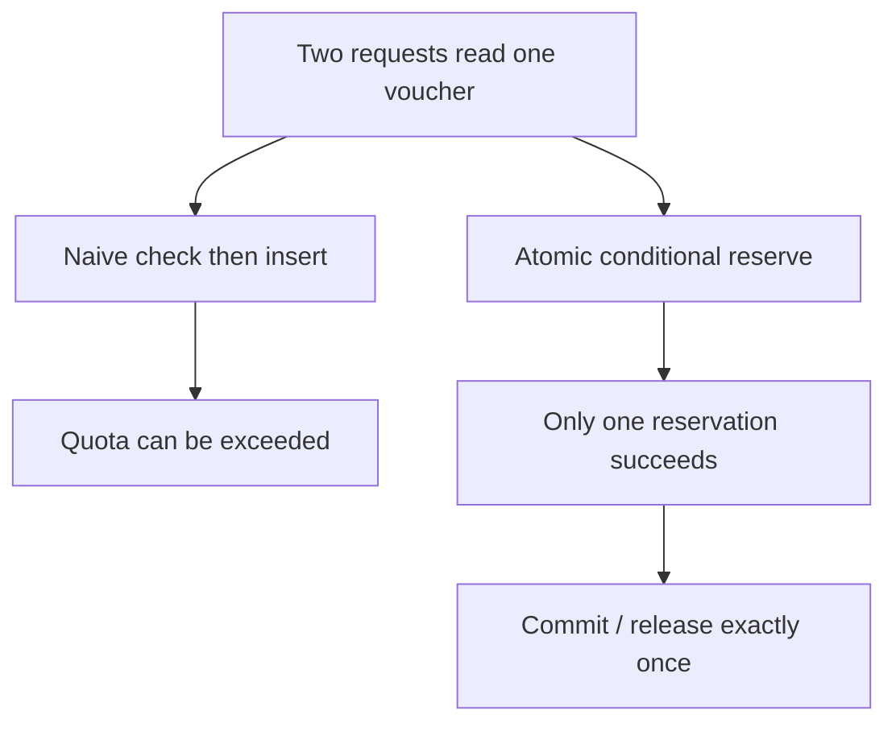

## 4.9. Order Snapshot: một hóa đơn cũ phải tự giải thích được

Một lỗi khá phổ biến: `order_items` chỉ lưu `sku_id` và `quantity`, còn màn hình lịch sử đơn luôn JOIN sang bảng giá hiện tại.

Sau hai tháng, seller xóa offer hoặc đổi giá. Hóa đơn cũ đột nhiên hiện số tiền mới, hoặc không còn dữ liệu để render.

Giải pháp: lưu snapshot những dữ liệu cần thiết tại thời điểm giao dịch; tham chiếu ID vẫn có ích để liên kết catalog, nhưng **không dùng nó để tái tính giá đã chốt**.

| Dữ liệu ở Order Item | Lý do |
|---|---|
| `sku_id`, `seller_offer_id` | Liên kết nguồn hàng |
| `product_name_snapshot`, `variant_snapshot` | Hiển thị lịch sử khi catalog đổi |
| `unit_price_snapshot` | Đơn giá tại thời điểm mua |
| `quantity` | Số lượng đã xác nhận |
| `gross_line_amount` | Giá trước điều chỉnh của dòng |
| `allocated_item_discount`, `allocated_order_discount` | Giải thích và refund từng dòng |
| `net_line_amount` | Giá trị dòng sau giảm |
| `currency_code` | Đồng tiền giao dịch |
| `price_version`, `applied_rule_ids` | Audit và giải thích nguồn giá |

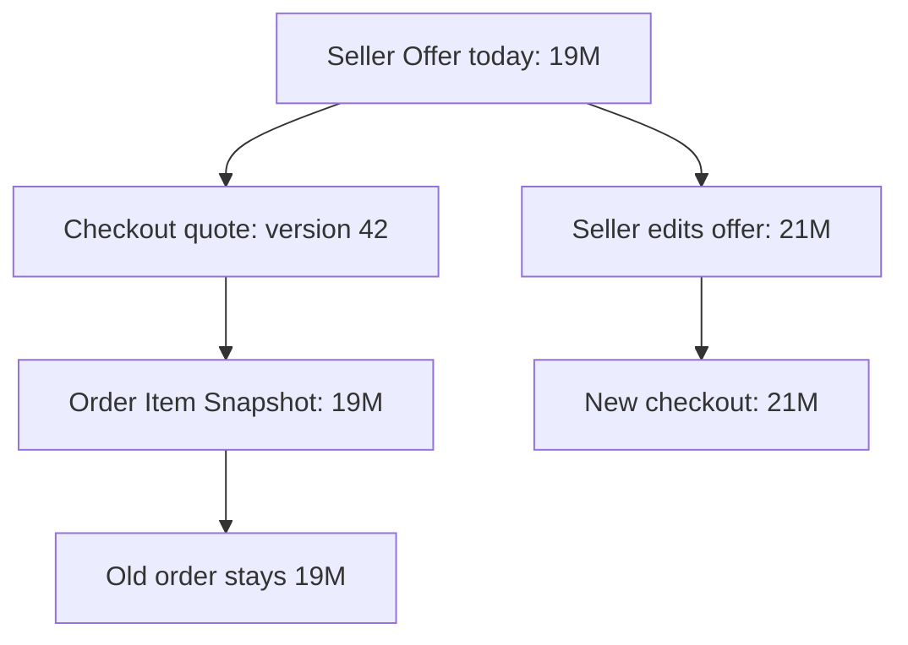

Trong Marketplace, cần lưu **discount allocation theo Seller Order và Order Item**, cùng các khoản fee/commission/seller subsidy do ai chịu, để seller settlement và hoàn hàng một phần có thể đối soát. Không nên cố suy ra lịch sử từ cấu hình khuyến mãi đã được sửa hoặc xóa.

### Giá lịch sử khác “đóng băng mọi thứ”

Bạn vẫn có thể cập nhật một số thông tin vận hành như tracking number, ghi chú nội bộ và trạng thái giao hàng. Điều cần bất biến hoặc được điều chỉnh qua nghiệp vụ rõ ràng là **các giá trị đã thỏa thuận và vết thay đổi tài chính**, không phải toàn bộ record `orders`.

## 4.10. Cache giá: tăng READ throughput nhưng tạo bài toán consistency

Product page là một candidate điển hình để cache. Nhưng cache nguyên `product:1001` chỉ chứa một giá có thể sai khi: một SKU có nhiều seller; Flash Sale đổi theo thời gian; khách thuộc price tier khác; currency/channel khác.

Định nghĩa cache key theo **những chiều thực sự làm thay đổi kết quả**:

```text
catalog:product:{productId}:v{catalogVersion}
offer:{sellerOfferId}:v{priceVersion}:channel:{channel}
```

Không cache tùy tiện toàn bộ price quote được cá nhân hóa bằng một key dùng chung. Nếu một quote phụ thuộc buyer/voucher/địa chỉ, cần cache ở phạm vi hợp lý hoặc không cache; không ghi dữ liệu nhạy cảm thô vào key.

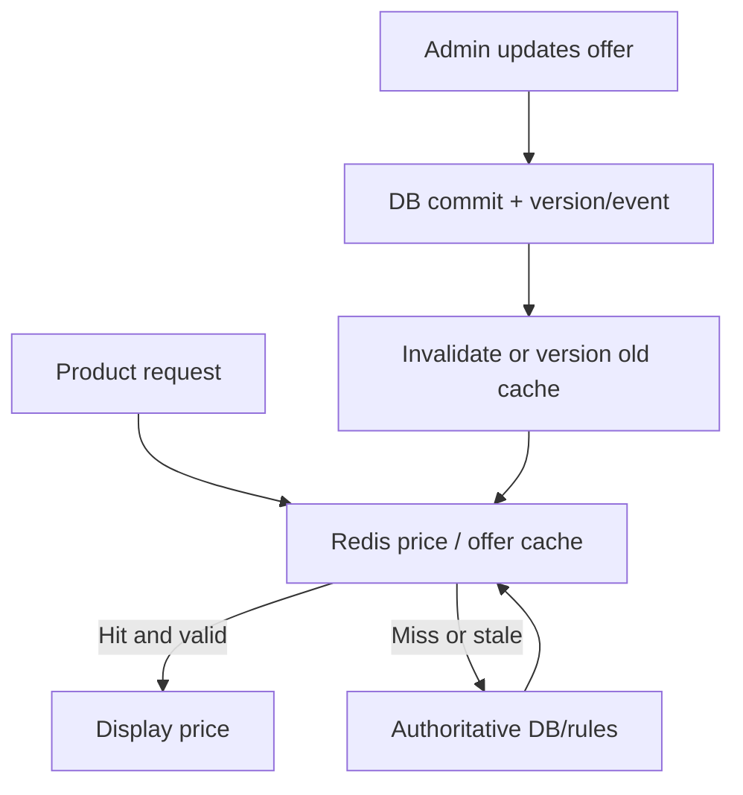

### Bốn failure case phải dự liệu

1. **Stale cache:** giá admin đã cập nhật nhưng cache vẫn còn TTL. Giải pháp có thể là versioned key, invalidate sau commit, TTL ngắn phù hợp hoặc nguồn cập nhật event; vẫn phải revalidate lúc checkout.
2. **Cache stampede:** giá hot vừa hết TTL, hàng nghìn request cùng đánh DB. Có thể dùng single-flight/per-key lock, stale-while-revalidate cho **display** khi business chấp nhận, hoặc prewarm. Không lấy stale estimate làm tiền charge.
3. **Delayed invalidation:** DB commit thành công nhưng event xóa cache thất bại. Có thể dùng transactional outbox để phát event đáng tin cậy hơn, TTL là giới hạn bảo vệ bổ sung.
4. **Clock boundary:** Flash Sale hết hạn nhưng key còn 5 phút TTL. TTL phải được giới hạn bởi thời điểm hết hiệu lực giá/chiến dịch nếu cache biểu diễn giá đang có hiệu lực.

### Phân biệt tốc độ và sự thật nghiệp vụ

Redis phục vụ hàng nghìn trang sản phẩm nhanh; PostgreSQL/rule authority cùng giao dịch checkout mới quyết định số tiền được chốt theo hợp đồng nghiệp vụ. Không phải mọi checkout đều cần bypass Redis: điều bắt buộc là **cơ chế xác nhận đúng rule/version/quota**, bất kể dữ liệu được đọc từ đâu.

## 4.11. Product Lifecycle và Price Lifecycle là hai state machine khác nhau

Một Product có thể tồn tại nhưng chưa được đăng bán; Offer có thể được lưu nhưng chưa có giá hợp lệ; chương trình giảm giá có thời điểm bắt đầu/kết thúc độc lập. Nếu gom tất cả vào `products.status`, bạn sẽ không biểu diễn được những trạng thái này.

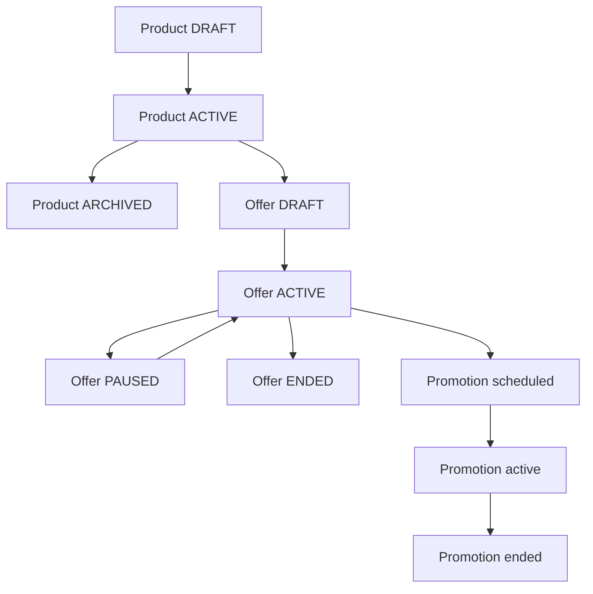

Đây là sơ đồ **minh họa nhiều state machine liên quan**, không có nghĩa Product ACTIVE “tạo” Offer DRAFT qua một transition của cùng aggregate. Cần quy định permission và transitions độc lập theo domain.

### Price history và thời gian hiệu lực

Giá không chỉ có `updated_at`; có thể cần `valid_from` và `valid_to` để xác định mức giá tại thời điểm nào, đặc biệt khi đặt lịch khuyến mãi. Cần phân biệt:

- **Effective time:** mức giá có hiệu lực với giao dịch khi nào?
- **Recorded time:** hệ thống ghi nhận thay đổi khi nào?

Hai khái niệm này giúp audit một thay đổi đặt lịch trước hoặc chỉnh sửa dữ liệu sai. Chỉ thêm hai cột thời gian chưa bảo đảm không có hai khoảng giá active chồng nhau; cần transaction và ràng buộc phù hợp (ví dụ exclusion constraint khi dùng PostgreSQL range).

## 4.12. Thiết kế ranh giới Pricing và Order trong Spring Boot

MVP không cần deploy riêng Pricing Service. Bắt đầu bằng **modular monolith**:

```text
com.example.ecommerce
├── catalog/
│   ├── Product
│   └── Variant
├── offer/
│   ├── SellerOffer
│   └── OfferPriceHistory
├── pricing/
│   ├── PriceQuote
│   ├── PricingContext
│   ├── PricingPolicy
│   ├── DiscountAllocation
│   └── PricingApplicationService
├── promotion/
│   ├── PromotionRule
│   ├── PromotionBudget
│   └── Redemption
├── checkout/
│   └── CheckoutApplicationService
└── order/
    ├── Order
    └── OrderItemSnapshot
```

Kiến trúc trách nhiệm:

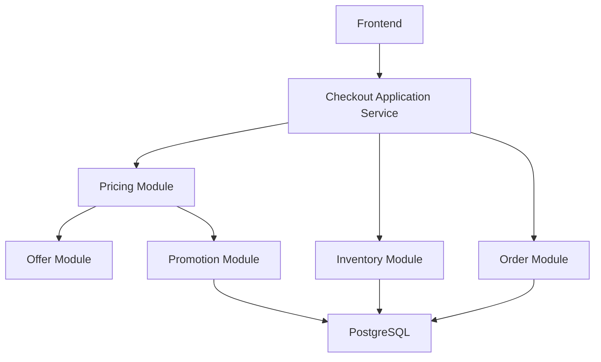

**Aggregate boundaries** không nhất thiết đi theo package hoặc table. Pricing có thể là domain service tính kết quả thuần, còn Order sở hữu snapshot và Inventory/Promotion sở hữu reservation. Chính xác transaction nào cùng commit tùy coupling và database ownership.

### Khi nào tách Pricing Service?

Tách riêng có thể hợp lý khi nhiều sản phẩm/kênh cùng dùng pricing engine; business cần deploy rule độc lập; team ownership đã rõ; tải CPU rule evaluation lớn hơn phần Order. Nhưng tách service tạo thêm network latency, versioning, cache consistency và distributed checkout flow. Chưa có nhu cầu thì package/module có ranh giới rõ là đủ.

## 4.13. Bottleneck Shifting: tối ưu một lớp, điểm nghẽn dịch sang lớp khác

Ở giai đoạn đầu, query lấy giá có thể chậm vì JOIN/rules quá phức tạp. Bạn cache offer. Read throughput tăng nhưng vào giờ Flash Sale, tất cả cùng dùng voucher 500 nghìn → **hot row `promotion_budget`**. Bạn tăng API Pods thì transaction chờ row lock nhiều hơn. Đưa yêu cầu vào queue sẽ giảm concurrent processing nhưng người mua phải đợi xác nhận.

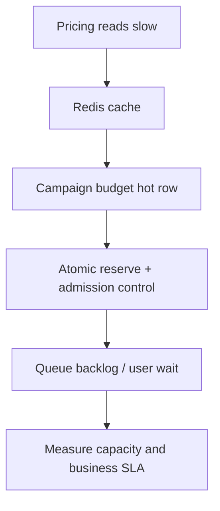

| Bottleneck | Triệu chứng quan sát | Cách tiếp cận |
|---|---|---|
| Rule evaluation CPU | p95 quote tăng khi nhiều campaign | Pre-filter candidate rules, profiling, cache rule metadata |
| DB connection pool | Threads chờ lấy connection | Pool sizing, giảm transaction duration, hạn mức concurrency |
| Voucher hot row | Lock wait cao ở một promotion | Admission control, queue/partition workload, điều chỉnh thiết kế quota |
| Pricing cache miss | DB read đột biến sau TTL | Single-flight, prewarm, staggered TTL, version key |
| External tax/shipping quote | Phụ thuộc bên ngoài timeout | Timeout, fallback theo chính sách, hiển thị pending nếu không thể báo giá |
| Multi-seller order calculation | Nhiều item / seller, allocation phức tạp | Grouping, giảm query N+1, deterministic algorithm, đo CPU/DB |

**Không thể tăng số Pod và hy vọng giải quyết mọi trường hợp.** Hạn mức ngân sách voucher, row lock và service đối tác là những tài nguyên chia sẻ không tự tăng khi thêm Spring Boot instances.

## 4.14. Database design tham khảo: ghi rõ lịch sử và tính toán

Không nên ép tất cả bảng dưới đây vào một transaction duy nhất bằng mọi giá. Đây là mẫu **modular monolith dùng một PostgreSQL**, sau đó mới cân nhắc tách ranh giới dữ liệu khi thực sự cần.

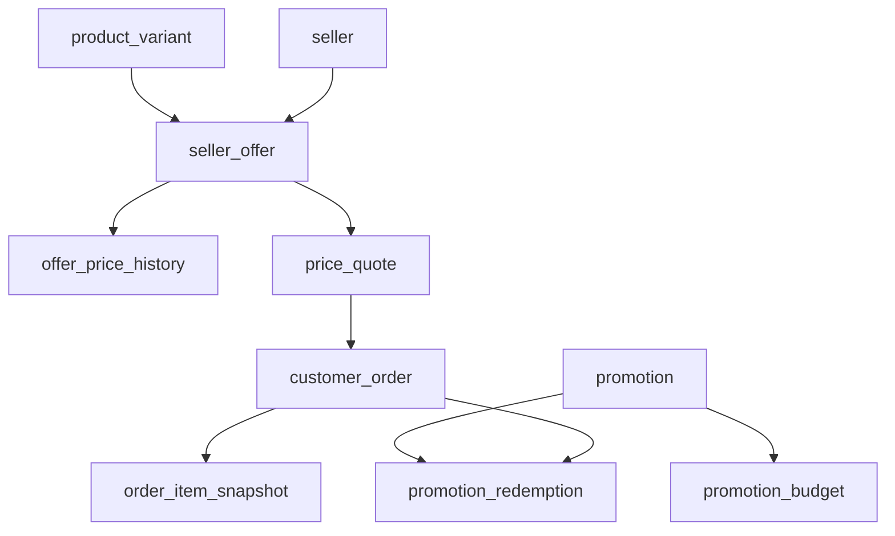

Các trường quan trọng nên được xem xét:

| Table | Fields cốt lõi | Constraint nghiệp vụ |
|---|---|---|
| `seller_offer` | `seller_id`, `sku_id`, `active_price`, `currency`, `price_version`, `status` | Giá không âm; phiên bản giá tăng có kiểm soát |
| `offer_price_history` | `offer_id`, `amount`, `valid_from`, `valid_to`, `version` | Khoảng hiệu lực theo policy; audit biến động |
| `price_quote` | `buyer_id`, `quote_hash`, `payable_total`, `expires_at`, `status`, `price_version` | Không dùng quote hết hạn/khác buyer hoặc cart |
| `promotion_budget` | `usage_limit`, `reserved_uses`, `consumed_uses` | Không vượt quota; counter không âm |
| `promotion_redemption` | `promotion_id`, `buyer_id`, `order_id`, `request_key`, `status` | Chống cùng request hưởng quyền lợi nhiều lần |
| `order_item_snapshot` | `unit_price`, `discounts`, `net_amount`, `currency`, `price_version` | Không phụ thuộc giá hiện tại để giải thích order cũ |

**Đừng nhầm `order_id` duy nhất với `payment_attempt_id` duy nhất:** một order có thể có nhiều lần thử thanh toán. Pricing giữ vết số tiền của order; Payment xử lý dòng tiền và trạng thái giao dịch ở chương 05/phần V.

## 4.15. Failure Scenarios và nguyên tắc xử lý

| Failure | Hậu quả nếu thiết kế đơn giản | Hướng xử lý |
|---|---|---|
| Admin cập nhật giá giữa render và checkout | Khách bị thu giá khác với kỳ vọng | Reprice + yêu cầu xác nhận, hoặc giá được bảo đảm bằng quote hợp lệ |
| Redis chưa invalidate | Hiển thị giá cũ | TTL/version; checkout dùng rule/version có thẩm quyền |
| Voucher cùng lúc hết lượt | Dùng vượt hạn mức | Atomic reservation + idempotency |
| Khách gửi lại checkout sau timeout | Tạo hai đơn, sử dụng voucher hai lần | Idempotency key, lookup kết quả request trước |
| Offer bị tạm dừng sau khi tạo cart | Cart chứa item không thể bán | Revalidate availability, trả lỗi nghiệp vụ |
| Ship/tax service timeout | Tổng tiền không chắc chắn | Không charge “đại”; timeout/retry, thông báo chưa đủ dữ liệu hoặc fallback được chấp nhận |
| Quote hết hạn khi khách confirm | Checkout dùng giá cũ | Quote expiration policy, tạo quote mới |
| Một dòng hàng được hoàn trả | Voucher toàn đơn bị phân bổ sai | Lưu allocated discounts, định nghĩa refund policy |
| Worker chết sau giữ quota | Voucher bị kẹt | Reservation expiry, recovery job, at-least-once idempotent |
| Multi-currency checkout | Cộng VND với USD không có chuyển đổi | Money currency guard, FX rate snapshot và settlement currency riêng |

### Three invariants kiểm tra xuyên suốt

```text
I1. order.payable_total = sum(order_item.net_amount)
    + shipping + applicable_taxes - order_level_adjustments_not_yet_allocated

I2. promotion.reserved_uses + promotion.consumed_uses <= promotion.usage_limit
    (for limited-use promotions)

I3. Existing order snapshots do not change when active_offer_price changes.
```

I1 là **một biểu thức có điều kiện về mô hình phân bổ**: nếu toàn bộ voucher order đã được phân bổ xuống từng item thì `order_level_adjustments_not_yet_allocated = 0`. Không trừ cùng một discount hai lần. Một số phí/thuế có thể nằm ở item hoặc order level, phải ghi rõ nơi ghi nhận để phép cộng đúng.

## 4.16. Hands-on Lab — từ một cột giá tới Checkout Quote

Thư mục thực hành kèm theo ở `labs/chapter-04/` gồm schema PostgreSQL, các query có thể chạy và bộ test scenario. Mục tiêu không phải tạo production-grade promotion engine ngay lập tức mà tự kiểm chứng các invariants quan trọng.

### Lab A — Khởi tạo hai Seller Offer cho cùng SKU

- Tạo Seller A với giá 20.000.000 VND, Seller B với giá 19.700.000 VND.
- Xác nhận hai offer có `price_version` độc lập.
- Admin đổi giá Seller A lên 21.000.000, Seller B không thay đổi.
- Đọc lịch sử giá và kiểm tra đơn đã tạo vẫn có giá snapshot.

### Lab B — Voucher chỉ còn một lượt

Mở hai session/transaction PostgreSQL cùng cố reserve voucher một lượt. Kiểm chứng chỉ một transaction được tăng `reserved_uses`, transaction còn lại trả `affected_rows = 0` sau khi chờ. Ghi lại row lock wait khi dùng `pg_stat_activity` hoặc log trong môi trường thử nghiệm.

### Lab C — Cố tình phá checkout

Gửi payload giả định:

```json
{"sellerOfferId":701,"quantity":1,"clientTotal":1000}
```

Backend phải phớt lờ `clientTotal` và tính lại bằng dữ liệu offer/rules của server. Nếu giá/quote thay đổi, trả kết quả nghiệp vụ để người dùng xác nhận chứ không charge theo tổng frontend.

### Lab D — Phân bổ và hoàn một phần

- Giỏ có ba dòng hàng, tổng voucher 10.000 VND.
- Kiểm tra tổng phân bổ chính xác là 10.000 VND.
- Hủy một dòng; không tính lại giá đơn cũ bằng campaign hiện tại.
- Xác định theo business policy xem phần voucher của item bị hủy được thu hồi, giữ hay tính lại, rồi hạch toán nhất quán.

### Lab E — Cache staleness drill

- Cache giá version 1.
- Admin đổi DB sang version 2.
- Cố tình giữ cache version 1 ở trang product.
- Gửi checkout: phải xác thực lại giá/rule và đưa ra quyết định theo chính sách đã chọn.

## 4.17. Chapter Review — tự trả lời như một system designer

1. Một SKU có ba seller và ba mức giá; bảng nào sở hữu giá và tại sao?
2. Vì sao cart total không nên là số tiền backend charge trực tiếp?
3. Hai request cùng dùng voucher còn một lượt: cần atomic ở đâu?
4. `BigDecimal` giải quyết vấn đề nào và **không** giải quyết vấn đề nào (ví dụ sai thứ tự áp voucher)?
5. Làm sao bảo đảm tổng giảm phân bổ không lệch 1 đơn vị tiền?
6. Giá đã chốt trong Order có được cập nhật khi admin đổi Offer không?
7. Cache key thiếu seller hoặc channel có thể gây lỗi gì?
8. Khi nào Price Quote có thể bảo đảm giá trong 5 phút, và điều kiện bổ sung nào cần cho voucher/stock?
9. Thêm 10 Pricing Pod có giúp gì khi voucher hot row đang bị lock không?
10. Nếu checkout gồm hai seller và một voucher toàn giỏ, tại sao cần lưu allocation?

### Key Takeaways

- **Giá là kết quả của một quyết định nghiệp vụ theo ngữ cảnh**, không đơn giản là một thuộc tính tĩnh của Product.
- Product, SKU và Seller Offer có ranh giới riêng; mô hình marketplace thường khiến giá thuộc về lời chào bán của seller.
- Display price, cart estimate, checkout quote và order snapshot khác nhau về vai trò và mức độ cam kết.
- Pricing pipeline cần thứ tự rule, stacking, rounding và discount allocation được xác định.
- Tiền tệ phải có biểu diễn chính xác và quy tắc xử lý từng currency.
- Checkout không tin tổng tiền client; cần xác nhận lại giá, điều kiện voucher, quota và tồn kho theo chính sách.
- Atomic voucher reservation xử lý race condition; nó vẫn có thể tạo hot row và lock contention.
- Redis tăng tốc READ nhưng yêu cầu chiến lược invalidation, time boundary và revalidation rõ ràng.
- Order snapshot là bằng chứng nghiệp vụ cho lịch sử giao dịch, refund và đối soát.

---

## Kết nối chương tiếp theo

**Chapter 05 — Order Lifecycle:** Sau khi đã biết “đơn hàng phải chốt giá gì”, câu hỏi kế tiếp là “đơn hàng được phép đi qua những trạng thái nào, và hệ thống phải làm gì khi thanh toán, giữ hàng, vận chuyển hoặc hoàn trả gặp lỗi?”. Chương 05 sẽ biến checkout thành một **state machine có transition rules và failure recovery**.

## Tài liệu tham khảo

1. PostgreSQL Documentation — Numeric Types: https://www.postgresql.org/docs/current/datatype-numeric.html
2. PostgreSQL Documentation — Transactions: https://www.postgresql.org/docs/current/tutorial-transactions.html
3. PostgreSQL Documentation — Explicit Locking: https://www.postgresql.org/docs/current/explicit-locking.html
4. Java `BigDecimal`: https://docs.oracle.com/en/java/javase/21/docs/api/java.base/java/math/BigDecimal.html
5. Shopify Help — Setting sale prices: https://help.shopify.com/en/manual/products/details/product-pricing/sale-pricing
6. Shopify Help — Product prices: https://help.shopify.com/en/manual/products/details/product-pricing

> **Biên tập:** Số tiền, traffic và chính sách discount trong chương là ví dụ minh họa có ghi giả định. Các đoạn schema/Java là mã học tập, không hàm ý đã tích hợp đầy đủ tax, FX, invoicing, ledger, fraud, migration hoặc quốc gia cụ thể. Lab phải được chạy trên môi trường thử nghiệm trước khi dùng làm nền tảng production.
