# INSIDE E-COMMERCE
## Volume 1 — Understanding E-commerce
### Chapter 05 — Order Lifecycle: Từ nút Mua ngay đến hoàn tất, hủy và hoàn tiền

> **Câu hỏi dẫn đường:** Một khách mua chiếc điện thoại cuối cùng. Hệ thống giữ hàng và tạo đơn, cổng thanh toán trả timeout, khách nhấn hủy, nhưng webhook báo trả tiền thành công đến sau đó. Liệu một cột `orders.status` có mô tả và giải quyết chính xác mọi thứ?

> **Phạm vi:** Tiếp tục cửa hàng giả định **Hoàng Phone → Hoàng Marketplace** của chương 01–04. Trạng thái, SLA giữ hàng và chính sách hoàn tiền dưới đây là ví dụ thiết kế, không phải quy tắc bất biến áp dụng cho mọi nhà bán hàng hay nhà cung cấp thanh toán. `PaymentIntent` của một PSP không đồng nghĩa với trạng thái đơn hàng nội bộ của doanh nghiệp.

## Sau chương này, bạn sẽ có khả năng

- Vẽ state machine và bảng chuyển trạng thái **có guard/action rõ ràng**, thay cho các lệnh `setStatus(...)` tự do.
- Phân biệt **Order, Payment, Reservation, Fulfillment, Shipment và Refund** theo vòng đời độc lập.
- Thiết kế **atomic checkout** với order snapshot, inventory reservation và outbox trong một database transaction khi chúng cùng datastore.
- Kiểm soát hai tác vụ cạnh tranh: cancel vs payment callback; cancel vs shipping; expiry vs payment success.
- Xử lý timeout không rõ kết quả, duplicate webhook, out-of-order event, retry và worker crash.
- Phân biệt hủy trước giao với return/refund sau giao; xử lý một phần khi đơn có nhiều dòng hoặc nhiều seller.
- Tìm bottleneck ở hot order row, worker/queue backlog, PSP quota và reconciliation.
- Có SQL Lab để tự tái hiện các lỗi và kiểm tra invariant cốt lõi.

---

## 5.1. Bad case: biến mọi thứ thành một `orders.status`

Phiên bản demo đầu tiên thường viết như sau:

```sql
CREATE TABLE orders (
    id BIGINT PRIMARY KEY,
    user_id BIGINT NOT NULL,
    status VARCHAR(30) NOT NULL,
    total_amount NUMERIC(18, 2) NOT NULL
);
```

```java
order.setStatus("SUCCESS");
repository.save(order);
```

Nhưng `SUCCESS` nghĩa là gì? Đã tạo đơn, đã trừ tồn, đã thu tiền, đã giao hàng hay đã hết hạn đổi trả? Nếu webhook thanh toán gửi lại `SUCCESS` sau khi nhân viên vừa cập nhật `CANCELLED`, thằng nào là sự thật? Nếu người mua trả lại một trong ba món, trạng thái đơn nên là `SUCCESS`, `REFUNDED` hay `PARTIALLY_RETURNED`?

Đây không phải lỗi riêng của JPA. **Lỗi nằm ở domain modeling: ép nhiều sự kiện và vòng đời độc lập thành một biến trạng thái nghèo ngữ nghĩa.**

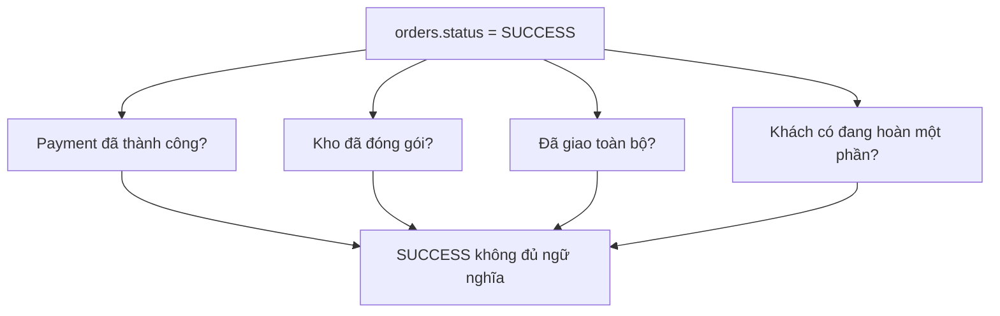

**Feynman analogy:** Phiếu gọi món ở quán không thể chỉ ghi “XONG”, bởi bếp nấu xong, thu ngân đã thu tiền và người giao hàng đã mang đồ đi là ba sự việc khác nhau. E-commerce cũng vậy.

### Ba nhầm lẫn gây lỗi lớn

1. **State ≠ Event:** `PAID` là trạng thái; `PaymentConfirmed` là điều vừa xảy ra. Một event có thể dẫn đến thay đổi nhiều projection/trạng thái.
2. **Command ≠ Fact:** `CancelOrder` là yêu cầu; `OrderCancelled` chỉ được ghi sau khi cancel thực sự thành công theo rule.
3. **HTTP response ≠ Business outcome:** Timeout không chứng minh giao dịch thanh toán hay tạo đơn đã thất bại.

## 5.2. Tách sáu lifecycle liên quan nhưng không đồng nhất

Một hệ thống đủ thực dụng không nhất thiết tạo sáu microservice, nhưng nên nhận diện sáu domain entity/process khác nhau:

| Đối tượng | Câu hỏi sở hữu | Ví dụ trạng thái |
|---|---|---|
| Order | Khách và cửa hàng đã cam kết mua bán tới bước nào? | `PENDING_PAYMENT`, `CONFIRMED`, `CANCELLED` |
| Payment Attempt / Payment | Có khoản thanh toán được khởi tạo, đang xử lý, thành công hay thất bại? | `PENDING`, `SUCCEEDED`, `FAILED`, `UNKNOWN` |
| Inventory Reservation | Bao nhiêu SKU đã giữ cho đơn, tới lúc nào? | `ACTIVE`, `CONSUMED`, `RELEASED`, `EXPIRED` |
| Fulfillment | Kho đã phân bổ, nhặt, đóng gói tới đâu? | `NEW`, `PICKING`, `PACKED`, `HANDOVER` |
| Shipment | Đơn vị vận chuyển đã nhận và giao ra sao? | `CREATED`, `IN_TRANSIT`, `DELIVERED`, `LOST` |
| Return / Refund | Hàng có được nhận trả và tiền có hoàn hay không? | `REQUESTED`, `APPROVED`, `SUCCEEDED`, `REJECTED` |

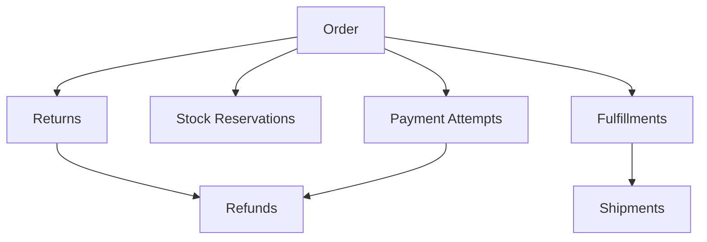

Mối liên hệ là business reference, không đồng nghĩa bắt buộc một bảng cho mỗi ô. Trong Marketplace một **checkout group** còn có thể tách thành nhiều **seller order** và nhiều shipment. Đừng để UI chỉ hiển thị “Đơn đã giao” che mất chi tiết các gói hàng khác nhau.

## 5.3. Order lifecycle là một State Machine có điều kiện

Ta chọn lifecycle tối giản cho **một đơn prepaid, một seller**, payment thu tiền sau khi reserve thành công:

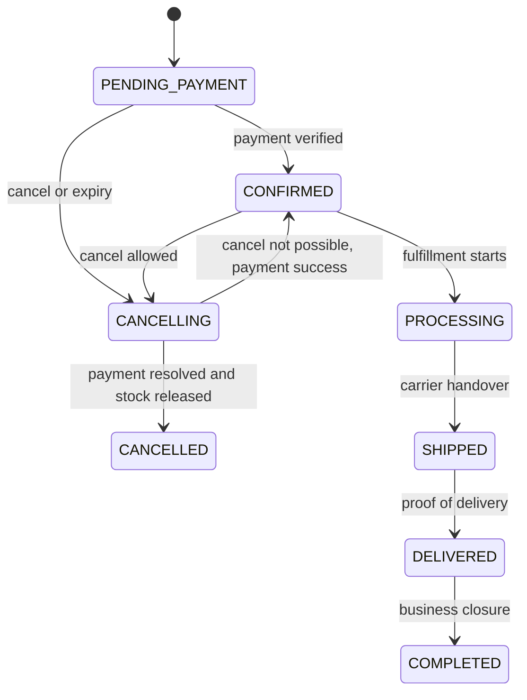

Đây là **mô hình minh họa**, không phải tập trạng thái chuẩn quốc tế. `COMPLETED` là mốc business closure do doanh nghiệp quy định; không đồng nghĩa hết hạn bảo hành hay cấm refund. `CANCELLING` là trạng thái trung gian cần thiết khi cancellation phụ thuộc vào gateway/kho/shipper không thể xử lý tức thì.

### Transition table: contract thực sự của backend

| Từ | Command/Event | Điều kiện (guard) | Sang | Side effect nghiệp vụ |
|---|---|---|---|---|
| `PENDING_PAYMENT` | `PaymentVerified` | Đúng attempt, đúng amount/currency, chưa cancel thực sự | `CONFIRMED` | Đánh dấu giữ hàng đã gắn với đơn; yêu cầu fulfillment |
| `PENDING_PAYMENT` | `CancelRequested` | Trong cửa sổ hủy | `CANCELLING` | Chặn tạo payment attempt mới; yêu cầu xác minh/cancel PSP |
| `CANCELLING` | `PaymentSettledAsUnpaid` | Không còn khoản có thể hoàn tất bất ngờ | `CANCELLED` | Release reservation đúng một lần |
| `CANCELLING` | `PaymentSucceededLate` | Thanh toán thành công dù đã yêu cầu hủy | Theo chính sách: `CONFIRMED` hoặc tiếp tục `CANCELLING` để hoàn tiền | Không release bừa; quyết định hoàn tiền/tiếp tục giao |
| `CONFIRMED` | `StartFulfillment` | Chưa có active cancel, đủ hàng | `PROCESSING` | Tạo fulfillment |
| `PROCESSING` | `CarrierAccepted` | Handover hợp lệ | `SHIPPED` | Ghi tracking |
| `SHIPPED` | `ProofOfDelivery` | Gói hàng tương ứng xác nhận giao | `DELIVERED` | Ghi POD; tiếp tục hậu mãi |

**Quan trọng:** Điều kiện `PaymentSettledAsUnpaid` phải dựa trên kết quả đủ tin cậy từ PSP/reconciliation, không phải suy ra từ việc request HTTP bị timeout.

### Invariant cần cố định trước khi viết code

- `CONFIRMED` trong prepaid flow cần payment evidence hợp lệ, hoặc một ngoại lệ thanh toán khác được model hóa rõ (COD, pay-later).
- Một reservation chỉ có **một kết cục terminal**: `CONSUMED`, `RELEASED` hoặc `EXPIRED` (nếu expiry là một biến thể release; không đồng thời).
- Số lượng `reserved_qty` trên kho không âm và không vượt `on_hand_qty` theo quy tắc kho đơn giản của lab.
- Một lệnh gửi lại cùng idempotency key với cùng nội dung trả cùng business result; cùng key mà nội dung khác phải từ chối.
- Không chuyển từ `CANCELLED` về `CONFIRMED` chỉ vì nhận event cũ. Late money phải thành dispute/refund/reconciliation case.
- Status snapshot có thể mất đồng bộ ngắn với projection nhưng event/audit log không được làm mất dấu các chuyển trạng thái đã commit.

## 5.4. Product → Price Quote → Order Snapshot: giữ bằng chứng giao dịch

Chương 04 đã tách `price` hiện tại khỏi `price snapshot`. Chapter 05 nối logic đó với lịch sử đơn:

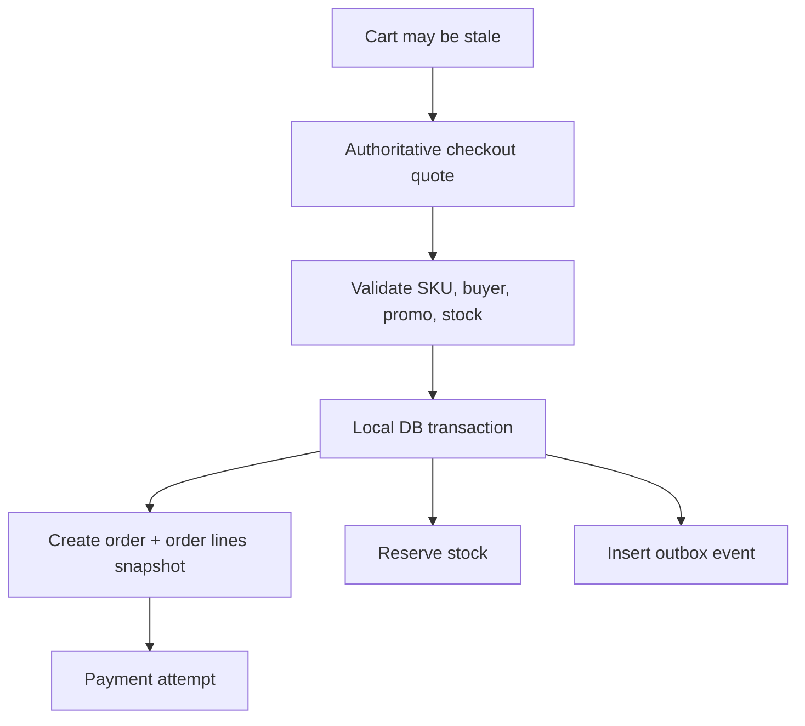

Một dòng đơn hàng tối thiểu nên giữ: `sku_id`, `seller_id`, tên/biến thể để hiển thị lịch sử, `qty`, `unit_price`, discount allocation, tax/shipping allocation nếu domain yêu cầu, currency và policy version. Không query giá catalog hiện tại để tính lại đơn cũ.

**Vấn đề khó:** quote hết hạn giữa lúc khách bấm confirm. Contract cần nói rõ giá được cố định tại thời điểm nào: khi tạo quote, khi server chấp nhận checkout, hay chỉ sau khi thanh toán? Không có lựa chọn duy nhất cho mọi cửa hàng. Điều cần có là rule minh bạch, server enforce và snapshot có thể audit.

## 5.5. Transaction Boundary: cái gì thực hiện nguyên tử được, cái gì không?

Nếu order và inventory nằm cùng PostgreSQL, checkout có thể thực hiện nguyên tử trong **transaction ngắn**:

```sql
BEGIN;
-- 1. Idempotency row/unique key, validate price version.
-- 2. Conditionally reserve inventory.
-- 3. Insert orders and order_items snapshots.
-- 4. Insert stock_reservations.
-- 5. Insert outbox event OrderPlaced.
COMMIT;
```

Nếu bước nào thất bại, rollback toàn bộ. Không để backend tạo order mà không reserve hàng, hoặc reserve hàng nhưng không tạo order do lỗi ở giữa.

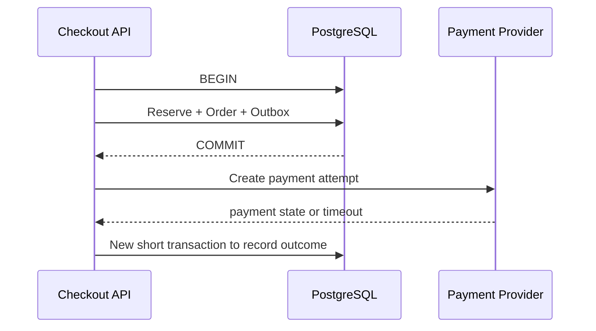

**Không gọi PSP bên trong transaction đang giữ row lock kho/đơn.** PSP có thể timeout vài giây hoặc cần người dùng xác thực; transaction bị giữ sẽ tăng lock wait, connection occupancy và deadlock risk. PostgreSQL mô tả row lock tồn tại tới cuối transaction và cảnh báo tránh giữ transaction mở dài. Tham khảo PostgreSQL Explicit Locking ở cuối chương.

Khi Order và Inventory chuyển thành database riêng, local `@Transactional` trên Order Service không thể rollback kho tại service khác; cần workflow phân tán và compensation, được đi sâu ở Volume 6.

## 5.6. Business command không được là `PATCH /orders/{id}/status`

API ngây thơ:

```http
PATCH /orders/123
{"status":"DELIVERED"}
```

Nếu khách hoặc client có thể tự chọn trạng thái, bạn đã trao quyền bỏ qua business guards. API nên mô tả **ý định nghiệp vụ**:

```http
POST /orders/123/cancellations
Idempotency-Key: user-101-cancel-order-123

{"reason":"CHANGED_MIND"}
```

```http
POST /fulfillments/ful-123/handover
Idempotency-Key: carrier-handover-xyz

{"trackingNumber":"TRK-001"}
```

```http
POST /webhooks/payment
Stripe-Signature: ...

{...provider payload...}
```

Chữ ký/cơ chế xác minh webhook là trách nhiệm riêng; không dùng request body tự khai `paymentStatus=PAID` để xác nhận tiền. Quyền actor phải được gắn vào command: customer được *yêu cầu hủy*, warehouse được *xác nhận đóng gói*, carrier/đầu tích hợp đáng tin được *cập nhật vận chuyển*.

## 5.7. Race Condition 1: Cancel Order và Payment Succeeded cùng đến

Tình huống hay xuất hiện:

- T0: Order `PENDING_PAYMENT`; PSP đang xử lý.
- T1: Khách nhấn Cancel và request A đọc trạng thái.
- T2: Webhook `payment.succeeded` và request B cũng đọc trạng thái.
- T3: A set `CANCELLED`; B set `CONFIRMED`; transaction nào commit cuối cùng thắng nếu không có bảo vệ.

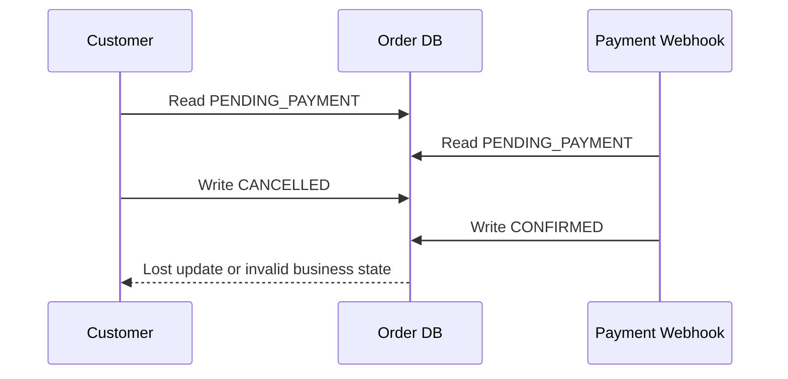

Cách bảo vệ tầng DB: **compare-and-set (CAS)** theo `status`, hoặc optimistic locking bằng `version`, kết hợp guard nghiệp vụ. Ví dụ:

```sql
UPDATE orders
SET status = 'CANCELLING', version = version + 1
WHERE id = :order_id
  AND status = 'PENDING_PAYMENT'
  AND version = :expected_version;
```

`rows_updated = 0` có nghĩa trạng thái đã thay đổi hoặc version không còn phù hợp: **reload và quyết định lại**; không phải cứ retry cùng cập nhật cho đến khi thắng. Với payment success đến sau khi order chuyển `CANCELLING`, handler phải xử lý nhánh late-payment theo policy; không ghi `CONFIRMED` bằng mọi giá.

**Chú ý ranh giới:** CAS trên order row ngăn lost update nhưng *không* tự đảm bảo side effect từ hệ thống bên ngoài chạy đúng một lần. Idempotency và reconciliation vẫn cần.

## 5.8. Race Condition 2: Reservation Expiry vs Payment Confirmation

Stock reservation có thể có `expires_at`. Worker tìm các reservation đã hết hạn để giải phóng. Cùng lúc webhook báo payment success.

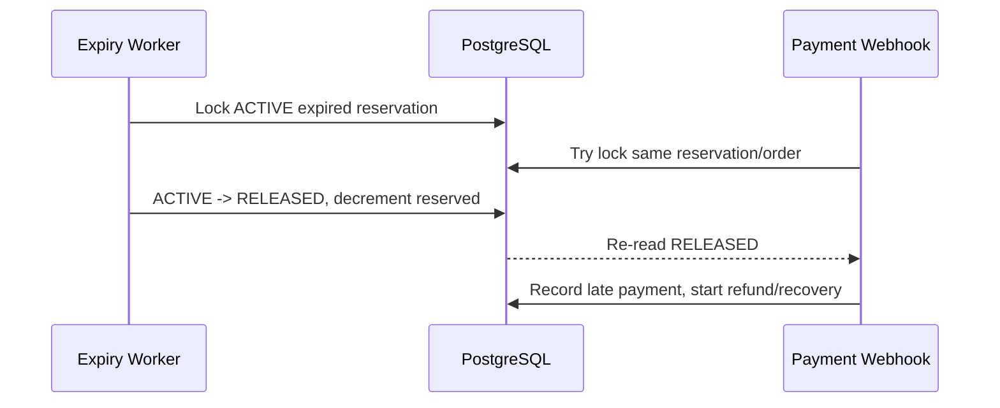

**Không được diễn giải expiry timestamp là quyền trừ kho tự do.** Cần điều kiện trạng thái + transaction + xác minh thanh toán đang xử lý và quy tắc xử lý payment trễ.

Một số hệ thống đặt expiry worker vào trạng thái `EXPIRING`/`CANCELLING` trước, sau đó đối soát PSP, rồi mới commit trạng thái release terminal. Việc chọn strategy phụ thuộc payment method và SLA. Với PSP có thể gửi success muộn, tự động release hàng chỉ vì deadline mà không xử lý late-success sẽ tạo ra paid-without-stock.

## 5.9. Cancellation là một workflow, không phải một lệnh set status

Phân biệt:

| Mốc | Nghiệp vụ | Cách xử lý có thể cần |
|---|---|---|
| Chưa thanh toán, chưa fulfillment | Request hủy | Resolve pending PSP, release reservation |
| Đã thu tiền, chưa đóng gói | Request hủy | Dừng fulfillment, refund theo rule |
| Đang đóng gói | Request hủy | Kho có dừng được không? Nếu không thì đợi handover/return workflow |
| Đã giao cho carrier | Request hủy | Có thể cần intercept hoặc return-to-origin, không phải đơn thuần rollback |
| Đã giao thành công | Request trả hàng | Return Authorization + Refund process |

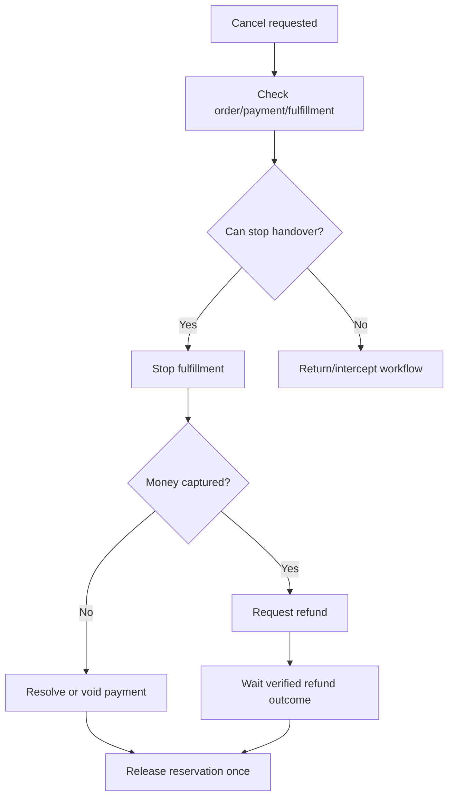

Trong các sản phẩm có capture trước fulfilment, `CANCELLED` có thể nghĩa là **không giao hàng nữa**, còn refund đang `PENDING`/`FAILED` phải thể hiện độc lập. Không được quảng bá “đã hoàn tiền” chỉ vì đã gửi API refund mà chưa xác nhận kết quả.

### Policy matrix là dữ liệu kinh doanh

Ví dụ cấu hình (chỉ minh họa):

```yaml
cancellationPolicy:
  beforePacked: allow
  afterHandover: requireReturnFlow
  paymentUnknown: waitForVerification
  customerRefundOnSuccessfulCancel: required
```

Khi policy thay đổi, nên lưu policy version hoặc đủ context để giải thích tại sao một đơn được hủy tại thời điểm đó.

## 5.10. Return ≠ Cancellation; Refund ≠ Order State

Đơn giao hai điện thoại, khách chỉ trả một chiếc. Hệ thống cần line-level quantity, return authorization và refund amount độc lập:

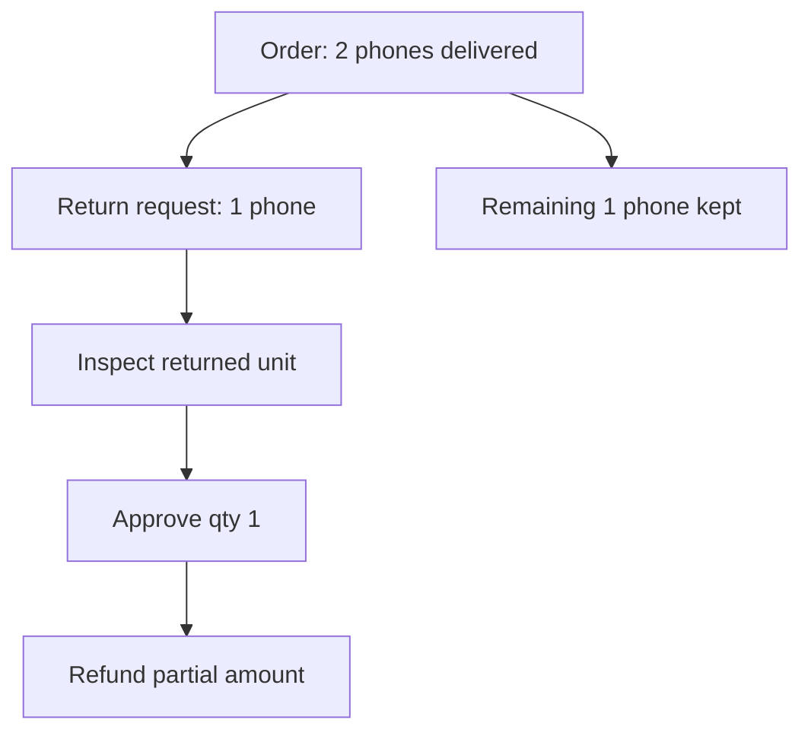

Invariant ở cấp dòng: `returned_qty + non_returnable_or_other_allocations <= fulfilled_qty` theo chính sách; refunded monetary sum không vượt phần có thể hoàn của giao dịch sau khi trừ lần hoàn trước. Shipping, vouchers và phí hoàn có thể phải phân bổ theo rule, không suy trực tiếp `unit_price × qty`.

Trong Marketplace, return/refund cần liên hệ `seller_order_id` và `shipment_id` đúng. Một marketplace checkout có thể có một payment tổng nhưng nhiều seller settlement; refund chỉ một seller có thể cần điều chỉnh commission/payable liên quan.

## 5.11. Idempotency ở bốn lớp, không chỉ ở nút Mua

Một retry có thể đến từ user, load balancer, Worker, broker hoặc PSP. Bốn lớp quan trọng:

| Lớp | Duplicate risk | Dedupe key/điều kiện |
|---|---|---|
| Checkout request | Tạo hai order | `(user_id, idempotency_key)` + request fingerprint |
| Message consumer | Chạy business action hai lần | `processed_messages(consumer, event_id)` unique + transaction |
| Payment webhook | Đánh dấu thanh toán hai lần | `provider_event_id` hoặc provider payment unique; verify signature |
| Stock release/refund | Cộng tồn kho hoặc hoàn tiền hai lần | Reservation terminal CAS; refund idempotency key + provider transaction reference |

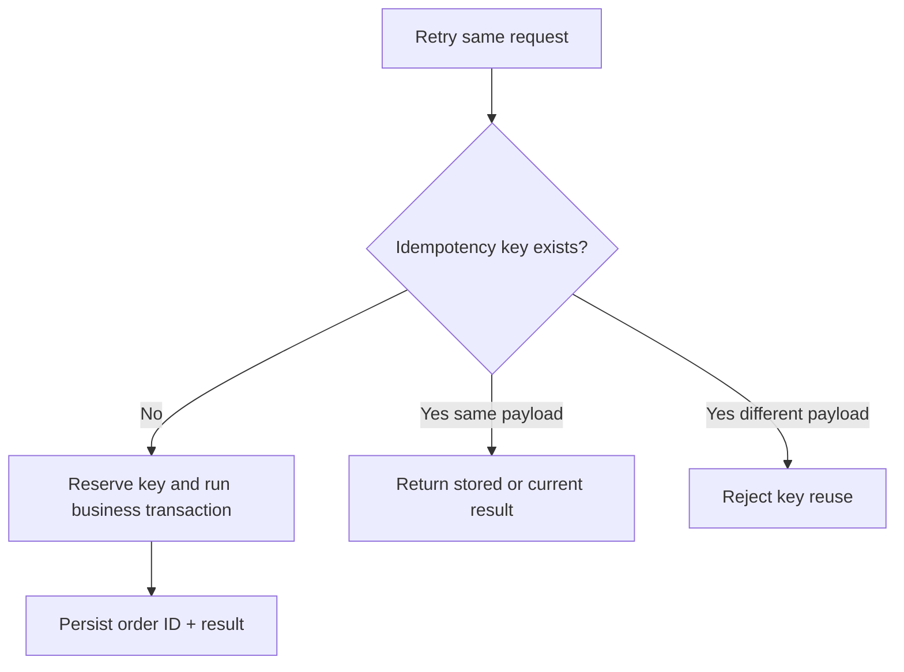

Idempotency ở API của PSP giúp retry thao tác phía PSP, nhưng **không thay thế** idempotency tại API và database của bạn. Tài liệu Stripe mô tả idempotency key cho việc retry mà không tạo thao tác trùng, kèm giới hạn lưu kết quả phụ thuộc provider: xem tài liệu tham khảo.

## 5.12. Crash giữa Commit và Publish: Transactional Outbox

Bad case:

```java
saveOrder();           // DB commit succeeded
rabbitTemplate.send(); // JVM crashes before this line
```

Database đã có đơn nhưng Inventory/Fulfillment không bao giờ nhận `OrderPlaced`.

Đảo thứ tự cũng nguy hiểm: message phát đi nhưng transaction tạo đơn rollback.

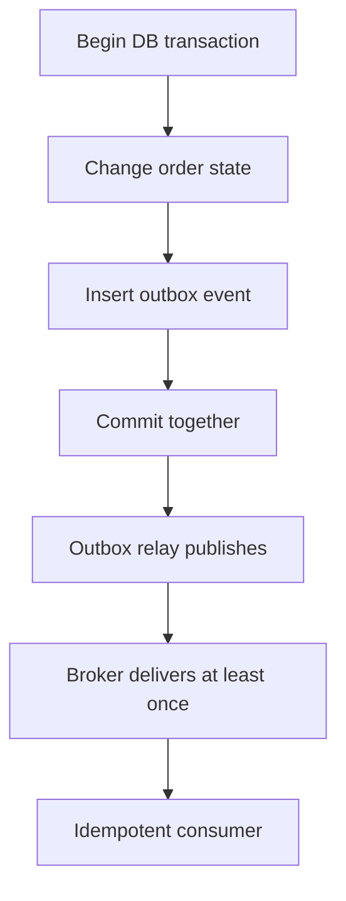

Trong cùng DB transaction, `orders` và `outbox_events` cùng commit hoặc rollback. Relay gửi message ngoài transaction rồi đánh dấu published. Relay vẫn có thể crash sau khi publish nhưng trước khi đánh dấu, dẫn đến **duplicate event**. Vì vậy consumer phải idempotent; outbox không đảm bảo exactly-once end-to-end một cách thần kỳ.

AWS Prescriptive Guidance mô tả outbox như cách xử lý dual write và lưu ý duplicate/order concerns. Xem phần tài liệu tham khảo.

## 5.13. Payment timeout: `UNKNOWN` là thông tin, không phải sự thất bại

Bad case:

```text
HTTP to PSP → timeout → set PAYMENT_FAILED → release stock
```

Nếu PSP đã thu tiền thành công nhưng response mất trên mạng thì bạn tạo trường hợp paid-without-order/stock.

Quy trình tốt hơn:

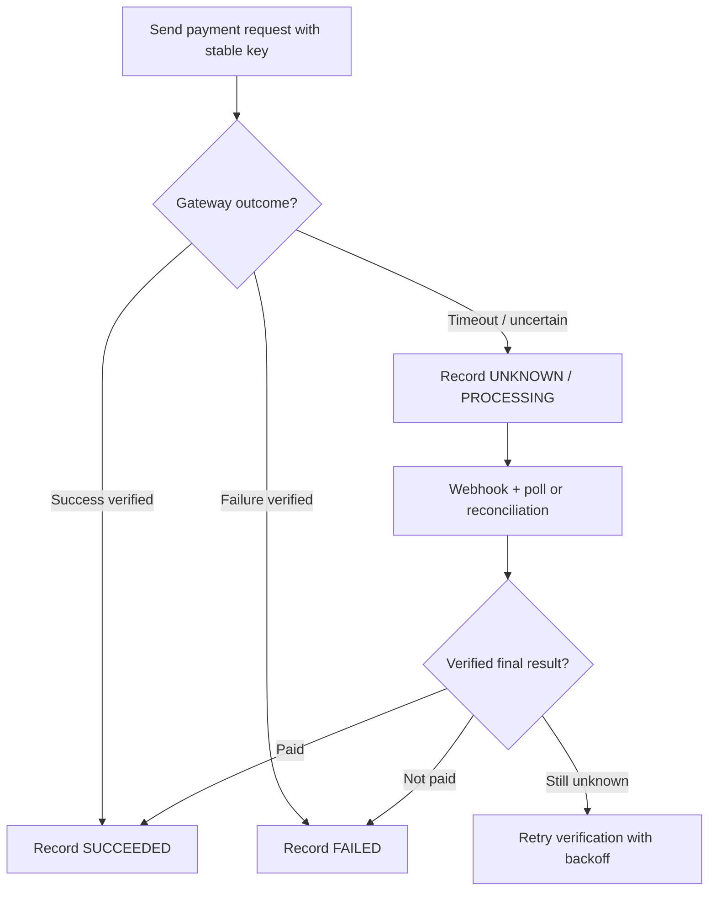

PSP webhooks là tín hiệu bên ngoài cần xác minh chữ ký và đối chiếu `payment reference`, số tiền, tiền tệ và đơn hàng. Có thể nhận duplicate hoặc sự kiện không theo thứ tự; đừng lấy thời gian nhận webhook làm thứ tự chân lý tuyệt đối. Đọc thêm Stripe PaymentIntents lifecycle và event handling tài liệu cuối chương.

**Tách triệt để:** `order_status`, `payment_status`, `refund_status`. Nếu `payment_status=SUCCEEDED` nhưng `order_status=CANCELLING`, system tiếp tục business workflow được khai báo, không mất một trong hai sự thật.

## 5.14. Worker crash, queue backlog và recovery design

Ví dụ Worker nhận `OrderConfirmed` rồi crash sau khi gọi kho nhưng trước khi ack broker. Broker redeliver; nếu không có dedupe, fulfilment tạo hai lần. Workflow an toàn phải nhận diện: order ID, fulfillment unique reference, processed message và command idempotency.

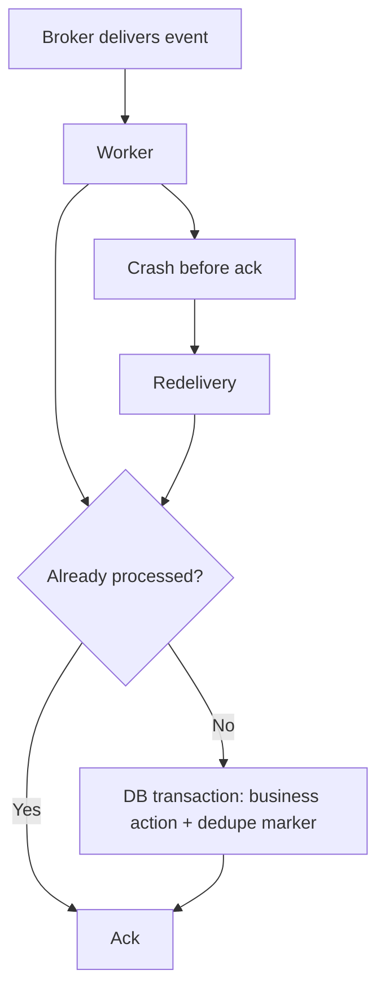

Các loại lỗi nên phân biệt:

- **Transient:** DB failover ngắn, network timeout → bounded retry với backoff/jitter.
- **Permanent business:** order terminal không hợp lệ, out of stock → ghi kết quả nghiệp vụ, không retry vô hạn.
- **Poison message:** dữ liệu sai schema hoặc bug → DLQ/quarantine + alert.
- **Ambiguous external effect:** refund request timeout → tra trạng thái provider trước khi lặp lại cùng idempotency key.

Tránh `catch(Exception e) { retry(); }` vô hạn gây retry storm. Worker concurrency cần giới hạn độc lập với HTTP API replica; queue length không phải chỉ số duy nhất, phải theo dõi **oldest message age**.

## 5.15. Database schema: thiết kế đủ để giải thích một đơn hàng

Nhóm bảng tối thiểu cho chapter lab:

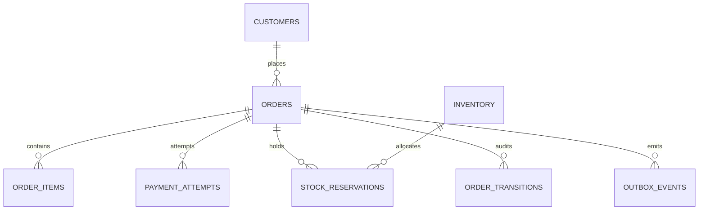

**Tránh mô hình sai:** Không dùng `order_id` làm khóa duy nhất của payment attempts nếu một đơn được phép retry thanh toán. Không gộp trạng thái refund vào payment cũ mà mất refund transaction ID. `Order` có thể kết thúc nghiệp vụ bán trong khi return/refund vẫn đang mở.

Trong SQL Lab, bảng `orders` có `status`, `version`, `total_amount`, `currency`, `request_fingerprint`, `idempotency_key`; `order_items` lưu `unit_price` snapshot; `inventory` dùng `on_hand` và `reserved`; `stock_reservations` lưu terminal status riêng; `payment_attempts` có unique provider reference; `order_transitions` giữ audit; `outbox_events` giữ event bền vững.

### Các mẫu constraint quan trọng

```sql
CHECK (on_hand >= 0 AND reserved >= 0 AND reserved <= on_hand)
```

```sql
UNIQUE (user_id, idempotency_key)
```

```sql
UNIQUE (provider, provider_payment_id)
```

Các constraint này là tuyến phòng thủ cuối, không thay thế việc mô hình hóa nghiệp vụ trong application service.

## 5.16. Spring Boot design: command handler + state guards + local transaction

Một module đơn giản:

```text
order/
  api/
    OrderController.java
  application/
    CheckoutService.java
    CancelOrderHandler.java
    ConfirmPaymentHandler.java
  domain/
    Order.java
    OrderStatus.java
    OrderPolicy.java
  persistence/
    OrderRepository.java
    OrderTransitionRepository.java
  messaging/
    OutboxRelay.java
```

Pseudo-code quan trọng nhất của cancel handler:

```java
@Transactional
public CancelResult requestCancel(long orderId, long actorId) {
    Order order = orderRepository.lockById(orderId);
    authz.assertCanCancel(actorId, order);

    if (order.isCancelled()) return CancelResult.alreadyCancelled(orderId);
    if (!policy.canRequestCancel(order)) throw new BusinessConflict("NOT_CANCELLABLE");

    order.requestCancellation(); // validated PENDING_PAYMENT/CONFIRMED -> CANCELLING
    transitions.append(orderId, "CancelRequested", actorId);
    outbox.append(orderId, "CancelRequested", order.version());
    return CancelResult.accepted(orderId);
}
```

Đây là **architectural pseudocode**, không phải class Java được biên dịch sẵn: repository/authz/policy/outbox là abstraction cần implement. `lockById()` trong cùng transaction có thể dùng `SELECT ... FOR UPDATE`; nếu dùng optimistic locking, phải kiểm tra affected rows hoặc version conflict rồi quyết định lại theo state hiện tại. Không dùng lock rồi đi gọi PSP trong transaction.

### Spring event không mặc định là reliable message broker

Gọi `applicationEventPublisher.publishEvent(...)` trong process không đồng nghĩa với sự kiện đã được lưu bền vững hoặc consumer khác nhận chắc chắn. Nếu event thúc đẩy bước nghiệp vụ quan trọng, cần thiết kế độ tin cậy phù hợp (outbox/retry/dedupe).

## 5.17. Observability: đo một lifecycle chứ không chỉ đo HTTP 200

Chỉ nhìn latency `POST /orders` là thiếu. Các metric có ý nghĩa nghiệp vụ:

| Metric | Giúp trả lời |
|---|---|
| `checkout_success_rate` | Bao nhiêu request hợp lệ tạo đơn thành công? |
| `orders_pending_payment_age` | Đơn chờ tiền lâu bao nhiêu? |
| `payment_unknown_count` | Bao nhiêu thanh toán đang mơ hồ? |
| `reservation_expired_count` | Bao nhiêu giữ hàng hết hạn? |
| `refund_pending_age` | Tiền hoàn đang bị chậm bao lâu? |
| `invalid_transition_total` | Có bao nhiêu command/event trái trạng thái? |
| `outbox_oldest_unpublished_age` | Sự kiện quan trọng bị kẹt bao lâu? |
| `broker_oldest_message_age` | Worker có đang theo kịp traffic? |
| `inventory_reserved_vs_active_sum` | Reserved của kho có khớp tổng reservation ACTIVE? |

Đừng đưa `user_email`, địa chỉ nhận, số thẻ hoặc raw PSP secrets vào label metrics/logs. Sử dụng correlation ID/order ID có kiểm soát, masking và phân quyền đọc log.

### Reconciliation jobs

- Payment provider `SUCCEEDED` nhưng local order chưa `CONFIRMED`/chưa có case xử lý.
- Order `CANCELLING` quá SLA; phát hiện PSP vẫn đang xử lý.
- Reservation `ACTIVE` quá hạn nhưng chưa có decision.
- `inventory.reserved` khác tổng `stock_reservations` ACTIVE.
- `outbox_events` chưa publish quá ngưỡng.
- Refund provider đã thành công nhưng local record còn pending.

**Reconciliation không phải dấu hiệu thiết kế kém:** trong hệ thống có external services và trạng thái bất đồng bộ, nó là lớp kiểm chứng và phục hồi thiết yếu.

## 5.18. Bottleneck Shifting trong Order Lifecycle

Cùng một thứ tự tư duy của cuốn sách:

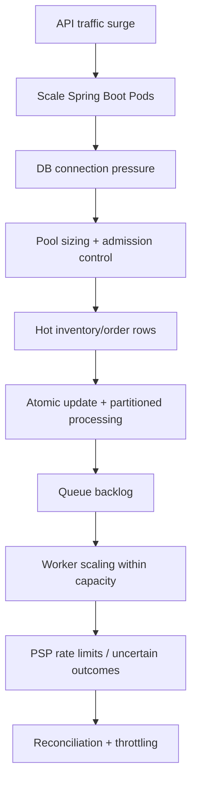

Với Flash Sale, “scale mọi thứ lên 100 Pod” không khiến một SKU có thêm hàng hay PSP có thêm hạn mức. Nếu giữ transaction mở dài, nhiều Worker có thể chỉ tạo thêm hàng đợi lock. Khi mở rộng, cần đo chính xác **bottleneck hiện tại** trước khi tăng replica.

## 5.19. Engineering Lab — diễn tập một vòng đời đơn

Bộ file trong `labs/chapter-05/` gồm `schema.sql`, `seed.sql`, `queries.sql`, `test-scenarios.md` và `README.md`.

### Thiết lập

1. Tạo PostgreSQL DB thí nghiệm riêng.
2. Chạy `schema.sql`, sau đó `seed.sql` bằng `psql`.
3. Chạy từng transaction có chú thích trong `queries.sql`, nhất là **reserve once** và **release once**.
4. Mở hai session để mô phỏng cạnh tranh `CancelRequested` vs `PaymentVerified`.
5. Thử duplicate `idempotency_key`, duplicate `provider_event_id` và phát event sai trạng thái.

### Bài toán bắt buộc

**A. Reserve once:** `on_hand=1`, hai checkout đồng thời; nhiều nhất một reservation ACTIVE được commit.

**B. Release once:** hai Worker cùng cancel một order; `reserved` chỉ giảm đúng một đơn vị.

**C. Late payment:** order đã vào `CANCELLING`; callback success tới sau; không hồi sinh `CANCELLED` bằng update không guard.

**D. Crash after commit:** order/outbox đã lưu; giả lập relay crash; phát lại event an toàn với dedupe.

**E. Partial return:** đơn có 2 item, chỉ 1 được hoàn; payment/refund ledger khớp theo số tiền thực tế.

### Đáp án tư duy: test không thể thiếu

| Tình huống | Kết quả kỳ vọng |
|---|---|
| `on_hand=1`, 2 concurrent checkout | Tối đa 1 active reservation |
| Cancel được gửi lại sau thành công | Không tăng available lần hai |
| Hai webhook cùng provider event ID | Một bản ghi dedupe; một business side effect |
| Payment timeout | `UNKNOWN`/`PROCESSING`, không tự coi `FAILED` |
| `SHIPPED` nhận `CancelRequested` | Từ chối simple cancellation hoặc chuyển workflow phù hợp |
| Relay publish rồi crash | Event có thể redeliver, consumer không tạo double effect |

## 5.20. Chapter Review — tư duy trước khi chọn công nghệ

1. Nếu order đã `CANCELLED` nhưng PSP báo `SUCCEEDED`, tại sao `UPDATE orders SET status='CONFIRMED'` là sai?
2. Vì sao cần phân biệt cancel request với cancelled fact?
3. Vì sao unique idempotency key trên order không đủ bảo vệ refund và webhook?
4. Nếu một payment đã thu tiền thành công còn fulfillment chưa diễn ra, chúng ta có thể hoàn stock trước khi resolve refund không? Rule nào chi phối?
5. CAS status/version giải quyết được loại race nào; loại external failure nào nó không giải quyết?
6. Khi nào local transaction giải quyết được consistency? Khi nào cần outbox và Saga?
7. Nếu `broker_oldest_message_age` tăng trong khi API latency thấp, điểm nghẽn nằm ở đâu?
8. Nếu một checkout chứa hai seller, nên tạo một order hay order group + seller orders? Vì sao?

### Knowledge Map

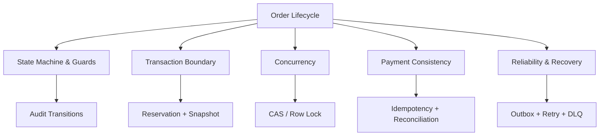

### Key Takeaways

- **Order status không thay thế payment, reservation, fulfillment, return và refund state.**
- **Một state transition = guard + atomic state change + audit + reliable side effects.**
- **Không định nghĩa timeout thành business failure, nhất là với payment.**
- **Thao tác lặp phải không gây side effect trùng; terminal inventory release là one-way.**
- **Local transaction đúng lúc, ngắn; external calls chạy ngoài transaction.**
- **Outbox/consumer dedupe giúp phục hồi khi process chết, không làm event tự nhiên exactly-once.**
- **Bottleneck tiếp theo có thể là hot row, queue, PSP hay reconciliation, chứ không chỉ database CPU.**

---

## Tài liệu tham khảo kỹ thuật

- PostgreSQL Documentation, *Explicit Locking*, row-level locking / transaction scope: https://www.postgresql.org/docs/current/explicit-locking.html
- AWS Prescriptive Guidance, *Transactional outbox pattern*: https://docs.aws.amazon.com/prescriptive-guidance/latest/cloud-design-patterns/transactional-outbox.html
- AWS Prescriptive Guidance, *Saga choreography pattern*: https://docs.aws.amazon.com/prescriptive-guidance/latest/cloud-design-patterns/saga-choreography.html
- Stripe API Reference, *Idempotent requests*: https://docs.stripe.com/api/idempotent_requests
- Stripe API Reference, *PaymentIntents and their lifecycle*: https://docs.stripe.com/api/payment_intents
- Stripe Docs, *Webhooks*: https://docs.stripe.com/webhooks

> **Đóng Volume 1:** Chương 01–05 trả lời lần lượt: E-commerce có những luồng nghiệp vụ gì; ai sở hữu các luồng đó trong từng business model; domain được phân ranh ra sao; giá được xác định/chốt như thế nào; và cuối cùng một order được quản lý đúng qua mọi thay đổi/ngoại lệ. **Volume 2** sẽ bắt đầu từ Modular Monolith và schema/API implementation, không cần nhảy thẳng lên microservices.
